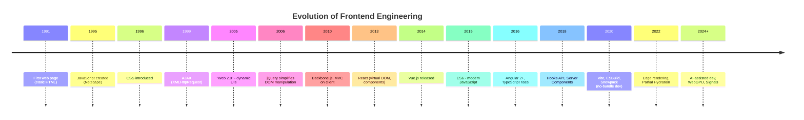
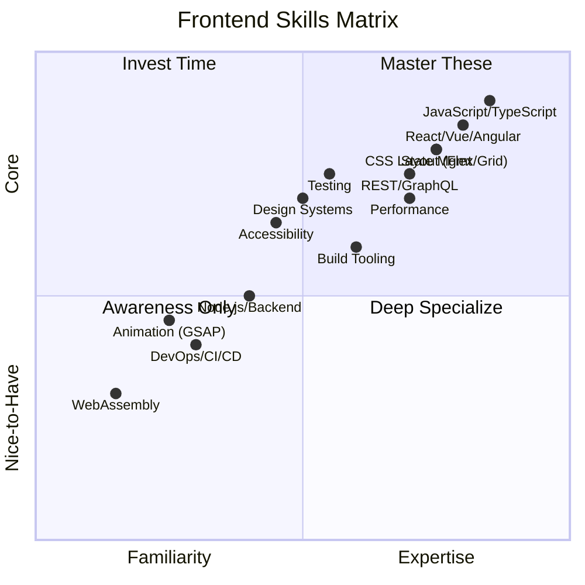

# What is Frontend Engineering?

## Definition

Frontend Engineering is the discipline of building the **user-facing layer** of web applications — everything the user sees, touches, and interacts with in the browser. It bridges **design** (visual mockups, UX flows) and **backend engineering** (APIs, databases, business logic).

```
                    ┌─────────────────────────────────┐
                    │         USER (Browser)           │
                    │  ┌───────────────────────────┐   │
                    │  │  Frontend (UI/UX Layer)   │   │
                    │  │  HTML · CSS · JS · TS     │   │
                    │  │  React · Vue · Angular    │   │
                    │  └──────────┬────────────────┘   │
                    │             │ HTTP/WebSocket      │
                    │  ┌──────────▼────────────────┐   │
                    │  │  Backend (API Layer)      │   │
                    │  │  Node.js · Python · Go    │   │
                    │  └──────────┬────────────────┘   │
                    │             │                    │
                    │  ┌──────────▼────────────────┐   │
                    │  │  Database / Infrastructure│   │
                    │  │  PostgreSQL · Redis · S3  │   │
                    │  └───────────────────────────┘   │
                    └─────────────────────────────────┘
```

## Scope & Responsibilities

| Area | What it Covers |
|------|----------------|
| **Structure** | Semantic HTML, accessibility (a11y), SEO metadata |
| **Styling** | Layout (Flexbox, Grid), animations, responsive design, design systems |
| **Logic** | State management, client-side routing, data fetching, caching |
| **Performance** | Bundle size, lazy loading, Core Web Vitals (LCP, FID, CLS) |
| **Tooling** | Build tools (Vite, Webpack), linting, formatting, CI/CD pipelines |
| **Testing** | Unit (Vitest/Jest), integration, E2E (Playwright/Cypress) |
| **Security** | XSS prevention, CSP headers, secure cookie handling |

## Frontend vs Fullstack vs Backend

```
┌────────────────────────────────────────────────────────┐
│                      FULLSTACK                         │
│  ┌──────────────────┐      ┌─────────────────────────┐ │
│  │   FRONTEND       │      │      BACKEND            │ │
│  │ ・UI Components  │      │ ・API Endpoints         │ │
│  │ ・State Mgmt     │◄────►│ ・Business Logic        │ │
│  │ ・Routing        │ HTTP │ ・Auth / Sessions       │ │
│  │ ・Rendering      │      │ ・Database Queries      │ │
│  │ ・Animations     │      │ ・Server Infra          │ │
│  └──────────────────┘      └─────────────────────────┘ │
└────────────────────────────────────────────────────────┘
```

| Aspect | Frontend | Backend | Fullstack |
|--------|----------|---------|-----------|
| **Primary Concern** | User experience, UI, browser | Data, business logic, infra | Both |
| **Languages** | JS, TS, HTML, CSS, WASM | Python, Go, Java, Ruby, Rust, PHP | Both |
| **Runs On** | Browser / Client | Server / Cloud | Both |
| **Key Frameworks** | React, Vue, Angular, Svelte | Express, Django, Spring, Rails | Both |
| **Performance Metric** | FCP, LCP, TTI, TBT | Latency, Throughput, uptime | Both |
| **Debugging Tools** | DevTools, Lighthouse | Logs, APM, Datadog | Both |

## Evolution of Frontend Engineering

### Timeline



### Detailed Evolution

| Era | Years | Characteristics |
|-----|-------|-----------------|
| **Static HTML** | 1991–1998 | Server-rendered pages, no interactivity, table-based layouts |
| **Scripting Era** | 1999–2005 | DHTML, Flash, Java applets, basic form validation |
| **Web 2.0 / AJAX** | 2005–2010 | Gmail/Google Maps prove rich clients, jQuery dominates |
| **MVC / SPA Rise** | 2010–2015 | Backbone, AngularJS, Ember — full apps in browser |
| **Component Era** | 2015–2020 | React/Vue/Angular 2+, component model, TypeScript mainstream |
| **Modern Era** | 2020–present | Server Components, edge compute, fine-grained reactivity (Solid, Signals) |

## Why Frontend Engineering Matters

- **First impression**: Users judge an app's credibility in **0.05 seconds** (Google study)
- **Performance directly impacts revenue**: Amazon found 100ms delay → 1% drop in sales
- **Accessibility is a right**: ~15% of the world's population has some disability
- **Mobile-first**: Over 60% of web traffic comes from mobile devices

## Skills Matrix



## Key Takeaway

> Frontend engineering is not just "making things look pretty." It's a **systems discipline** combining performance, accessibility, UX, state management, networking, and security — all running inside the most hostile runtime environment on the planet: the browser.
