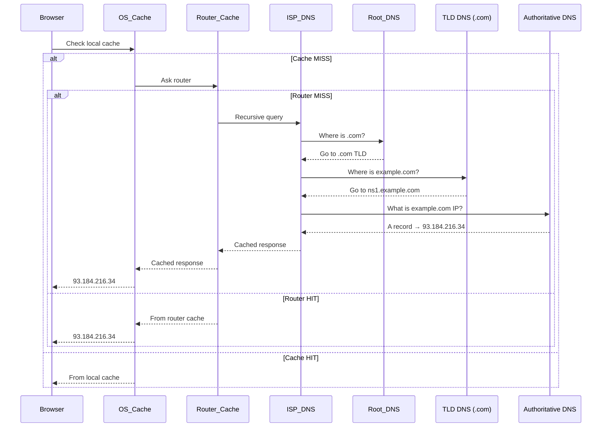
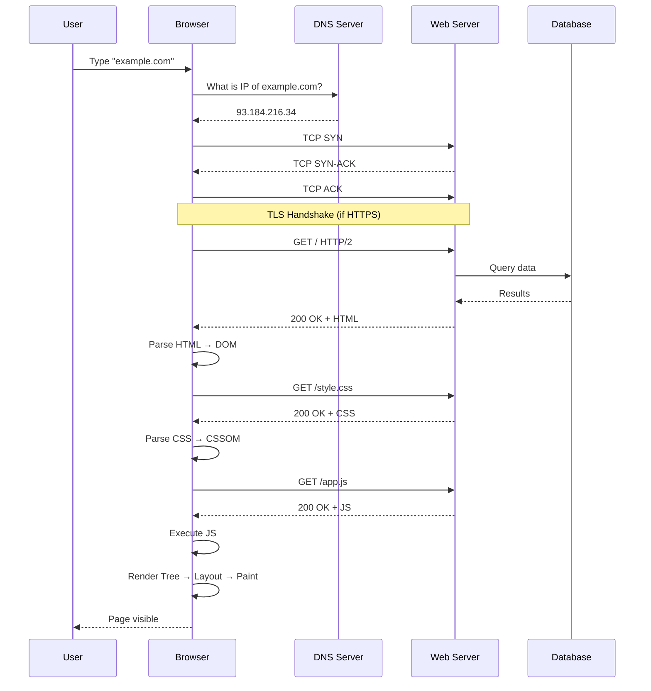

# How the Web Works

## What Happens When You Type a URL?

```
User types "https://example.com" in browser
              │
              ▼
  ┌──────────────────────────┐
  │  1. URL Parsing          │
  │  ──────────────────────  │
  │  scheme → "https"        │
  │  host   → "example.com"  │
  │  path   → "/"            │
  └──────────┬───────────────┘
             │
             ▼
  ┌──────────────────────────┐
  │  2. DNS Resolution        │
  │  ──────────────────────  │
  │  Browser checks cache     │
  │  → OS cache               │
  │  → Router cache           │
  │  → ISP DNS server         │
  │  → Root → TLD → Authoritative│
  │  Returns: 93.184.216.34  │
  └──────────┬───────────────┘
             │
             ▼
  ┌──────────────────────────┐
  │  3. TCP Handshake         │
  │  ──────────────────────  │
  │  SYN ──────────────►     │
  │       ◄────── SYN-ACK    │
  │  ACK ──────────────►     │
  │  Connection established  │
  └──────────┬───────────────┘
             │
             ▼
  ┌──────────────────────────┐
  │  4. TLS Handshake (HTTPS)│
  │  ──────────────────────  │
  │  ClientHello ──────►     │
  │  ServerHello + Cert ◄──  │
  │  Key Exchange            │
  │  Secure tunnel ready     │
  └──────────┬───────────────┘
             │
             ▼
  ┌──────────────────────────┐
  │  5. HTTP Request          │
  │  ──────────────────────  │
  │  GET / HTTP/2             │
  │  Host: example.com        │
  │  Accept: text/html        │
  │  User-Agent: Chrome/...   │
  └──────────┬───────────────┘
             │
             ▼
  ┌──────────────────────────┐
  │  6. Server Processes      │
  │  ──────────────────────  │
  │  Receives request         │
  │  Runs app logic           │
  │  Queries DB (if needed)   │
  │  Builds HTML response     │
  └──────────┬───────────────┘
             │
             ▼
  ┌──────────────────────────┐
  │  7. HTTP Response         │
  │  ──────────────────────  │
  │  200 OK                   │
  │  Content-Type: text/html  │
  │  Cache-Control: max-age   │
  │  <html>...</html>         │
  └──────────┬───────────────┘
             │
             ▼
  ┌──────────────────────────┐
  │  8. Browser Renders       │
  │  ──────────────────────  │
  │  Parse HTML → DOM         │
  │  Parse CSS → CSSOM        │
  │  Execute JS               │
  │  Render Tree → Layout     │
  │  Paint → Composite        │
  └──────────────────────────┘
```

## DNS Resolution — Deep Dive



## TCP Handshake (3-Way)

```
  CLIENT                    SERVER
    │                         │
    │      SYN (seq=100)      │
    │ ───────────────────────► │  CLIENT: "Hey, let's talk"
    │                         │
    │   SYN-ACK (seq=300,     │
    │   ack=101)              │
    │ ◄─────────────────────── │  SERVER: "OK, I'm listening"
    │                         │
    │      ACK (seq=101,      │
    │      ack=301)           │
    │ ───────────────────────► │  CLIENT: "Great, let's go"
    │                         │
    │    ◄── CONNECTION SETUP DONE ──►  │
```

## HTTP Request / Response

### Request Structure

```
GET /api/users?page=1 HTTP/2
Host: example.com
User-Agent: Mozilla/5.0 (Windows NT 10.0; Win64; x64)
Accept: application/json
Authorization: Bearer eyJhbGci...
Cache-Control: no-cache
```

### Response Structure

```
HTTP/2 200 OK
Content-Type: application/json; charset=utf-8
Cache-Control: public, max-age=3600
Set-Cookie: session_id=abc123; HttpOnly; Secure
X-Request-Id: req-7a9b3c

{"users": [{"id": 1, "name": "Alice"}]}
```

## Full Flow (Mermaid Sequence)



## Key Concepts

| Term | Definition |
|------|------------|
| **DNS** | Phonebook of the internet — maps domain names to IP addresses |
| **TCP** | Reliable, connection-oriented transport protocol |
| **TLS** | Encryption layer on top of TCP (HTTPS = HTTP + TLS) |
| **HTTP** | Application protocol for web communication |
| **URL** | Uniform Resource Locator (scheme + host + path) |
| **CDN** | Content Delivery Network — serves static assets from edge nodes |
| **Latency** | Time taken for a packet to travel from source to destination |
| **Bandwidth** | Amount of data that can be transmitted per second |
| **TTFB** | Time To First Byte — time until server starts responding |
| **RTT** | Round Trip Time — time for a packet to go and come back |

## Real-World Example

```javascript
// Measuring the full page load timeline
window.performance.timing && (() => {
  const t = window.performance.timing;
  const stats = {
    dnsLookup: t.domainLookupEnd - t.domainLookupStart,
    tcpConnect: t.connectEnd - t.connectStart,
    tlsNegotiation: t.secureConnectionStart ? t.connectEnd - t.secureConnectionStart : 0,
    ttfb: t.responseStart - t.requestStart,
    domInteractive: t.domInteractive - t.navigationStart,
    totalLoad: t.loadEventEnd - t.navigationStart,
  };
  console.table(stats);
})();
```

## Summary

```
URL Entry ──► DNS ──► TCP ──► TLS ──► HTTP Req ──► Server ──► HTTP Res ──► Render ──► Done
   │          │        │        │          │           │           │            │
  100ms     20ms     15ms     30ms        5ms        200ms       5ms         50ms     ≈ 425ms
```
