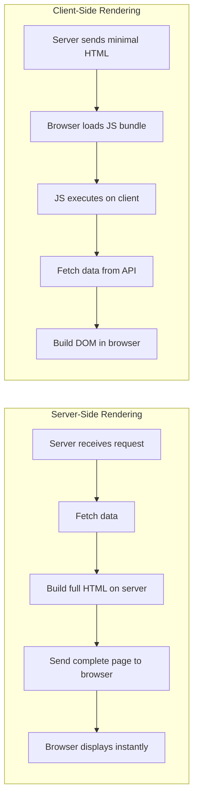
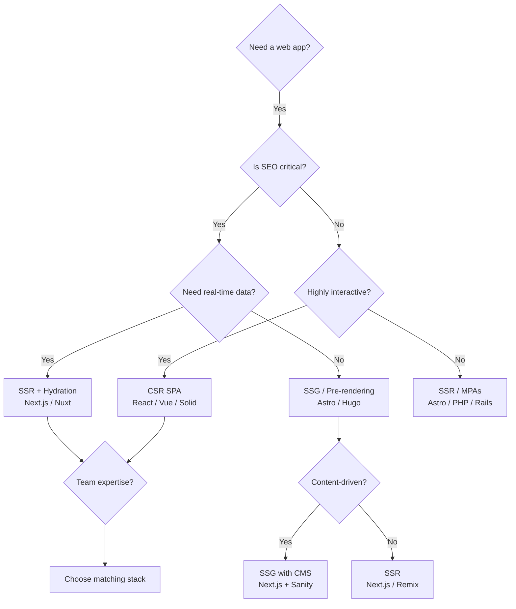
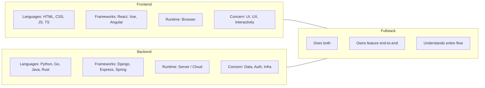

# Frontend vs Backend

## The Core Difference

```
                         WEB APPLICATION
                              │
              ┌───────────────┴───────────────┐
              │                               │
         FRONTEND                         BACKEND
     (Client-side)                    (Server-side)
              │                               │
     ┌────────┴────────┐           ┌──────────┴──────────┐
     │  What users     │           │  Logic users don't  │
     │  see & touch    │           │  see — data, infra  │
     └─────────────────┘           └─────────────────────┘
```

## Responsibilities

| Layer | Frontend | Backend |
|-------|----------|---------|
| **Presentation** | HTML structure, CSS styling, animations | Generates JSON/HTML for frontend |
| **Interactivity** | Event handling, state management, client routing | N/A |
| **Data** | Fetching, caching, optimistic updates | Validation, transformation, storage |
| **Authentication** | Token storage, login forms, route guards | Session mgmt, JWT issuance, OAuth flows |
| **Performance** | Bundle optimization, lazy loading, CDN | Query optimization, caching, scaling |
| **Security** | CSP, XSS prevention, secure cookies | SQL injection prevention, rate limiting |
| **Testing** | Component tests, visual regression, E2E | Unit tests, integration, load tests |
| **Deployment** | Static hosting (Vercel, Netlify, S3) | Server deployment (AWS, Docker, K8s) |

## Rendering: Client-Side vs Server-Side



| Aspect | SSR | CSR | SSG (Static) |
|--------|-----|-----|-------------|
| **Initial Load** | Fast (HTML ready) | Slow (wait for JS) | Fastest (pre-built) |
| **Interactivity** | Hydration needed | Immediate | Hydration needed |
| **SEO** | Excellent | Poor (needs workarounds) | Excellent |
| **Server Cost** | Higher (CPU per request) | Lower (static files) | Lowest |
| **Data Freshness** | Always fresh | Real-time after load | Needs rebuild |
| **Examples** | Next.js SSR, PHP | Create React App, Vite | Next.js SSG, Hugo, Astro |

## Data Flow Comparison

### Frontend-First Data Flow (CSR)

```
User clicks button
       │
       ▼
  ┌─────────────┐     ┌──────────────┐     ┌──────────┐
  │ Component   │────►│ State Update │────►│ UI Re-   │
  │ Event       │     │ (e.g. React  │     │ render   │
  │ Handler     │     │  useState)   │     │          │
  └──────┬──────┘     └──────────────┘     └──────────┘
         │                                        │
         ▼                                        │
  ┌─────────────┐                                  │
  │ API Call    │                                  │
  │ (fetch/     │                                  │
  │  axios)     │                                  │
  └──────┬──────┘                                  │
         │  HTTP Response                          │
         ▼                                         ▼
  ┌─────────────┐                          ┌──────────────┐
  │ State       │                          │ Final UI     │
  │ Update with │─────────────────────────►│ with Data    │
  │ API data    │                          │              │
  └─────────────┘                          └──────────────┘
```

### Backend-First Data Flow (SSR)

```
Browser requests /products
       │
       ▼
  ┌─────────────────────┐
  │ Server receives req │
  └──────────┬──────────┘
             │
             ▼
  ┌─────────────────────┐     ┌──────────────┐
  │ Server fetches      │────►│ Query        │
  │ data from DB/API    │     │ Database     │
  └──────────┬──────────┘     └──────────────┘
             │
             ▼
  ┌─────────────────────┐
  │ Server renders      │
  │ full HTML with data │
  └──────────┬──────────┘
             │
             ▼
  ┌─────────────────────┐
  │ Send HTML to        │
  │ browser             │
  └──────────┬──────────┘
             │
             ▼
  ┌─────────────────────┐
  │ Browser displays    │
  │ page immediately    │
  └─────────────────────┘
```

## When to Use What



## Comparison Table



| Dimension | Frontend Engineer | Backend Engineer | Fullstack Engineer |
|-----------|------------------|-----------------|-------------------|
| **Primary focus** | Browser behavior | Server/infra logic | Whole system |
| **Code visibility** | 100% visible to user | 0% visible to user | Both |
| **Debugging** | DevTools, Lighthouse | Logs, APM tools | Both |
| **Key constraint** | Network, device perf | Concurrency, scale | Both |
| **Shipping speed** | Fast (static deploy) | Slower (infra changes) | Moderate |
| **Security mindset** | XSS, CSRF, CSP | SQLi, RCE, IAM | Both |
| **Salary range** | $80k–$200k+ | $90k–$220k+ | $90k–$210k+ |

## Real-World Example

```javascript
// Frontend: Fetch data and render
async function UserProfile({ userId }) {
  const [user, setUser] = useState(null);
  const [loading, setLoading] = useState(true);

  useEffect(() => {
    fetch(`/api/users/${userId}`)
      .then(res => res.json())
      .then(data => {
        setUser(data);
        setLoading(false);
      });
  }, [userId]);

  if (loading) return <Skeleton />;
  return <ProfileCard user={user} />;
}

// Backend: Serve the API endpoint
// Express.js
app.get('/api/users/:id', async (req, res) => {
  try {
    const user = await db.users.findById(req.params.id);
    if (!user) return res.status(404).json({ error: 'Not found' });
    // Remove sensitive fields
    const { passwordHash, ssn, ...safeUser } = user;
    res.json(safeUser);
  } catch (err) {
    res.status(500).json({ error: 'Server error' });
  }
});
```

## Key Insight

> Frontend and backend are two halves of the same system. The best engineers understand both — even if they specialize in one. Frontend without backend has no data. Backend without frontend has no user.
