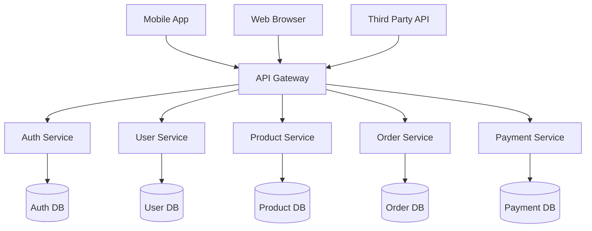
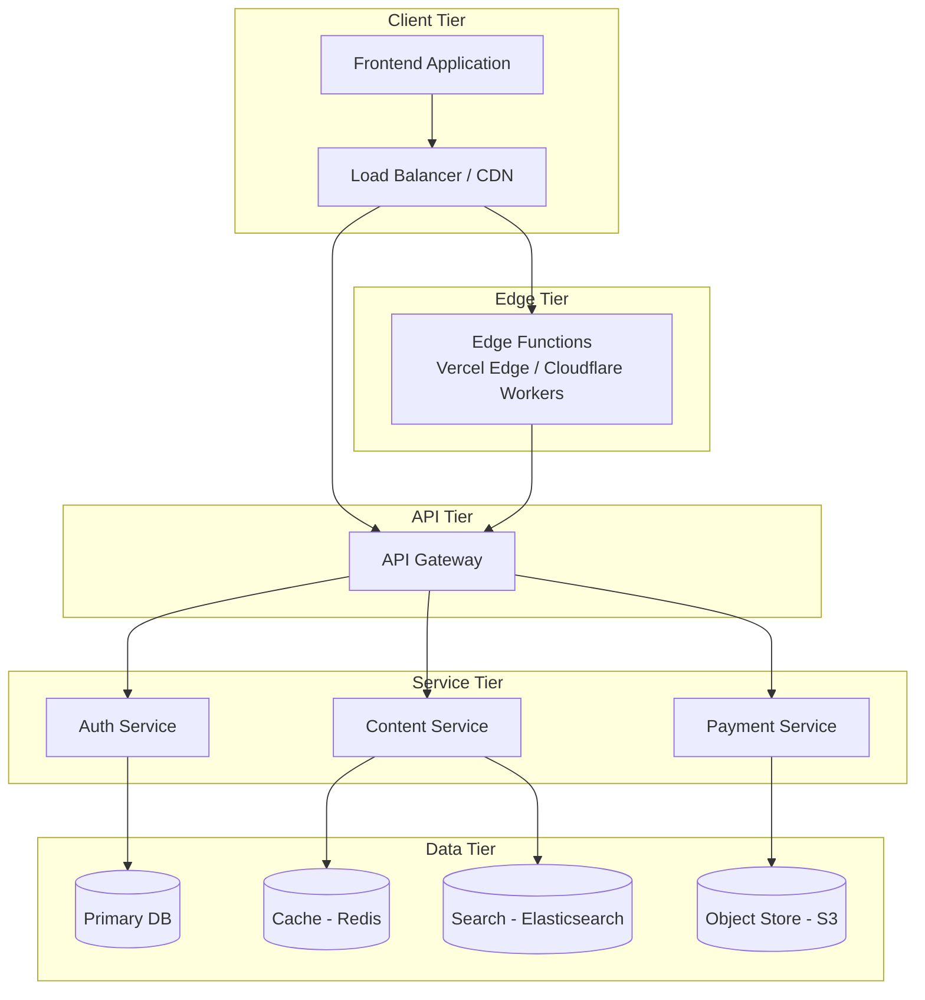

# Client-Server Architecture

## The Fundamental Model

```
  ┌──────────┐      Request      ┌──────────┐      Query      ┌──────────┐
  │          │ ──────────────────►│          │ ────────────────►│          │
  │  CLIENT  │                   │  SERVER  │                 │ DATABASE │
  │  (Front) │ ◄─────────────────┤  (Logic) │ ◄────────────────┤          │
  │          │      Response     │          │      Results     │          │
  └──────────┘                   └──────────┘                 └──────────┘
```

## Two-Tier Architecture

```
  ┌──────────────────────┐          ┌──────────────────────┐
  │      CLIENT          │          │      DATABASE        │
  │  ┌────────────────┐  │          │  ┌────────────────┐  │
  │  │ Presentation   │  │          │  │  Data Storage  │  │
  │  │ Business Logic │──┤  Direct  ├──│  + Logic       │  │
  │  │ Data Access    │  │  Connect │  │                │  │
  │  └────────────────┘  │          │  └────────────────┘  │
  └──────────────────────┘          └──────────────────────┘
```

- **Pros**: Simple, low latency
- **Cons**: Security risk (DB creds on client), no scalability, tight coupling
- **Example**: Desktop app connecting directly to SQL Server

## Three-Tier Architecture

```
  ┌─────────────┐     ┌─────────────┐     ┌─────────────┐
  │             │     │             │     │             │
  │  CLIENT     │     │  SERVER     │     │  DATABASE   │
  │  (Tier 1)   │────►│  (Tier 2)   │────►│  (Tier 3)   │
  │             │     │             │     │             │
  │  UI Layer   │     │  App Layer  │     │  Data Layer │
  │  Browser    │     │  Node/Java  │     │  PostgreSQL │
  └─────────────┘     └─────────────┘     └─────────────┘
```

- **Pros**: Security (DB hidden from client), modular, scalable
- **Cons**: More network hops, complex deployment
- **Example**: React SPA → Express API → PostgreSQL

## N-Tier Architecture

```
  ┌──────────┐   ┌──────────┐   ┌──────────┐   ┌──────────┐   ┌──────────┐
  │          │   │          │   │          │   │          │   │          │
  │ CLIENT   │──►│  API     │──►│ SERVICE  │──►│  CACHE   │──►│ DATABASE │
  │          │   │  GATEWAY │   │  LAYER   │   │  (Redis) │   │          │
  └──────────┘   └──────────┘   └──────────┘   └──────────┘   └──────────┘
       │               │              │
       │               │       ┌──────────┐
       │               │       │  QUEUE   │
       │               │       │ (Rabbit) │
       │               │       └──────────┘
       │               │              │
       │               │       ┌──────────┐
       │               │       │ WORKER   │
       │               │       │  SERVICE │
       │               │       └──────────┘
```

- **Pros**: Highly scalable, fault-tolerant, teams work independently
- **Cons**: Complex, higher latency, hard to debug
- **Example**: Netflix — client → API Gateway → 500+ microservices → multiple DBs

## API Gateway Pattern



### API Gateway Responsibilities

| Function | Description |
|----------|-------------|
| **Routing** | Directs requests to appropriate microservice |
| **Auth** | Validates tokens, API keys before reaching services |
| **Rate Limiting** | Prevents abuse by throttling requests |
| **Caching** | Serves cached responses for common queries |
| **Load Balancing** | Distributes traffic across service instances |
| **Request/Response Transform** | Aggregates data from multiple services |
| **Monitoring** | Logs metrics, traces for observability |

## Monolith vs Microservices

```
MONOLITH                         MICROSERVICES
┌───────────────────┐            ┌───┐ ┌───┐ ┌───┐ ┌───┐
│                   │            │ A │ │ B │ │ C │ │ D │
│  ┌─────────────┐ │            │ u │ │ u │ │ P │ │ O │
│  │ Auth        │ │            │ t │ │ s │ │ r │ │ r │
│  │ User        │ │            │ h │ │ e │ │ o │ │ d │
│  │ Products    │ │            │   │ │ r │ │ d │ │ e │
│  │ Orders      │ │            │   │ │ s │ │   │ │ r │
│  │ Payments    │ │            └───┘ └───┘ └───┘ └───┘
│  │ Notifications││             │    │    │    │
│  └─────────────┘ │             └────┴────┴────┘
│  Single DB       │              Each has own DB
│  Single Deploy   │              Independently deployable
└───────────────────┘
```

| Aspect | Monolith | Microservices |
|--------|----------|--------------|
| **Deployment** | Single unit | Multiple units |
| **Scaling** | Scale everything | Scale per service |
| **Team Structure** | One team owns all | Teams own services |
| **Complexity** | Low (code) / High (scaling ceiling) | High (infra) / Low (isolated changes) |
| **Testing** | Easier (E2E in one process) | Harder (integration testing) |
| **Startup friendly** | Yes | No (needs mature DevOps) |
| **When to use** | < 10 engineers, early stage | > 50 engineers, proven product |

## Where Frontend Fits



### Frontend's Position

```
┌─────────────────────────────────────────────────────────┐
│                    USER'S DEVICE                         │
│  ┌───────────────────────────────────────────────────┐   │
│  │  Frontend Application                             │   │
│  │  ┌──────────┐ ┌──────────┐ ┌──────────────────┐  │   │
│  │  │ UI       │ │ State    │ │ API Client       │  │   │
│  │  │ Layer    │ │ Mgmt     │ │ (fetch/axios)    │──┼───►
│  │  └──────────┘ └──────────┘ └──────────────────┘  │   │
│  └───────────────────────────────────────────────────┘   │
└─────────────────────────────────────────────────────────┘
                         │
                    HTTP/HTTPS
                         │
                         ▼
┌─────────────────────────────────────────────────────────┐
│                    SERVER INFRASTRUCTURE                  │
│  ┌────────────────┐  ┌──────────────┐  ┌────────────┐  │
│  │ API Gateway    │──► Microservices│──► Databases  │  │
│  │ Rate Limit     │  │ Business     │  │ SQL / NoSQL│  │
│  │ Auth           │  │ Logic        │  │ Cache      │  │
│  └────────────────┘  └──────────────┘  └────────────┘  │
└─────────────────────────────────────────────────────────┘
```

## Real-World Architecture Example

```javascript
// Frontend: API client layer
class ApiClient {
  constructor(baseURL) {
    this.baseURL = baseURL;
  }

  async get(endpoint) {
    const res = await fetch(`${this.baseURL}${endpoint}`, {
      headers: { Authorization: `Bearer ${getToken()}` },
    });
    if (!res.ok) throw new ApiError(res.status, await res.json());
    return res.json();
  }
}

// Backend: API Gateway route
// (conceptual middleware in a Node.js gateway)
gateway.use('/api/*', rateLimiter({ windowMs: 60000, max: 100 }));
gateway.use('/api/*', authenticate);
gateway.use('/api/users', 'user-service');
gateway.use('/api/products', 'product-service');
gateway.use('/api/orders', 'order-service');

// Backend: Microservice health check
app.get('/health', (req, res) => {
  res.json({
    service: 'user-service',
    version: '2.1.0',
    status: 'healthy',
    db: db.isConnected() ? 'connected' : 'disconnected',
  });
});
```

## Key Takeaway

> Frontend is the outermost tier in n-tier architecture — closest to the user. Understanding every layer beneath helps you build better, faster, and more resilient frontend applications. You don't need to build the backend, but you must understand how it works.
