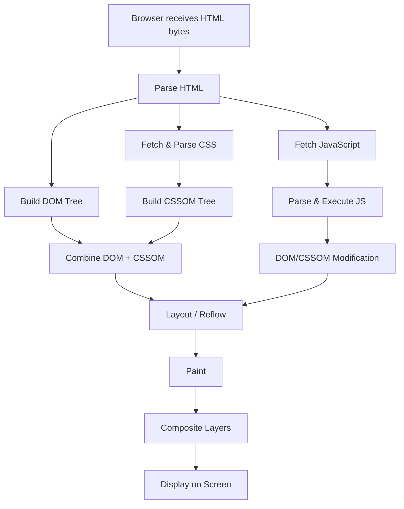
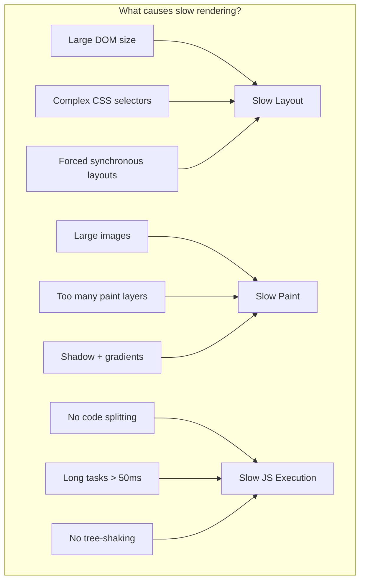

# Website Rendering Lifecycle

## Overview

```
            ┌──────────────────────────────────────────────────────────────┐
            │                     CRITICAL RENDERING PATH                    │
            │                                                              │
            │  ┌────────┐   ┌────────┐   ┌────────┐   ┌────────┐         │
            │  │  HTML  │──►│  DOM   │   │        │   │        │         │
            │  │ Parse  │   │        │   │ RENDER │   │ LAYOUT │         │
            │  └────────┘   └───┬────┘   │ TREE   │   │        │         │
            │                   │        │        │   └───┬────┘         │
            │  ┌────────┐   ┌───▼────┐   │ Build  │       │              │
            │  │  CSS   │──►│  CSSOM │   │        │       │              │
            │  │ Parse  │   │        │   └────────┘       │              │
            │  └────────┘   └────────┘                     │              │
            │                                              ▼              │
            │                                   ┌──────────────────┐      │
            │                                   │  PAINT + COMPOSITE      │
            │                                   └──────────────────┘      │
            └──────────────────────────────────────────────────────────────┘
```

## Step-by-Step Rendering Pipeline



### 1. HTML Parsing → DOM

```
Bytes received over network
        │
        ▼
    "<html><head>..."
        │
        ▼
  Tokenization (lexing)
        │
        ▼
  ┌─────────────────┐
  │  <html>         │
  │  ├── <head>     │
  │  │   ├── <title>│
  │  │   └── <link> │
  │  └── <body>     │
  │       ├── <h1>  │
  │       └── <p>   │
  └─────────────────┘
  Document Object Model (Tree of Nodes)
```

```javascript
// What the browser builds internally
// Visual representation:
document
 └── html
      ├── head
      │    ├── title
      │    └── link (rel="stylesheet")
      └── body
           ├── h1
           ├── div
           │    ├── p
           │    └── img
           └── script
```

### 2. CSS Parsing → CSSOM

CSS Object Model — also a tree, but with cascading rules applied.

```
CSS bytes → Tokenize → Build CSSOM Tree

body { font-size: 16px; }
h1 { font-size: 2em; color: blue; }
p { line-height: 1.5; }

          ┌──────────────┐
          │  Rule: body  │
          │  font-size:  │
          │  16px        │
          └──────┬───────┘
                 │
      ┌──────────┴──────────┐
      ▼                     ▼
┌──────────┐          ┌──────────┐
│ h1: 2em  │          │ p: 1.5   │
│ color:   │          │ inherit  │
│ blue     │          │ font-size│
└──────────┘          └──────────┘
```

### 3. Render Tree Construction

Only visible elements. `display: none` elements are excluded.

```
DOM                          CSSOM
 ┌──────┐                   ┌──────┐
 │ html │                   │ body │
 │       │                   │{font:16 │
 │ body  │                   │ color:# │
 │       │                   └──────┘
 │  h1   │◄── "Hello" ──►   │ h1   │
 │  p    │◄── "World" ──►   │ p    │
 │  div  │                   │ div  │
 │   span│◄── "Hidden"      (display:
 │       │                   │ none)│
 └──────┘                   └──────┘
               │
               ▼
         ┌──────────┐
         │ h1       │
         │ "Hello"  │
         │ font:32px│
         ├──────────┤
         │ p        │
         │ "World"  │
         │ font:16px│
         ├──────────┤
         │ div      │
         │ (no span)│
         └──────────┘
         RENDER TREE
```

### 4. Layout (Reflow)

Calculates geometry — position (x, y) and size (width, height) of each node.

```
┌─────────────────────────────────────────┐
│  Viewport: 1280 x 720                    │
│                                         │
│  ┌──────────────────────────────────┐   │
│  │ body (margin: 8px)              │   │
│  │ x:8, y:8, w:1264, h:704        │   │
│  │ ┌────────────────────────────┐  │   │
│  │ │ h1 "Hello World"           │  │   │
│  │ │ x:8, y:8, w:1264, h:42    │  │   │
│  │ └────────────────────────────┘  │   │
│  │ ┌────────────────────────────┐  │   │
│  │ │ p "This is a paragraph"   │  │   │
│  │ │ x:8, y:58, w:1264, h:24   │  │   │
│  │ └────────────────────────────┘  │   │
│  │ ┌────────────────────────────┐  │   │
│  │ │ div (padding: 16)          │  │   │
│  │ │ x:8, y:90, w:1264, h:200  │  │   │
│  │ │  ┌──────────────────────┐  │  │   │
│  │ │  │ img (150x150)        │  │  │   │
│  │ │  │ x:24, y:106          │  │  │   │
│  │ │  └──────────────────────┘  │  │   │
│  │ └────────────────────────────┘  │   │
│  └──────────────────────────────────┘   │
└─────────────────────────────────────────┘
```

### 5. Paint

Fills pixels: text, colors, images, borders, shadows — rasterizes each layer.

```
                    ┌──────────────────┐
                    │  Paint Layer 1    │
                    │  (background)     │
                    └──────────────────┘
                    ┌──────────────────┐
                    │  Paint Layer 2    │
                    │  (text)           │
                    └──────────────────┘
                    ┌──────────────────┐
                    │  Paint Layer 3    │
                    │  (images)         │
                    └──────────────────┘
```

### 6. Compositing

Layers are sent to GPU for compositing into final screen image.

```
Layer 1 (Background)   ─┐
Layer 2 (Text)         ─┤──► GPU Compositor ──► Screen
Layer 3 (Image)        ─┘
Layer 4 (Fixed Header) ─┘ (separate compositor layer → no re-paint on scroll)
```

## Blocking vs Non-Blocking Resources

```mermaid
graph LR
    subgrave "Critical (Blocking)"
        A1[HTML] --> A2[CSS in `<head>`]
        A2 --> A3[Render Blocking]
        A3 --> A4[Page NOT rendered until CSS loaded]
    end
    
    subrave "Non-Critical (Non-Blocking)"
        B1[JS with defer/async] --> B2[Images]
        B2 --> B3[Font files]
        B3 --> B4[Analytics scripts]
    end
```

| Resource | Blocking? | Why | Optimization |
|----------|-----------|-----|--------------|
| **HTML** | Yes | Must parse to build DOM | Stream, minimize |
| **CSS** (`<link>` in `<head>`) | Yes | Render-blocking — browser waits for CSSOM | Critical CSS inline, media queries |
| **CSS** (`<link media="print">`) | No | Only applies for print | Use correct media |
| **JS** (no `defer`/`async`, in `<head>`) | Yes | Blocks parser until executed | `defer` or move to end of `<body>` |
| **JS** (`<script defer>`) | No | Parses in parallel, executes after HTML | Use for non-critical JS |
| **JS** (`<script async>`) | No | Parses + executes as soon as downloaded | Use for independent scripts (analytics) |
| **Images** | No | Doesn't block parsing, but lazy-load recommended | `loading="lazy"` |
| **Fonts** (@font-face) | No | Text invisible until font loads (FOUT) | `font-display: swap` |

## Performance Implications



### Core Web Vitals

| Metric | What it measures | Good | Poor | Frontend Action |
|--------|-----------------|------|------|-----------------|
| **LCP** | Largest Contentful Paint | ≤ 2.5s | > 4.0s | Optimize images, preload key resources |
| **FID** | First Input Delay | ≤ 100ms | > 300ms | Break up long tasks, code split |
| **CLS** | Cumulative Layout Shift | ≤ 0.1 | > 0.25 | Set explicit sizes on images/embeds |
| **TBT** | Total Blocking Time | ≤ 200ms | > 500ms | Reduce main thread work |
| **FCP** | First Contentful Paint | ≤ 1.8s | > 3.0s | Eliminate render-blocking resources |

## Optimization Techniques

```html
<!-- 1. Critical CSS inlined -->
<head>
  <style>
    /* Above-the-fold styles only */
    header { background: #333; color: white; }
    .hero { font-size: 2rem; margin: 2rem 0; }
  </style>
  <link rel="stylesheet" href="/full.css" media="print" onload="this.media='all'">
</head>

<!-- 2. Defer non-critical JS -->
<script src="app.js" defer></script>
<script async src="analytics.js"></script>

<!-- 3. Lazy load images -->


<!-- 4. Preload critical resources -->
<link rel="preload" href="/font.woff2" as="font" crossorigin>
<link rel="preconnect" href="https://api.example.com">

<!-- 5. Use fetchpriority -->

```

```javascript
// 6. Avoid layout thrashing (forced reflow)
const bad = () => {
  elements.forEach(el => {
    el.style.width = '100px';       // write
    const h = el.offsetHeight;      // read → forces reflow!
    el.style.height = h + 'px';     // write → another reflow!
  });
};

const good = () => {
  const heights = elements.map(el => el.offsetHeight);  // batch reads
  elements.forEach((el, i) => {
    el.style.width = '100px';
    el.style.height = heights[i] + 'px';
  });  // batch writes
};

// 7. Use requestAnimationFrame for visual updates
function animate() {
  updatePosition();  // batch reads/writes here
  requestAnimationFrame(animate);
}
```

## Key Takeaway

> Rendering is a **pipeline**. Optimizing one step without understanding the others is like patching a hole in a bucket while ignoring the crack below it. Always measure (Lighthouse, DevTools Performance tab) before optimizing.
