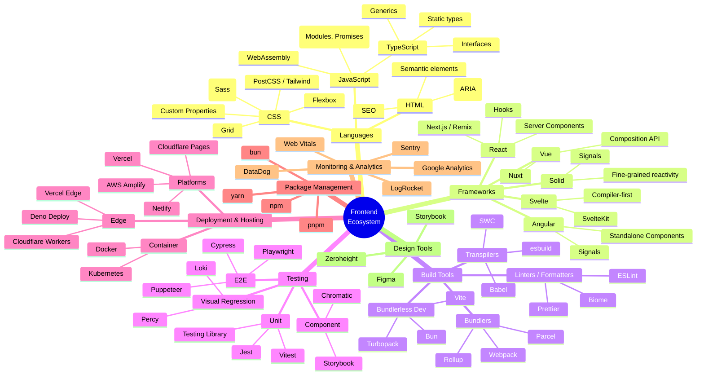
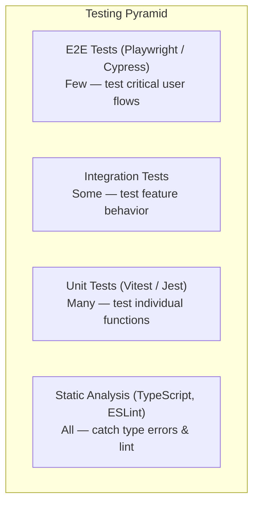

# Modern Frontend Ecosystem

## Mind Map



## Languages

### HTML
```html
<!-- Semantic HTML example -->
<header>
  <nav aria-label="Main navigation">
    <ul>
      <li><a href="/">Home</a></li>
      <li><a href="/about">About</a></li>
    </ul>
  </nav>
</header>
<main>
  <article>
    <h1>Blog Post Title</h1>
    <time datetime="2024-03-15">March 15, 2024</time>
    <p>Content here...</p>
  </article>
</main>
<footer>
  <small>&copy; 2024 Company</small>
</footer>
```

### CSS
```css
/* Modern CSS with Custom Properties and Grid */
:root {
  --primary: #646cff;
  --surface: #1a1a2e;
  --text: #e0e0e0;
  --radius: 8px;
}

.layout {
  display: grid;
  grid-template-areas:
    "header header"
    "sidebar main"
    "footer footer";
  grid-template-columns: 250px 1fr;
  gap: 1rem;
}

.card {
  background: var(--surface);
  border-radius: var(--radius);
  padding: 1.5rem;
  box-shadow: 0 2px 8px rgba(0,0,0,0.1);
}

/* Responsive without media queries (clamp) */
.responsive-text {
  font-size: clamp(1rem, 2.5vw, 2rem);
}
```

### JavaScript / TypeScript
```typescript
// Modern TypeScript example
interface User {
  id: string;
  name: string;
  email: string;
  role: 'admin' | 'user';
}

const fetchUsers = async (): Promise<User[]> => {
  const res = await fetch('/api/users');
  if (!res.ok) throw new Error(`HTTP ${res.status}`);
  return res.json();
};

// Generic utility
const createState = <T>(initial: T) => {
  let value = initial;
  const listeners = new Set<(v: T) => void>();
  return {
    get: () => value,
    set: (next: T | ((prev: T) => T)) => {
      value = typeof next === 'function'
        ? (next as (prev: T) => T)(value)
        : next;
      listeners.forEach(fn => fn(value));
    },
    subscribe: (fn: (v: T) => void) => {
      listeners.add(fn);
      return () => listeners.delete(fn);
    },
  };
};
```

## Frameworks Comparison

| Framework | Type | Bundle Size | Learning Curve | Stars (GitHub) | Best For |
|-----------|------|-------------|----------------|----------------|----------|
| **React** | Library | ~40 KB gzip | Moderate | ~220k | Large apps, ecosystem |
| **Vue** | Framework | ~33 KB gzip | Easy | ~206k | Progressive apps |
| **Angular** | Framework | ~90 KB gzip | Steep | ~94k | Enterprise apps |
| **Svelte** | Compiler | ~2 KB gzip | Easy | ~76k | Small-to-medium apps |
| **Solid** | Library | ~7 KB gzip | Moderate (if React exp) | ~31k | High-perf apps |
| **Qwik** | Framework | ~1 KB gzip | Moderate | ~20k | Instant-load apps |

### React Example
```tsx
function Counter() {
  const [count, setCount] = useState(0);
  return (
    <button onClick={() => setCount(c => c + 1)}>
      Count: {count}
    </button>
  );
}
```

### Vue Example
```vue
<script setup lang="ts">
import { ref } from 'vue'
const count = ref(0)
</script>

<template>
  <button @click="count++">Count: {{ count }}</button>
</template>
```

### Svelte Example
```svelte
<script lang="ts">
  let count = 0;
</script>

<button on:click={() => count++}>
  Count: {count}
</button>
```

## Build Tools Evolution

```
2015: Grunt / Gulp (task runners)
   │
   ▼
2016: Webpack (bundler, config-heavy)
   │
   ▼
2018: Parcel (zero-config)
   │
   ▼
2020: Vite (ESM-native dev server) ⭐ Current Default
   │
   ▼
2022: Turbopack (Rust-based, by Vercel)
   │
   ▼
2024: Bun (all-in-one: runtime + bundler + package manager)
```

| Tool | Type | Language | Dev Speed | Build Speed | Config |
|------|------|----------|-----------|-------------|--------|
| **Vite** | Dev server + bundler | JS/Go | Instant HMR | Fast (Rollup) | Minimal |
| **Webpack** | Bundler | JS | Slow HMR | Slow | Heavy |
| **Turbopack** | Bundler | Rust | Fast HMR | Very fast | Minimal |
| **esbuild** | Bundler (low-level) | Go | N/A | Extremely fast | Minimal |
| **SWC** | Transpiler | Rust | N/A | Extremely fast | Minimal |
| **Bun** | Runtime + bundler | Zig | Fast | Fast | Minimal |

## Testing Stack



### Vitest Example
```typescript
// sum.ts
export const sum = (a: number, b: number) => a + b;

// sum.test.ts
import { describe, it, expect } from 'vitest';
import { sum } from './sum';

describe('sum', () => {
  it('adds two numbers', () => {
    expect(sum(1, 2)).toBe(3);
  });

  it('handles negative numbers', () => {
    expect(sum(-1, -2)).toBe(-3);
  });
});
```

### Playwright Example
```typescript
import { test, expect } from '@playwright/test';

test('user can log in and see dashboard', async ({ page }) => {
  await page.goto('/login');
  await page.fill('[name="email"]', 'user@example.com');
  await page.fill('[name="password"]', 'password123');
  await page.click('button[type="submit"]');
  await expect(page.locator('h1')).toHaveText('Dashboard');
  await expect(page).toHaveURL('/dashboard');
});
```

## Deployment Platforms

| Platform | Focus | Features | Cost |
|----------|-------|----------|------|
| **Vercel** | Next.js, SSR | Edge functions, analytics, ISR | Free tier, paid for scale |
| **Netlify** | JAMstack, SSG | Forms, identity, functions | Free tier |
| **Cloudflare Pages** | Static + edge | Unlimited bandwidth, workers | Free tier |
| **AWS Amplify** | Fullstack | Auth, GraphQL, hosting | Pay-as-you-go |
| **Railway** | Fullstack apps | Simple deploys, DBs | Pay-as-you-go |

## Ecosystem Snapshot (2024-2025)

```
┌────────────────────────────────────────────────────────────────┐
│                    TYPICAL MODERN FRONTEND STACK                │
│                                                                │
│  Framework:  React 18 + Next.js 14 (App Router)                │
│  Language:   TypeScript 5.x                                    │
│  Styling:    Tailwind CSS 3.x                                  │
│  Build:      Vite / Turbopack                                  │
│  State:      Zustand / TanStack Query                          │
│  Testing:    Vitest + Playwright                                │
│  Linting:    ESLint + Prettier (+ Biome emerging)              │
│  Monorepo:   Turborepo / Nx                                    │
│  Package:    pnpm                                              │
│  Deploy:     Vercel / Docker + AWS                             │
│  Monitoring: Sentry + Vercel Analytics                         │
│  Design:     Figma → Storybook → Chromatic                     │
└────────────────────────────────────────────────────────────────┘
```

## Key Insight

> The frontend ecosystem evolves rapidly. Don't chase every new tool — understand **categories** (a bundler, a framework, a testing tool). When you know what category a problem belongs to, you can evaluate any tool in that space.
