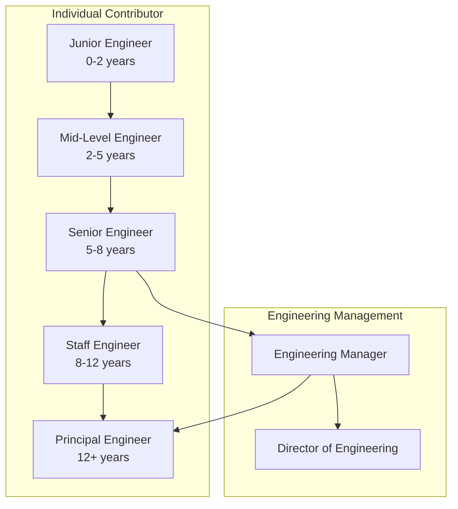
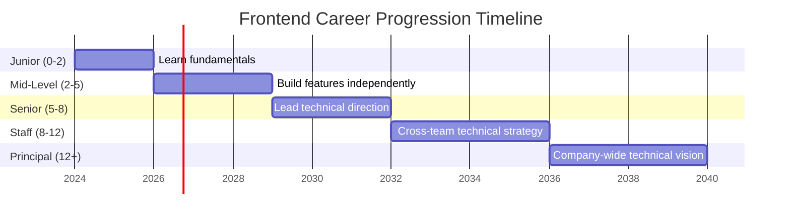
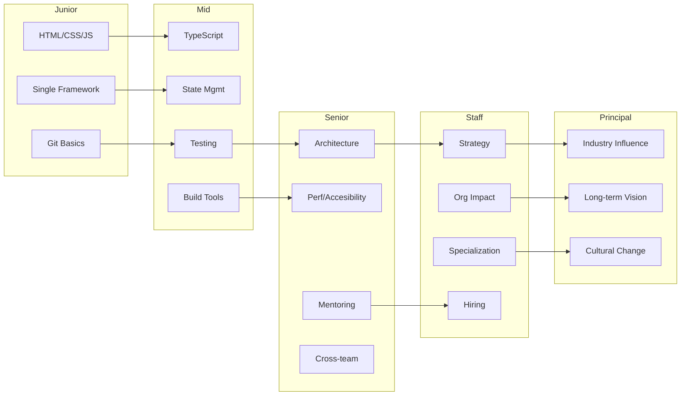

# Frontend Career Roadmap

## The Career Ladder



## Level Breakdown

### Junior Engineer (0–2 years)

```
┌─────────────────────────────────────────────────────────────┐
│  "I can build features with supervision"                    │
├─────────────────────────────────────────────────────────────┤
│  Core Skills:                                               │
│  ✓ HTML, CSS, JavaScript fundamentals                       │
│  ✓ One framework (React/Vue) — basic components             │
│  ✓ Git (add, commit, push, pull, branches)                  │
│  ✓ Basic responsive design                                  │
│  ✓ Consume REST APIs (fetch/axios)                          │
│  ✓ Debug with DevTools (Console, Network, Elements)         │
│                                                             │
│  Needs help with:                                           │
│  ✗ Architecture decisions                                   │
│  ✗ Performance optimization                                 │
│  ✗ Complex state management                                 │
│  ✗ Testing strategies                                       │
└─────────────────────────────────────────────────────────────┘
```

### Mid-Level Engineer (2–5 years)

```
┌─────────────────────────────────────────────────────────────┐
│  "I can own features end-to-end"                            │
├─────────────────────────────────────────────────────────────┤
│  Core Skills:                                               │
│  ✓ Deep framework knowledge (hooks, lifecycle, patterns)    │
│  ✓ State management (Redux, Zustand, TanStack Query)        │
│  ✓ TypeScript — generics, utility types                     │
│  ✓ Unit/integration testing                                 │
│  ✓ Build tooling (Vite/Webpack)                             │
│  ✓ CI/CD basics                                             │
│  ✓ Performance basics (lazy loading, bundle analysis)       │
│  ✓ Cross-browser compatibility                              │
│                                                             │
│  Starts contributing to:                                    │
│  • Code review                                              │
│  • Technical discussions                                    │
│  • Estimating effort                                        │
└─────────────────────────────────────────────────────────────┘
```

### Senior Engineer (5–8 years)

```
┌─────────────────────────────────────────────────────────────┐
│  "I lead technical direction for a domain"                  │
├─────────────────────────────────────────────────────────────┤
│  Core Skills:                                               │
│  ✓ Architecture design (component trees, data flow)         │
│  ✓ Advanced performance (Core Web Vitals, profiling)        │
│  ✓ Accessibility mastery (WCAG 2.1 AA/AAA)                  │
│  ✓ Testing strategy (what to test, how to mock)             │
│  ✓ Mentoring juniors/mid-level                              │
│  ✓ Cross-team collaboration                                 │
│  ✓ Technical decision-making (RFCs, ADRs)                   │
│  ✓ Security-conscious development                           │
│                                                             │
│  Outputs:                                                   │
│  • Design documents                                         │
│  • Code review culture                                      │
│  • Technical talks / knowledge sharing                      │
└─────────────────────────────────────────────────────────────┘
```

### Staff Engineer (8–12 years)

```
┌─────────────────────────────────────────────────────────────┐
│  "I set technical strategy across multiple teams"           │
├─────────────────────────────────────────────────────────────┤
│  Core Skills:                                               │
│  ✓ Cross-team architecture influence                        │
│  ✓ Deep specialization (perf, a11y, infra)                  │
│  ✓ Build vs buy decisions                                   │
│  ✓ Org-wide standards (design system, testing conventions)  │
│  ✓ Unblocking teams — technical and organizational          │
│  ✓ Hiring and interviewing                                  │
│                                                             │
│  Outputs:                                                   │
│  • Multi-quarter technical roadmaps                         │
│  • Engineering-wide initiatives                             │
│  • Platform/tool creation                                   │
└─────────────────────────────────────────────────────────────┘
```

### Principal Engineer (12+ years)

```
┌─────────────────────────────────────────────────────────────┐
│  "I shape the engineering vision of the company"            │
├─────────────────────────────────────────────────────────────┤
│  Core Skills:                                               │
│  ✓ Industry influence (talks, OSS, writing)                 │
│  ✓ Company-wide technical strategy                          │
│  ✓ Extreme cross-domain knowledge (backend, infra, product) │
│  ✓ Anticipates problems 2-3 years ahead                     │
│  ✓ Drives cultural change                                   │
│                                                             │
│  Outputs:                                                   │
│  • Company technical vision                                 │
│  • Architectural decisions that last years                  │
│  • Growing other Staff+ engineers                           │
└─────────────────────────────────────────────────────────────┘
```

## Salary Ranges (USD, Approximate)

| Level | India (₹) | US (Global) | Remote (US-based) |
|-------|-----------|-------------|-------------------|
| **Junior** | ₹3L–₹8L | $60k–$90k | $50k–$80k |
| **Mid** | ₹8L–₹20L | $90k–$140k | $80k–$130k |
| **Senior** | ₹20L–₹40L | $140k–$220k | $130k–$200k |
| **Staff** | ₹40L–₹70L | $200k–$350k | $180k–$300k |
| **Principal** | ₹70L–₹1Cr+ | $300k–$600k+ | $250k–$500k |

*Note: Total compensation includes base salary + stock + bonus. FAANG+ companies typically pay at the higher end of each range.*

## Timeline Expectations



## Skills by Level



## How to Level Up

### Junior → Mid
- Build 3–5 complete features end-to-end
- Learn TypeScript properly (not just `: any`)
- Write tests for everything you build
- Understand the build tooling (Vite config, environment variables)
- Give your first code review

### Mid → Senior
- Lead the architecture for a medium-sized feature
- Mentor a junior developer
- Write a technical design document (RFC/ADR)
- Deep-dive into performance (use Lighthouse, Profiler)
- Speak at a team demo or internal tech talk

### Senior → Staff
- Span multiple teams — solve problems that don't belong to one team
- Build tooling/platforms that amplify other engineers
- Develop a deep specialization (accessibility, performance, infra)
- Drive the hiring process (design interview questions, run loops)

### Staff → Principal
- Write tech strategy documents that influence the company direction
- Represent the company at industry conferences
- Build open-source projects or internal platforms used org-wide
- Develop other Staff+ engineers through sponsorship

## Key Takeaway

> Career growth is not about years — it's about **impact scope**. Junior impacts their own ticket. Senior impacts their team. Staff impacts the org. Principal impacts the industry. Always ask: "Who benefits from my work?"
