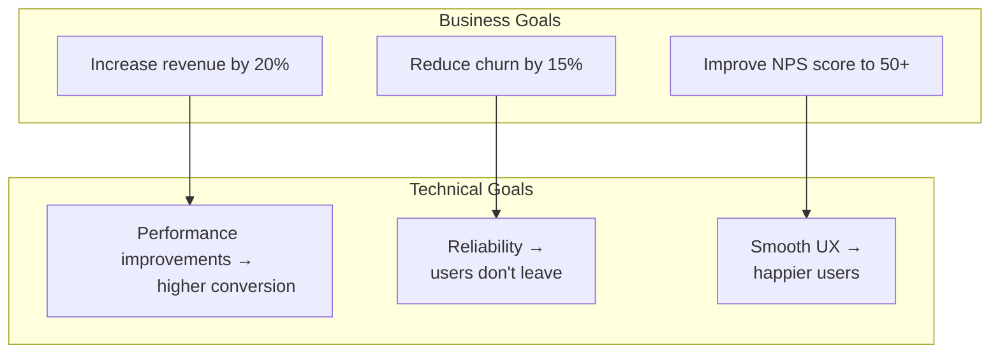
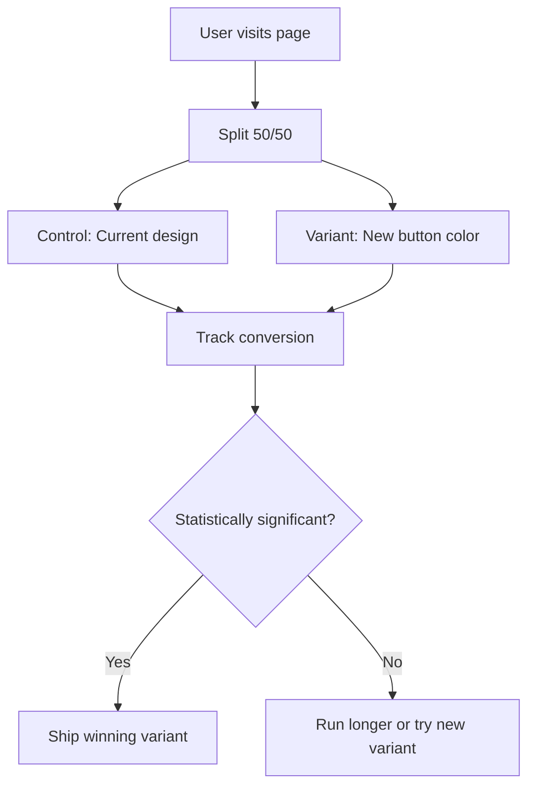

# Product Thinking

## What is Product Thinking?

> Product thinking means understanding **why** you're building something — not just **how**. It's the ability to connect technical work to user needs and business goals.

```
┌─────────────────────────────────────────────────────────┐
│                    PRODUCT-THINKING ENGINEER              │
│                                                         │
│  "I'm not just building a dropdown.                     │
│   I'm enabling users to filter 10,000 products          │
│   in under 2 seconds so they can find what they          │
│   need and complete a purchase."                        │
│                                                         │
│  ┌──────────┐   ┌──────────┐   ┌──────────┐            │
│  │ USER     │   │ BUSINESS │   │ TECHNICAL│            │
│  │ NEED     │──►│ GOAL     │──►│ SOLUTION │            │
│  └──────────┘   └──────────┘   └──────────┘            │
│       ▲              ▲               ▲                  │
│       │              │               │                  │
│       └──────────────┴───────────────┘                  │
│              ALIGNMENT                                  │
└─────────────────────────────────────────────────────────┘
```

## Understanding User Needs

### The Problem-Solution Gap

```
Users don't want a drill. They want a hole in the wall.

┌─────────────────────────────────────────────────────┐
│                   USER NEEDS                         │
│                                                      │
│  "I need to hang a shelf"                           │
│         │                                            │
│         ▼                                            │
│  Problem: No shelf on wall                          │
│         │                                            │
│         ▼                                            │
│  Job To Be Done: Attach shelf to wall               │
│         │                                            │
│         ▼                                            │
│  Solution (surface): "Buy a drill"                  │
│         │                                            │
│         ▼                                            │
│  Solution (real): "Create a hole, insert anchor,    │
│                    screw in bracket"                 │
└─────────────────────────────────────────────────────┘
```

### User Research Methods

| Method | What You Learn | When to Use |
|--------|---------------|-------------|
| **User interviews** | Deep qualitative insights | Early discovery |
| **Surveys** | Quantitative data at scale | Validation |
| **Analytics** | What users actually do | Post-launch |
| **A/B testing** | Which version performs better | Optimization |
| **Usability testing** | Where users struggle | Before/after launch |
| **Heatmaps** | Where users click/scroll | UX improvement |
| **Support tickets** | What frustrates users | Continuous |

```javascript
// Adding analytics to understand user behavior
function trackFilterUsage(filterType, filterValue, resultCount) {
  analytics.track('filter_applied', {
    filterType,
    filterValue,
    resultCount,
    timestamp: Date.now(),
    page: window.location.pathname,
  });
}

// Later, product manager can query:
// "70% of users apply 'price' filter first"
// → Move price filter to the top of the filter panel
```

## Business Goals vs Technical Goals



### Aligning Tech Work to Business Outcomes

| Business Goal | Technical Initiative | Metric |
|--------------|---------------------|--------|
| Increase signups (revenue) | Simplify onboarding flow | Signup completion rate ↑ |
| Reduce cart abandonment | Improve checkout performance | Checkout load time ↓ |
| Improve user retention | Personalize homepage | DAU/MAU ratio ↑ |
| Expand to new markets | Internationalization (i18n) | % traffic from new regions |
| Reduce support costs | Self-service dashboard | Support ticket volume ↓ |

### Saying No (Tactfully)

```
Feature Request: "Can we add confetti animation everywhere?"
                        
┌─────────────────────────────────────────────────────────┐
│  "I understand the desire to make the app delightful.   │
│   However, adding confetti to 20 pages would:           │
│   ・ Add 150KB to the bundle                            │
│   ・ Conflict with our current animation library         │
│   ・ Take 2 weeks away from the checkout optimization   │
│                                                         │
│   Alternative: Let's A/B test confetti on the           │
│   purchase-complete page only — highest impact,         │
│   lowest cost."                                         │
└─────────────────────────────────────────────────────────┘
```

## MVPs and Iterative Development

```
                    ┌──────────────────┐
                    │   BIG LAUNCH     │
                    │   (Not this)     │
                    │  ┌────────────┐  │
                    │  │ All        │  │
                    │  │ features   │  │
                    │  │ ever       │  │
                    │  └────────────┘  │
                    └──────────────────┘
                           ✗
                           
                    ┌──────────────────┐
                    │   MVP → Iterate  │
                    │   (This!)        │
                    │  ┌────────────┐  │
                    │  │ Core       │──┤──► Feature
                    │  │ value      │  │    │
                    │  └────────────┘  │    ▼
                    │  ┌────────────┐  │  ┌──────────────┐
                    │  │ Learn from │──┤──│ Add          │
                    │  │ users      │  │  │ improvements │
                    │  └────────────┘  │  └──────────────┘
                    └──────────────────┘
```

### MVP Definition

```
An MVP is not the smallest possible product —
it's the smallest product that delivers value and validates learning.

┌─────────────────────────────────────────────────────────┐
│  Questions an MVP should answer:                        │
│                                                         │
│  1. Will users use this? (desirability)                 │
│  2. Can we build this? (feasibility)                    │
│  3. Can this be profitable? (viability)                 │
└─────────────────────────────────────────────────────────┘
```

### Example MVP Scope

| Feature | MVP | V2 | V3 |
|---------|-----|----|----|
| User auth | Email + password | Google OAuth | Biometric |
| Search | Basic text search | Filters + sorting | Semantic search |
| Dashboard | Static chart | Interactive chart | AI-powered insights |
| Payments | Stripe checkout | Saved cards | Crypto/BNPL |

```javascript
// MVP approach: start simple, then optimize
// MVP: Server-side search
async function searchProducts(query) {
  const res = await fetch(`/api/search?q=${query}`);
  return res.json();
}

// V2: Client-side caching
const searchCache = new Map();
async function searchProducts(query) {
  if (searchCache.has(query)) return searchCache.get(query);
  const res = await fetch(`/api/search?q=${query}`);
  const data = await res.json();
  searchCache.set(query, data);
  return data;
}

// V3: Debounced search with optimistic UI
function useSearch() {
  const [query, setQuery] = useState('');
  const [results, setResults] = useState([]);
  const debouncedQuery = useDebounce(query, 300);

  useEffect(() => {
    if (!debouncedQuery) return;
    fetch(`/api/search?q=${debouncedQuery}`)
      .then(res => res.json())
      .then(setResults);
  }, [debouncedQuery]);

  return { query, setQuery, results };
}
```

## A/B Testing & Analytics



### A/B Testing Checklist

| Item | Why |
|------|-----|
| **Single variable** | Change one thing at a time (or you won't know what caused the change) |
| **Sufficient sample size** | Small samples give unreliable results |
| **Statistical significance** | Typically p < 0.05 (95% confidence) |
| **Duration** | Run for at least 1 full business cycle (usually 1-2 weeks) |
| **Segment results** | Does the variant help new users but hurt returning users? |

```javascript
// Feature flag implementation for gradual rollout
const featureFlags = {
  newCheckout: {
    enabled: false,
    rolloutPercent: 0,     // 0-100
    userIds: [],           // specific users for testing
  },
};

// Check if feature is enabled for a user
function isEnabled(feature, userId) {
  const flag = featureFlags[feature];
  if (!flag) return false;
  if (flag.userIds.includes(userId)) return true;
  // Hash-based rollout
  const hash = simpleHash(userId) % 100;
  return hash < flag.rolloutPercent;
}

// Usage
if (isEnabled('newCheckout', user.id)) {
  render<NewCheckout>();
} else {
  render<LegacyCheckout>();
}
```

## Case Studies of Product-Driven Decisions

### Case Study 1: Airbnb's Search Redesign

```
Problem:  Users were not booking — they were searching 
          forever but never converting.

Research: Heatmaps showed users spent 80% of time on 
          search results but rarely filtered.

Insight:  Users didn't know what to search for — they 
          wanted inspiration, not just search.

Solution: "I'm Flexible" feature — show popular 
          destinations, map-based browsing, category 
          exploration ("Beachfront", "Cabins").

Result:   Bookings increased 25% in test regions.
          */

Technical: Frontend team built a map-based exploration UI,
           lazy-loaded destination images, cached popular 
           categories for instant load.
```

### Case Study 2: Spotify's Discover Weekly

```
Problem:  Users listened to the same playlists — churn 
          risk due to lack of new content discovery.

Research: Users wanted new music but didn't know how 
          to find it. Discovery felt like work.

Insight:  Users trust algorithmic recommendations when 
          they're personalized and feel "curated."

Solution: Discover Weekly — a 30-song playlist generated 
          by collaborative filtering + audio analysis, 
          delivered every Monday.

Result:   Users spent 30% more time on the app.
          Discover Weekly became Spotify's signature feature.

Technical: Frontend handled smooth playlist loading,
           offline caching, and the "Like/Save" interaction 
           with optimistic updates.
```

### Case Study 3: Duolingo's Streak Feature

```
Problem:  Users would try the app once and never return.

Research: Behavioral science shows "loss aversion" — 
          people hate losing progress more than they 
          like gaining it.

Insight:  If users build a habit streak, they'll return 
          daily to protect it.

Solution: Streak counter, streak freeze (paid currency),
          notifications: "Don't lose your 30-day streak!"

Result:   DAU increased 50%. Streak freezes became a 
          major revenue driver.

Technical: Frontend showed animated streak counter,
           confetti on milestones, "streak at risk" 
           notifications, and a calendar heatmap.
```

## Product-First Decision Making

```javascript
// Before: Tech-first thinking
function PriceDisplay({ price, currency }) {
  // "Let's use the most elegant API"
  return <Intl.NumberFormat('en-US', {
    style: 'currency',
    currency,
  }).format(price);
}

// After: Product-first thinking
function PriceDisplay({ price, currency, user }) {
  // "Let's optimize for conversion"
  const locale = getUserLocale(user);       // en-US, de-DE, ja-JP
  const showDecimal = price < 100;           // Hide decimals for large prices
  const format = getLocalizedFormat(user);   // $10.99 vs 10,99€

  return (
    <span className="price" aria-label={`${price} ${currency}`}>
      {formatPrice(price, locale, showDecimal)}
    </span>
  );
}
```

## Key Questions to Ask

```
Before coding anything, ask:

┌─────────────────────────────────────────────────────────┐
│  1. What problem are we solving?                        │
│  2. Who is this for?                                    │
│  3. How will we measure success?                        │
│  4. What is the simplest version that works?            │
│  5. What assumptions are we making?                     │
│  6. How will users discover this?                       │
│  7. What happens if we do nothing?                      │
└─────────────────────────────────────────────────────────┘
```

## Key Takeaway

> The best frontend engineers don't just write code — they build **solutions** that solve **real problems** for **real people**. Product thinking is what turns a developer into a partner who shapes the product, not just implements tickets.
