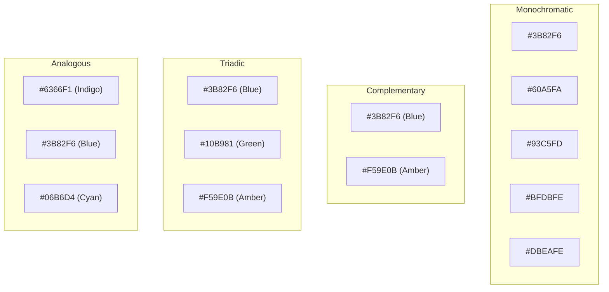
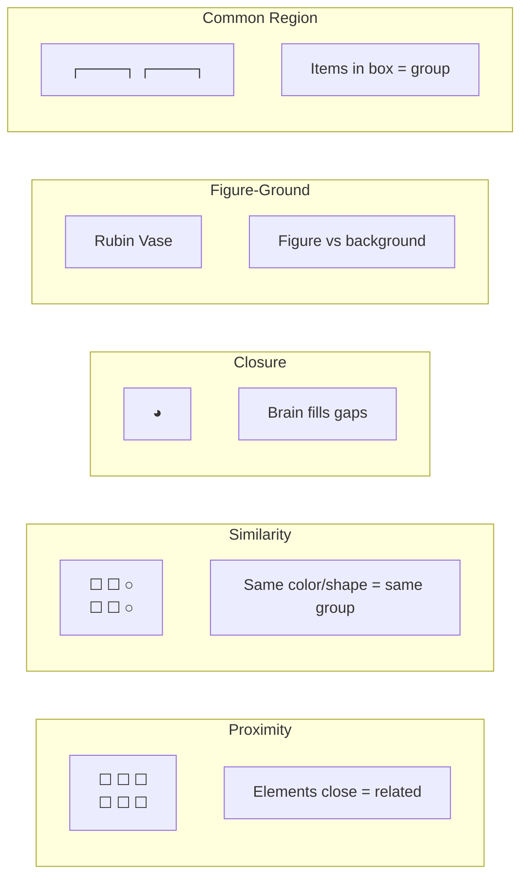

# UI/UX Fundamentals for Frontend Engineers

## UI vs UX

```
┌─────────────────────────────────────────────────────────┐
│  UI (User Interface)       UX (User Experience)         │
│  ─────────────────────     ─────────────────────        │
│  What users SEE            What users FEEL              │
│  Colors, typography,       Flow, ease of use,           │
│  spacing, layout, icons    satisfaction, efficiency     │
│                                                         │
│  "The button is blue"      "The button is easy to find  │
│                             and click"                  │
│                                                         │
│  UI is the LOOK            UX is the FEEL               │
│                                                         │
│  ┌────────────────┐        ┌────────────────┐           │
│  │                │        │                │           │
│  │   BEAUTIFUL    │        │   FUNCTIONAL   │           │
│  │   but          │        │   but           │           │
│  │   CONFUSING    │        │   UGLY          │           │
│  │                │        │                │           │
│  │   ✗ UX         │        │   ✓ UX         │           │
│  │   ✓ UI         │        │   ✗ UI         │           │
│  └────────────────┘        └────────────────┘           │
└─────────────────────────────────────────────────────────┘
```

## Visual Hierarchy

```
Visual hierarchy is the arrangement of elements by importance.
Users scan — they don't read.

┌─────────────────────────────────────────────────────────┐
│  POOR HIERARCHY                   GOOD HIERARCHY        │
│                                                         │
│  Some Title Here                 SHOP OUR SALE          │
│  This is a smaller subtitle      Up to 60% off          │
│  Some more random text           everything!             │
│  and then some more              ────────────────────   │
│  text that no one will           Limited time offer.    │
│  read because it's all           Shop now before it     │
│  the same size and               ends.                  │
│  color.                                                 │
│                                                         │
│  [Button]                       [Shop Now →]            │
└─────────────────────────────────────────────────────────┘
```

### Techniques for Visual Hierarchy

| Technique | How | Example |
|-----------|-----|---------|
| **Size** | Bigger = more important | H1 > H2 > H3 > body |
| **Color** | High contrast = attention | CTA button in brand color |
| **Spacing** | More space = separate sections | Card margins |
| **Weight** | Bold = emphasis | Price, headings |
| **Position** | Top/left = most attention | Navigation at top |
| **Typography** | Mix serif/sans-serif for contrast | Headings in serif, body in sans |

## Spacing Systems

```
Consistent spacing creates rhythm and makes UIs feel polished.

Instead of random values:   margin-top: 7px; padding: 13px;
Use a scale:                4, 8, 12, 16, 20, 24, 32, 40, 48, 64, 80, 96...

┌─────────────────────────────────────────────────────────┐
│  Example: 8px Grid System                               │
│                                                         │
│  4px  ─ tiny gap (icon + text)                          │
│  8px  ─ tight gap (list items)                          │
│  16px ─ standard gap (card padding)                     │
│  24px ─ section separation                              │
│  32px ─ large section gap                               │
│  48px ─ page sections                                   │
│  64px ─ major page blocks                               │
└─────────────────────────────────────────────────────────┘
```

```css
/* Spacing scale as CSS custom properties */
:root {
  --space-1: 4px;
  --space-2: 8px;
  --space-3: 12px;
  --space-4: 16px;
  --space-5: 20px;
  --space-6: 24px;
  --space-8: 32px;
  --space-10: 40px;
  --space-12: 48px;
  --space-16: 64px;
}

/* Usage */
.card {
  padding: var(--space-6);
  margin-bottom: var(--space-8);
}

.card-title {
  margin-bottom: var(--space-2);
}
```

## Typography

```
Readability is the #1 goal of typography on the web.

┌─────────────────────────────────────────────────────────┐
│  Anatomy of Type                                        │
│                                                         │
│    ┌──── ascender ────┐                                 │
│    │                   │                                 │
│   ┌┤├┐  x-height       │  Cap height                    │
│   ││││                 │                                 │
│   └┤├┘  baseline ──────┘                                 │
│    │                   │                                 │
│    └── descender ──────┘                                 │
│                                                         │
│  Key Terms:                                              │
│  · line-height: 1.5 (150% of font-size) — comfortable   │
│  · max-width: 60-75ch (characters per line) — readable   │
│  · font-size: 16px minimum (accessibility)               │
└─────────────────────────────────────────────────────────┘
```

### Typography System

```css
:root {
  --font-sans: 'Inter', -apple-system, sans-serif;
  --font-mono: 'JetBrains Mono', 'Fira Code', monospace;

  --text-xs: 0.75rem;     /* 12px */
  --text-sm: 0.875rem;    /* 14px */
  --text-base: 1rem;      /* 16px */
  --text-lg: 1.125rem;    /* 18px */
  --text-xl: 1.25rem;     /* 20px */
  --text-2xl: 1.5rem;     /* 24px */
  --text-3xl: 1.875rem;   /* 30px */
  --text-4xl: 2.25rem;    /* 36px */

  --leading-tight: 1.25;
  --leading-normal: 1.5;
  --leading-relaxed: 1.625;
}

body {
  font-family: var(--font-sans);
  font-size: var(--text-base);
  line-height: var(--leading-normal);
  max-width: 75ch;
}
```

## Color Theory

### Color Schemes



### Color System for UI

```css
:root {
  /* Brand colors */
  --primary: #3B82F6;
  --primary-hover: #2563EB;
  --primary-light: #DBEAFE;

  /* Semantic colors */
  --success: #10B981;
  --warning: #F59E0B;
  --error: #EF4444;
  --info: #3B82F6;

  /* Neutral scale */
  --gray-50: #F9FAFB;
  --gray-100: #F3F4F6;
  --gray-200: #E5E7EB;
  --gray-300: #D1D5DB;
  --gray-400: #9CA3AF;
  --gray-500: #6B7280;
  --gray-600: #4B5563;
  --gray-700: #374151;
  --gray-800: #1F2937;
  --gray-900: #111827;

  /* Light/Dark */
  --bg: #FFFFFF;
  --bg-secondary: var(--gray-50);
  --text: var(--gray-900);
  --text-secondary: var(--gray-500);
  --border: var(--gray-200);
}

/* Accessibility: contrast ratio must be >= 4.5:1 for normal text */
/* WCAG AA requires at least 4.5:1 for small text, 3:1 for large text */
```

## Consistency, Affordance, Feedback

### Consistency

```
┌────────────────────────────────────────────┐
│  INCONSISTENT          CONSISTENT           │
│                                            │
│  [Save]  [Save]        [Save]  [Cancel]    │
│  [保存]  [Speichern]   [Save]  [Cancel]    │
│                                            │
│  · Primary buttons are always blue          │
│  · Secondary buttons are always outlined   │
│  · Destructive actions are always red      │
│  · Same patterns throughout the app        │
└────────────────────────────────────────────┘
```

### Affordance

```
Affordance = visual cues that tell users how to interact.

┌────────────────────────────────────────────┐
│  GOOD AFFORDANCE        POOR AFFORDANCE    │
│                                            │
│  ┌──────────┐          Some text here      │
│  │ Click Me │          (looks like text    │
│  │ (button) │           but is actually    │
│  └──────────┘           a clickable link)  │
│                                            │
│  · Buttons look like they can be clicked   │
│  · Links are underlined/colored            │
│  · Inputs have borders + focus states      │
│  · Cards have hover effects                │
└────────────────────────────────────────────┘
```

### Feedback

```
Every user action should have a reaction.

┌────────────────────────────────────────────┐
│  ACTION           FEEDBACK                 │
│                                            │
│  Click button  →  Button depresses         │
│                   Loading spinner          │
│                   "Saved!" toast           │
│                                            │
│  Form error     →  Red border on field     │
│                   Error message below      │
│                   Shake animation          │
│                                            │
│  Drag item      →  Item follows cursor     │
│                   Drop zone highlights     │
│                   "Item moved" indicator   │
│                                            │
│  Page loaded    →  Content appears         │
│                   (no blank white flash)   │
└────────────────────────────────────────────┘
```

```javascript
// Example: Button with loading state
function SubmitButton({ loading, onClick, children }) {
  return (
    <button
      onClick={onClick}
      disabled={loading}
      aria-busy={loading}
      className={`btn ${loading ? 'btn--loading' : ''}`}
    >
      {loading ? (
        <>
          <span className="spinner" aria-hidden="true" />
          Saving...
        </>
      ) : children}
    </button>
  );
}
```

## Laws of UX

### Fitts's Law

```
The time to acquire a target is a function of the distance
to the target and the size of the target.

                    ┌──────────────────┐
                    │                  │
                    │   BIG TARGET     │
                    │   ↑ Fast click   │
                    │                  │
                    └──────────────────┘

  ┌──┐
  │  │  Small target → slow click (X close button)
  └──┘

Application:
· Buttons should be large enough (minimum 44x44px touch target)
· Important actions in easy-to-reach places (corners, thumb zone)
· Margins around clickable elements prevent mis-clicks
```

### Hicks Law

```
The time it takes to make a decision increases with the
number and complexity of choices.

❌ Too many choices:
┌────────────────────────────────────┐
│  Shop by Category (20 options)     │
│  Sort by: Price, Rating, Newest,  │
│  Popular, Discount, Brand... (12)  │
│  Filter: Color (8), Size (6)       │
│  ...                              │
└────────────────────────────────────┘

✓ Progressive disclosure:
┌────────────────────────────────────┐
│  Search: [_______________]         │
│                                    │
│  Popular Categories:               │
│  [Electronics] [Clothing] [Home]   │
│                                    │
│  Sort by: [Most Popular ▼]         │
└────────────────────────────────────┘

Application:
· Break complex tasks into steps (wizard pattern)
· Show fewer options, use "Show more" for the rest
· Defaults matter — pre-select the most common choice
```

### Gestalt Principles



```css
/* Applying Gestalt principles in CSS */
/* Proximity: space related items close together */
.card__meta {
  display: flex;
  gap: 4px;  /* tight gap for related items */
}

/* Similarity: all buttons share the same shape */
button, .btn {
  border-radius: 6px;
  font-weight: 500;
}

/* Common Region: wrap related items in a card */
.card {
  border: 1px solid var(--border);
  border-radius: 8px;
  padding: 16px;
}
```

## Accessibility as UX

```
Accessibility is not a checklist — it's part of UX.

┌─────────────────────────────────────────────────────────┐
│  1 in 5 people have some form of disability.            │
│                                                         │
│  Accessibility benefits EVERYONE:                       │
│  · Captions → people in noisy environments              │
│  · High contrast → people in bright sunlight            │
│  · Keyboard nav → people with broken mice               │
│  · Clear labels → everyone understands faster           │
└─────────────────────────────────────────────────────────┘
```

### Accessibility Basics for Developers

```html
<!-- ❌ Inaccessible -->
<div class="card" onclick="handleClick()">
  
  <div>Product Name</div>
  <div>$19.99</div>
</div>

<!-- ✅ Accessible -->
<article class="card">
  <h2>Product Name</h2>
  
  <p>$19.99</p>
  <a href="/products/123">View details</a>
</article>
```

```css
/* Focus styles — don't remove them, style them! */
:focus-visible {
  outline: 2px solid var(--primary);
  outline-offset: 2px;
  border-radius: 2px;
}

/* Reduced motion preference */
@media (prefers-reduced-motion: reduce) {
  *, *::before, *::after {
    animation-duration: 0.01ms !important;
    transition-duration: 0.01ms !important;
  }
}
```

## Figma Basics for Developers

```
┌─────────────────────────────────────────────────────────┐
│  FIGMA FOR DEVELOPERS                                   │
│                                                         │
│  What you need to know:                                 │
│                                                         │
│  1. Reading designs: layers, frames, components         │
│  2. Inspect panel: CSS values, spacing, colors          │
│  3. Auto Layout: Flexbox-equivalent in Figma            │
│  4. Variants: component states (hover, active, disabled)│
│  5. Constraints: responsive behavior                    │
│  6. Plugins: "Design Tokens" → export to CSS/JSON       │
│                                                         │
│  Workflow:                                              │
│  Design → Inspect → Implement → (Storybook) → Review   │
└─────────────────────────────────────────────────────────┘
```

### Extracting Design Tokens

```json
// figma-tokens.json — synced from Figma via plugin
{
  "color": {
    "primary": { "value": "#3B82F6" },
    "text": { "value": "#111827" },
    "background": { "value": "#FFFFFF" }
  },
  "spacing": {
    "xs": { "value": "4px" },
    "sm": { "value": "8px" },
    "md": { "value": "16px" }
  },
  "typography": {
    "heading1": {
      "value": {
        "fontFamily": "Inter",
        "fontWeight": 700,
        "fontSize": "36px",
        "lineHeight": "44px"
      }
    }
  }
}
```

## Common UI Patterns

| Pattern | Use Case | Implementation |
|---------|----------|---------------|
| **Card** | Group related content | `border-radius: 8px; box-shadow; padding` |
| **Modal** | Focused task without leaving page | `dialog` element or portal + overlay |
| **Skeleton** | Loading state indicator | Animated gradient placeholder |
| **Toast** | Non-blocking notifications | Fixed position, auto-dismiss |
| **Tabs** | Switch between related views | `role="tablist"`, aria attributes |
| **Accordion** | Progressive disclosure | `details` / `summary` element |
| **Breadcrumb** | Navigation hierarchy | `aria-label="breadcrumb"` |
| **Pagination** | Split large lists | Page numbers + next/prev buttons |

```jsx
// Skeleton component example
function Skeleton({ width = '100%', height = '16px', variant = 'text' }) {
  return (
    <div
      className="skeleton"
      style={{ width, height, borderRadius: variant === 'circle' ? '50%' : '4px' }}
      aria-hidden="true"
    />
  );
}

// Usage: loading state
function ProductCard({ product }) {
  if (!product) {
    return (
      <div className="card">
        <Skeleton height="200px" />
        <Skeleton width="70%" />
        <Skeleton width="40%" />
      </div>
    );
  }
  return <ActualCard product={product} />;
}
```

## Key Takeaway

> Great UI/UX is invisible. Users don't notice good design — they just feel like the app "works." As a frontend engineer, understanding these principles means you can implement designs faithfully, identify UX issues before they ship, and even contribute to design discussions.
