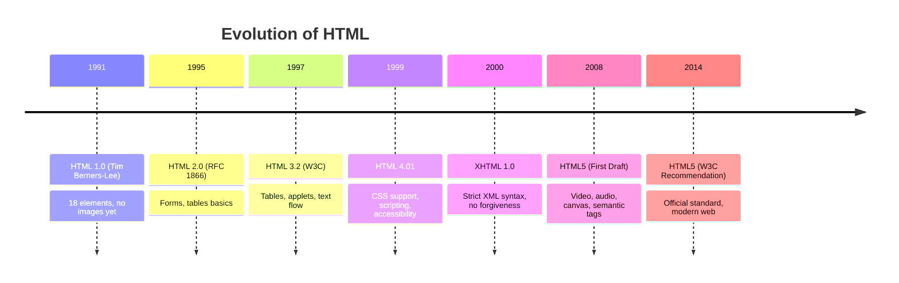

# Introduction to HTML

## What is HTML?

**HTML** (HyperText Markup Language) is the standard markup language for creating web pages and web applications. It describes the structure of a web page semantically using a system of **tags** and **attributes**.

```
 ┌─────────────────────────────────────────────────────┐
 │                   Web Page                           │
 │  ┌─────────────────────────────────────────────────┐ │
 │  │  HTML (Structure) ── Bones of the page          │ │
 │  │  CSS  (Presentation) ── Skin of the page        │ │
 │  │  JS   (Behavior) ── Muscles of the page         │ │
 │  └─────────────────────────────────────────────────┘ │
 └─────────────────────────────────────────────────────┘
```

## History Timeline



## The Role of HTML in the Web

- **Structure**: Defines headers, paragraphs, lists, links, images, etc.
- **Semantics**: Gives meaning to content (e.g., `<nav>` for navigation, `<article>` for articles).
- **Foundation**: Every web page starts with HTML. CSS and JS enhance it.

## Basic Document Structure

Every HTML document follows this skeleton:

```html
<!DOCTYPE html>
<html lang="en">
<head>
    <meta charset="UTF-8">
    <meta name="viewport" content="width=device-width, initial-scale=1.0">
    <title>My Web Page</title>
</head>
<body>
    <h1>Hello, World!</h1>
    <p>This is my first HTML page.</p>
</body>
</html>
```

### Breakdown

| Component | Purpose |
|-----------|---------|
| `<!DOCTYPE html>` | Declares HTML5 — tells the browser to render in standards mode |
| `<html>` | Root element of the document |
| `<head>` | Contains metadata (not displayed on the page) |
| `<body>` | Contains visible content |
| `<meta charset="UTF-8">` | Sets character encoding to support all Unicode characters |
| `<title>` | Appears in the browser tab and is used by search engines |

## DOCTYPE Deep Dive

The `<!DOCTYPE>` declaration is **not** an HTML tag. It is an instruction to the web browser about what version of HTML the page is written in.

- **HTML5**: `<!DOCTYPE html>` (case-insensitive)
- **HTML 4.01 Strict**: `<!DOCTYPE HTML PUBLIC "-//W3C//DTD HTML 4.01//EN" "http://www.w3.org/TR/html4/strict.dtd">`
- **XHTML 1.0 Strict**: `<!DOCTYPE html PUBLIC "-//W3C//DTD XHTML 1.0 Strict//EN" "http://www.w3.org/TR/xhtml1/DTD/xhtml1-strict.dtd">`

> **⚠️ Always use `<!DOCTYPE html>`** — it triggers **standards mode**, avoiding quirks mode inconsistencies.

## Browser Rendering Modes

```
 ┌─────────────────────────────────────┐
 │      Browser Receives HTML           │
 │              │                        │
 │    ┌─────────▼──────────┐            │
 │    │  Check DOCTYPE      │            │
 │    └─────────┬──────────┘            │
 │              │                        │
 │    ┌─────────▼──────────┐            │
 │    │  Standards Mode     │  ← Modern  │
 │    │  Almost Standards   │  ← Rare    │
 │    │  Quirks Mode        │  ← Legacy  │
 │    └─────────────────────┘            │
 └─────────────────────────────────────┘
```

## Real-World Example

```html
<!DOCTYPE html>
<html lang="en">
<head>
    <meta charset="UTF-8">
    <meta name="viewport" content="width=device-width, initial-scale=1.0">
    <meta name="description" content="A simple blog about web development">
    <title>DevBlog - Learn Web Development</title>
    <link rel="stylesheet" href="style.css">
</head>
<body>
    <header>
        <h1>DevBlog</h1>
        <nav>
            <a href="/">Home</a>
            <a href="/about">About</a>
            <a href="/contact">Contact</a>
        </nav>
    </header>

    <main>
        <article>
            <h2>Getting Started with HTML</h2>
            <p>HTML is the foundation of the web...</p>
        </article>
    </main>

    <footer>
        <p>&copy; 2026 DevBlog</p>
    </footer>
</body>
</html>
```

## Key Takeaways

1. HTML is a **markup language**, not a programming language.
2. The `<!DOCTYPE html>` declaration is mandatory.
3. Every HTML document needs `<html>`, `<head>`, and `<body>`.
4. Semantic tags improve SEO, accessibility, and code readability.
5. HTML5 introduced semantic elements, native media support, and the Canvas API.

---

**Next:** [02-HTML-Document.md](02-HTML-Document.md) — Deep dive into the document structure.
