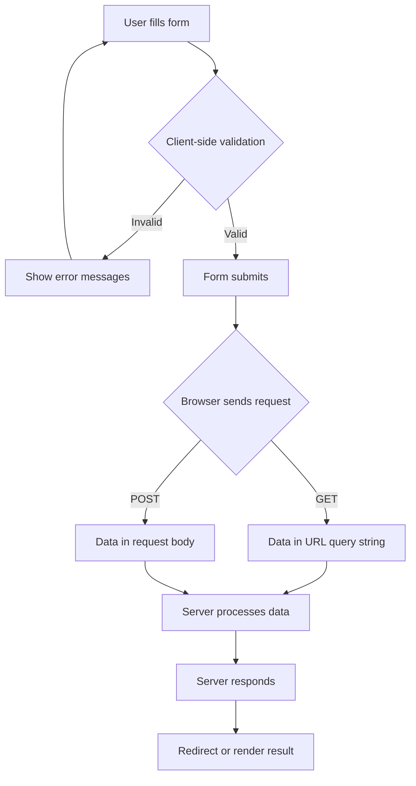

# HTML Forms

## Form Submission Flow



## The `<form>` Element

```html
<form action="/submit" method="POST" enctype="multipart/form-data">
    <!-- form controls -->
</form>
```

| Attribute | Values | Purpose |
|-----------|--------|---------|
| `action` | URL | Where to send the form data |
| `method` | `GET` or `POST` | HTTP method for submission |
| `enctype` | `application/x-www-form-urlencoded` (default), `multipart/form-data`, `text/plain` | Encoding type (use `multipart/form-data` for file uploads) |
| `novalidate` | boolean | Disable browser validation |
| `autocomplete` | `on` or `off` | Enable/disable autofill |
| `target` | `_self`, `_blank`, etc. | Where to display the response |

## GET vs POST

```
┌─────────────┬──────────────────────────────┬──────────────────────────────┐
│             │            GET                │           POST               │
├─────────────┼──────────────────────────────┼──────────────────────────────┤
│ Data in     │ URL query string             │ Request body                 │
│ Security    │ Visible in URL (not secure)   │ Not cached, not in history   │
│ Bookmark    │ Can be bookmarked             │ Cannot be bookmarked         │
│ Idempotent  │ Yes (same request = same      │ No (side effects possible)   │
│             │ result)                       │                              │
│ Size limit  │ ~2000 characters (browser     │ Much larger (~2GB)           │
│             │ dependent)                    │                              │
│ Use case    │ Search forms, data retrieval  │ Login, registration, uploads │
└─────────────┴──────────────────────────────┴──────────────────────────────┘
```

## Input Types

| Type | HTML | Purpose |
|------|------|---------|
| `text` | `<input type="text">` | Single-line text |
| `password` | `<input type="password">` | Masked text input |
| `email` | `<input type="email">` | Email validation |
| `number` | `<input type="number">` | Numeric input with stepper |
| `tel` | `<input type="tel">` | Telephone number |
| `url` | `<input type="url">` | URL validation |
| `search` | `<input type="search">` | Search field (stylable) |
| `date` | `<input type="date">` | Date picker |
| `time` | `<input type="time">` | Time picker |
| `datetime-local` | `<input type="datetime-local">` | Date + time picker |
| `month` | `<input type="month">` | Month picker |
| `week` | `<input type="week">` | Week picker |
| `color` | `<input type="color">` | Color picker |
| `file` | `<input type="file">` | File upload |
| `range` | `<input type="range">` | Slider |
| `checkbox` | `<input type="checkbox">` | Multiple options |
| `radio` | `<input type="radio">` | Single selection from group |
| `hidden` | `<input type="hidden">` | Non-visible data |
| `submit` | `<input type="submit">` | Submit button |
| `reset` | `<input type="reset">` | Reset form (avoid using) |
| `button` | `<input type="button">` | Generic button |

## Form Controls

### Text Input

```html
<label for="username">Username:</label>
<input type="text" id="username" name="username"
       placeholder="Enter your username"
       required minlength="3" maxlength="20">
```

### Email

```html
<label for="email">Email:</label>
<input type="email" id="email" name="email"
       placeholder="you@example.com"
       required multiple>
```

### Password

```html
<label for="password">Password:</label>
<input type="password" id="password" name="password"
       required minlength="8"
       pattern="(?=.*\d)(?=.*[a-z])(?=.*[A-Z]).{8,}"
       autocomplete="new-password">
```

### Select Dropdown

```html
<label for="country">Country:</label>
<select id="country" name="country" required>
    <option value="">-- Select a country --</option>
    <option value="us">United States</option>
    <option value="ca">Canada</option>
    <option value="uk">United Kingdom</option>
    <optgroup label="Asia">
        <option value="in">India</option>
        <option value="jp">Japan</option>
    </optgroup>
</select>
```

### Textarea

```html
<label for="message">Message:</label>
<textarea id="message" name="message" rows="5" cols="40"
          placeholder="Write your message here..."
          maxlength="1000"></textarea>
```

### Checkboxes

```html
<fieldset>
    <legend>Interests</legend>
    <label>
        <input type="checkbox" name="interests" value="tech" checked>
        Technology
    </label>
    <label>
        <input type="checkbox" name="interests" value="sports">
        Sports
    </label>
    <label>
        <input type="checkbox" name="interests" value="music">
        Music
    </label>
</fieldset>
```

### Radio Buttons

```html
<fieldset>
    <legend>Gender</legend>
    <label>
        <input type="radio" name="gender" value="male">
        Male
    </label>
    <label>
        <input type="radio" name="gender" value="female">
        Female
    </label>
    <label>
        <input type="radio" name="gender" value="other" checked>
        Other
    </label>
</fieldset>
```

### File Upload

```html
<label for="avatar">Profile Picture:</label>
<input type="file" id="avatar" name="avatar"
       accept="image/png, image/jpeg"
       capture="environment"
       multiple>
```

### Range Slider

```html
<label for="volume">Volume: <span id="volume-value">50</span></label>
<input type="range" id="volume" name="volume"
       min="0" max="100" value="50" step="1">
```

## Validation Attributes

| Attribute | Description |
|-----------|-------------|
| `required` | Field must have a value |
| `minlength` / `maxlength` | Character count limits |
| `min` / `max` | Numeric/date range limits |
| `step` | Allowed value increments |
| `pattern` | Regex pattern for validation |
| `multiple` | Allow multiple values (email, file) |

### Custom Validation with `pattern`

```html
<!-- US ZIP Code (5 digits or 5+4) -->
<input type="text" name="zip"
       pattern="\d{5}(-\d{4})?"
       title="Enter a valid ZIP code (e.g., 12345 or 12345-6789)">
```

## The `<label>` Element

Labels are critical for accessibility:

```html
<!-- Method 1: Wrapping -->
<label>Name: <input type="text" name="name"></label>

<!-- Method 2: Using for/id (preferred) -->
<label for="email">Email:</label>
<input type="email" id="email" name="email">

<!-- Method 3: aria-label (when no visible label) -->
<input type="search" aria-label="Search products">
```

> **✅ Always use labels.** They:
> - Make the input clickable (focuses the field)
> - Provide context for screen readers
> - Improve usability on mobile

## Fieldset and Legend

Group related form controls:

```html
<fieldset>
    <legend>Shipping Address</legend>

    <label for="street">Street:</label>
    <input type="text" id="street" name="street" required>

    <label for="city">City:</label>
    <input type="text" id="city" name="city" required>

    <label for="zip">ZIP Code:</label>
    <input type="text" id="zip" name="zip" pattern="\d{5}">
</fieldset>
```

## Buttons

```html
<!-- Submit button -->
<button type="submit">Submit</button>

<!-- Reset button (avoid—confusing to users) -->
<button type="reset">Reset</button>

<!-- Generic button -->
<button type="button" onclick="doSomething()">Click Me</button>
```

> **⚠️ Button default type is `submit`** — always specify `type="button"` if you don't want submission.

## Complete Form Example

```html
<form action="/register" method="POST" enctype="multipart/form-data"
      novalidate>
    <fieldset>
        <legend>Account Information</legend>

        <label for="username">Username *</label>
        <input type="text" id="username" name="username"
               required minlength="3" maxlength="20"
               pattern="[a-zA-Z0-9_]+"
               autocomplete="username">

        <label for="email">Email *</label>
        <input type="email" id="email" name="email"
               required autocomplete="email"
               placeholder="you@example.com">

        <label for="password">Password *</label>
        <input type="password" id="password" name="password"
               required minlength="8"
               autocomplete="new-password">
    </fieldset>

    <fieldset>
        <legend>Profile</legend>

        <label for="bio">Bio</label>
        <textarea id="bio" name="bio" rows="4"
                  maxlength="500"
                  placeholder="Tell us about yourself"></textarea>

        <label for="avatar">Avatar</label>
        <input type="file" id="avatar" name="avatar"
               accept="image/*">

        <label>
            <input type="checkbox" name="newsletter" checked>
            Subscribe to newsletter
        </label>
    </fieldset>

    <button type="submit">Create Account</button>
</form>
```

## Styling Forms

```css
/* Basic form styling */
form {
    max-width: 600px;
    margin: 0 auto;
}

label {
    display: block;
    margin-top: 16px;
    font-weight: 600;
}

input, select, textarea {
    width: 100%;
    padding: 8px 12px;
    border: 1px solid #ccc;
    border-radius: 4px;
    font-size: 16px;
}

input:focus, select:focus, textarea:focus {
    outline: none;
    border-color: #0066ff;
    box-shadow: 0 0 0 3px rgba(0,102,255,0.1);
}

input:invalid {
    border-color: #ff0000;
}

button[type="submit"] {
    background: #0066ff;
    color: white;
    border: none;
    padding: 12px 24px;
    border-radius: 4px;
    cursor: pointer;
    margin-top: 24px;
}

button[type="submit"]:hover {
    background: #0052cc;
}
```

## Key Takeaways

1. Use `method="POST"` for sensitive data (passwords, personal info).
2. Always associate labels with inputs using `for`/`id`.
3. Use `fieldset` and `legend` to group related fields.
4. Use HTML5 validation (`required`, `min`, `pattern`) for immediate feedback.
5. Use `accept` on file inputs to restrict file types.
6. Use `autocomplete` attributes to help users fill forms faster.

---

**Next:** [06-Media.md](06-Media.md) — Audio, video, and picture elements.
