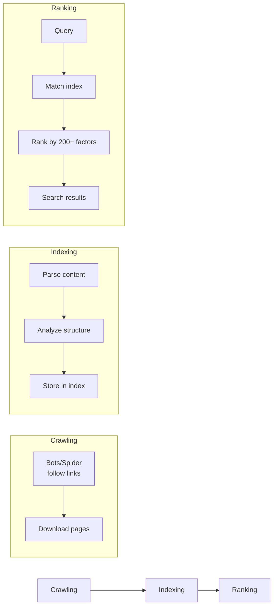
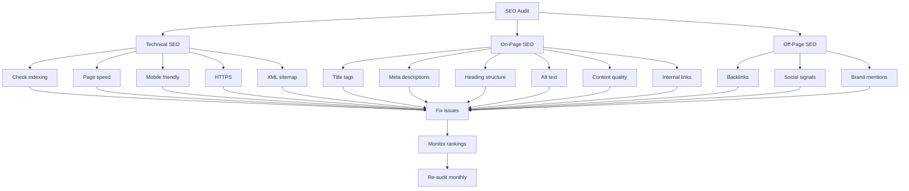

# SEO Basics

## How Search Engines Work



### 1. Crawling

Search engines use **bots** (Googlebot, Bingbot) to discover web pages by following links.

```
User submits URL ──► Crawl Queue ──► Fetch page ──► Parse links ──► Repeat
         ▲                                                              │
         └───────────────────── Add new URLs ──────────────────────────┘
```

**What helps crawling:**
- XML sitemap
- Internal links (every page should have at least one link pointing to it)
- Clean URL structure
- Fast server response time
- `robots.txt` that doesn't block important pages

### 2. Indexing

The search engine processes and stores the page content in a massive database (index).

**What helps indexing:**
- Unique, high-quality content
- Proper HTML structure (semantic tags)
- Meta tags (title, description)
- No duplicate content
- `index` directive in robots meta tag

### 3. Ranking

When a user searches, the search engine ranks matching pages from its index.

**Google uses 200+ ranking factors, including:**

```
Content Quality ── 25%
Backlinks ──────── 20%
User Experience ── 15%
Page Speed ─────── 10%
Mobile Friendliness 10%
Technical SEO ─── 10%
Brand Signals ──── 5%
Social Signals ─── 3%
Other ──────────── 2%
```

## On-Page SEO

On-page SEO refers to optimizations you make directly on your web pages.

### Title Tags

```html
<title>Primary Keyword - Secondary Keyword | Brand Name</title>
```

```
✅ Good:    "Wireless Bluetooth Headphones - Best Noise Cancelling | SoundPro"
❌ Bad:     "Home"
❌ Bad:     "Wireless Bluetooth Headphones Wireless Bluetooth Headphones"
```

**Best practices:**
- Keep under **60 characters**
- Include **primary keyword** near the beginning
- Unique per page
- Add brand at the end (separated by pipe `|`)

### Meta Description

```html
<meta name="description"
      content="Discover premium wireless Bluetooth headphones with active noise
               cancellation. 30-hour battery life, comfortable fit. Free shipping.">
```

**Best practices:**
- **120-158 characters** (longer descriptions may be truncated)
- Include primary keyword naturally
- Include a **call to action** (e.g., "Shop now", "Learn more")
- Unique per page
- Match the page content (don't mislead)

### Heading Hierarchy

```html
<h1>Complete Guide to SEO Basics</h1>
    <h2>What is SEO?</h2>
    <h2>Why SEO Matters</h2>
    <h2>On-Page SEO Techniques</h2>
        <h3>Title Tags</h3>
        <h3>Meta Descriptions</h3>
        <h3>Header Tags</h3>
    <h2>Technical SEO</h2>
```

```
Page Title (H1)    ───── 1 per page, primary topic
    └── Section (H2)     Main sections
         └── Sub-section (H3)  Detail sections
              └── Sub-sub (H4)  Fine detail
```

**Rules:**
- Only **one `<h1>`** per page
- Don't skip levels (h1 → h2 → h3, not h1 → h3)
- Include keywords naturally in headings
- Headings should describe the content below

### Image Alt Text

```html

```

**Why alt text matters for SEO:**
- Helps search engines understand images (they can't "see" images)
- Shows up in Google Image Search
- Improves accessibility

**Rules:**
- Describe what's in the image
- Include keywords naturally (but don't keyword-stuff)
- Keep under **125 characters**
- Don't use "image of" or "picture of"
- Leave empty (`alt=""`) for decorative images

### URL Structure

```
✅ /wireless-bluetooth-headphones
✅ /blog/seo-basics-guide
✅ /products/category/product-name

❌ /page?id=123
❌ /blog/2026/03/15/this-is-a-very-long-url-that-nobody-wants-to-read
❌ /products/category/product-name?session=abc123&ref=xyz
```

**Best practices:**
- Use **hyphens** (not underscores)
- Keep **short and descriptive**
- Include **keywords**
- Use **lowercase**
- Avoid special characters

## Structured Data (JSON-LD)

Structured data helps search engines understand your content and enables **rich results**.

```html
<script type="application/ld+json">
{
    "@context": "https://schema.org",
    "@type": "Article",
    "headline": "SEO Basics: A Complete Guide",
    "description": "Learn the fundamentals of search engine optimization.",
    "author": {
        "@type": "Person",
        "name": "John Doe"
    },
    "datePublished": "2026-03-15",
    "image": "https://example.com/seo-guide.jpg"
}
</script>
```

### Common Schema Types

| Type | When To Use | Rich Result |
|------|-------------|-------------|
| `Article` | Blog posts, news | Headline, image, date |
| `Product` | Product pages | Price, availability, reviews |
| `Recipe` | Recipe pages | Image, cook time, ratings |
| `Event` | Events | Date, location, tickets |
| `LocalBusiness` | Local businesses | Address, hours, phone |
| `FAQPage` | FAQ sections | Expandable questions |
| `BreadcrumbList` | Breadcrumb nav | Breadcrumb trail |
| `Review` | Reviews | Star rating, reviewer |

### Testing Structured Data

- **Google Rich Results Test**: `search.google.com/test/rich-results`
- **Schema Markup Validator**: `validator.schema.org`

## XML Sitemap

A sitemap tells search engines about pages on your site.

```xml
<?xml version="1.0" encoding="UTF-8"?>
<urlset xmlns="http://www.sitemaps.org/schemas/sitemap/0.9">
    <url>
        <loc>https://example.com/</loc>
        <lastmod>2026-03-15</lastmod>
        <changefreq>weekly</changefreq>
        <priority>1.0</priority>
    </url>
    <url>
        <loc>https://example.com/about</loc>
        <lastmod>2026-01-20</lastmod>
        <changefreq>monthly</changefreq>
        <priority>0.8</priority>
    </url>
    <url>
        <loc>https://example.com/blog/seo-guide</loc>
        <lastmod>2026-03-15</lastmod>
        <changefreq>monthly</changefreq>
        <priority>0.9</priority>
    </url>
</urlset>
```

**Submit your sitemap:**
- Google Search Console: `google.com/webmasters`
- Bing Webmaster Tools: `bing.com/webmasters`
- Add to `robots.txt`: `Sitemap: https://example.com/sitemap.xml`

## Robots.txt

Tells search engine bots which URLs they can or cannot access.

```
User-agent: *
Allow: /
Disallow: /admin/
Disallow: /private/
Disallow: /temp/

Sitemap: https://example.com/sitemap.xml
```

```
User-agent: Googlebot
Disallow: /beta/

User-agent: *
Allow: /
Disallow: /cgi-bin/
```

**⚠️ Common mistakes:**
- Blocking CSS/JS files (hinders rendering)
- Using `Disallow: /` on production (blocks ALL crawling)
- Forgetting to add sitemap URL

## Technical SEO Checklist

| Task | Priority | Notes |
|------|----------|-------|
| ✅ HTTPS enabled | Critical | Required for rankings + security |
| ✅ Mobile-friendly | Critical | Google uses mobile-first indexing |
| ✅ Page speed < 3s | High | Use Lighthouse to measure |
| ✅ Semantic HTML | High | Helps search engines understand content |
| ✅ Canonical URLs | High | Prevents duplicate content |
| ✅ XML sitemap | High | Helps indexing |
| ✅ robots.txt | Medium | Controls crawler access |
| ✅ Structured data | Medium | Enables rich results |
| ✅ Breadcrumbs | Medium | Improves navigation |
| ✅ 404 page | Low | Improves user experience |

## SEO Audit Flow



## Key Takeaways

1. Search engines **crawl** → **index** → **rank**.
2. Title tags and meta descriptions are the most impactful on-page factors.
3. Use **semantic HTML** (`<article>`, `<nav>`, `<h1>`-`<h6>`).
4. Add **alt text** to all meaningful images.
5. Use **JSON-LD structured data** for rich results.
6. Submit XML sitemap to Google Search Console.
7. Ensure **mobile-friendliness** and **fast page speed**.

---

**Next:** [11-Web-Accessibility.md](11-Web-Accessibility.md) — Web accessibility principles.
