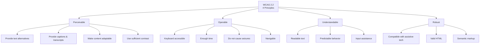

# Web Accessibility (a11y)

## What is Web Accessibility?

Web accessibility means designing and developing websites that **people with disabilities** can use effectively. It's about removing barriers that prevent interaction with or access to websites.

```
┌─────────────────────────────────────────────────────────────┐
│                  Who Benefits from Accessibility             │
├─────────────────────────────────────────────────────────────┤
│                                                             │
│  👁️  Blind / Low Vision                                      │
│     Screen readers, screen magnifiers, high contrast        │
│                                                             │
│  🦻  Deaf / Hard of Hearing                                  │
│     Captions, transcripts, visual indicators                 │
│                                                             │
│  🖐️  Motor / Physical Disabilities                           │
│     Keyboard-only navigation, voice control, switch devices │
│                                                             │
│  🧠  Cognitive / Learning Disabilities                       │
│     Clear content, consistent navigation, readable fonts    │
│                                                             │
└─────────────────────────────────────────────────────────────┘
```

**Accessibility benefits everyone**, not just people with permanent disabilities:
- Parents with a crying baby watch with captions
- Bright sunlight makes the screen hard to see
- Temporary injury (broken arm) limits mouse use
- Poor internet connection needs text-only fallbacks

## WCAG Principles (POUR)

The **Web Content Accessibility Guidelines (WCAG)** are organized around four principles:



### 1. Perceivable

Information must be presented in ways that users can perceive.

```html
<!-- ✅ Text alternatives for images -->


<!-- ✅ Captions for video -->
<video controls>
    <source src="tutorial.mp4" type="video/mp4">
    <track kind="captions" src="tutorial-en.vtt" srclang="en">
</video>

<!-- ✅ Audio transcripts -->
<audio controls>
    <source src="podcast.mp3" type="audio/mpeg">
</audio>
<div class="transcript">
    <p>Full transcript of the podcast...</p>
</div>
```

**Checklist:**
- ✅ All images have alt text (meaningful for content images, `alt=""` for decorative)
- ✅ Video has captions and audio descriptions
- ✅ Audio has transcripts
- ✅ Content can be presented without loss of information
- ✅ Color is not the only way to convey information
- ✅ Contrast ratio is at least **4.5:1** for normal text

### 2. Operable

Interface components must be operable by all users.

```html
<!-- ✅ Keyboard-accessible navigation -->
<nav aria-label="Main navigation">
    <ul>
        <li><a href="/">Home</a></li>
        <li><a href="/about">About</a></li>
        <li><a href="/contact">Contact</a></li>
    </ul>
</nav>

<!-- ✅ Skip to main content link -->
<a href="#main-content" class="skip-link">Skip to main content</a>

<!-- ✅ Focus indicators (CSS) -->
<style>
    :focus-visible {
        outline: 3px solid #0066ff;
        outline-offset: 2px;
    }
</style>
```

**Checklist:**
- ✅ All functionality is available via keyboard
- ✅ No keyboard traps (moving focus away is possible)
- ✅ Skip navigation link provided
- ✅ Focus indicator is visible
- ✅ No flashing content (or flashes below 3 per second)
- ✅ Links are distinguishable (not just color)
- ✅ Page title is descriptive and unique
- ✅ Tab order follows visual order

### 3. Understandable

Content and interface must be understandable.

```html
<!-- ✅ Clear language attribute -->
<html lang="en">

<!-- ✅ Consistent navigation -->
<nav aria-label="Main">
    <a href="/" aria-current="page">Home</a>
    <a href="/about">About</a>
    <a href="/contact">Contact</a>
</nav>

<!-- ✅ Error suggestions -->
<label for="email">Email:</label>
<input type="email" id="email" required
       aria-describedby="email-hint">
<p id="email-hint">Enter your email address (e.g., name@example.com)</p>
```

**Checklist:**
- ✅ Language set on `<html>` element
- ✅ Navigation is consistent across pages
- ✅ Form errors are clearly identified and suggest corrections
- ✅ Buttons and links have meaningful text (not "click here")
- ✅ Unusual words and abbreviations are explained
- ✅ Content is readable (plain language, short sentences)

### 4. Robust

Content must work with current and future technologies.

```html
<!-- ✅ Valid HTML -->
<!DOCTYPE html>
<html lang="en">
<head>
    <meta charset="UTF-8">
    <title>Accessible Page</title>
</head>
<body>
    <!-- ✅ Semantic elements -->
    <main>
        <article>
            <h1>Article Title</h1>
            <p>Content</p>
        </article>
    </main>
</body>
</html>
```

**Checklist:**
- ✅ Valid HTML (no parsing errors)
- ✅ Semantic HTML elements used appropriately
- ✅ ARIA used correctly (only when HTML semantics are insufficient)
- ✅ Name, role, value available to assistive technology
- ✅ Works with different browsers and user agents

## WCAG Conformance Levels

```
┌─────────┬────────────────────────────────────────────┐
│  Level  │  Description                                │
├─────────┼────────────────────────────────────────────┤
│  A      │  Minimum level — must-have                  │
│         │  Removes the most critical barriers         │
├─────────┼────────────────────────────────────────────┤
│  AA     │  Target level for most websites             │
│         │  Removes major barriers for most users      │
│         │  (Legal requirement in many countries)      │
├─────────┼────────────────────────────────────────────┤
│  AAA    │  Highest level — specialized                │
│         │  Not required for all content               │
│         │  May not be achievable for some content     │
└─────────┴────────────────────────────────────────────┘
```

## Laws and Standards

| Country/Region | Law/Standard | Requirements |
|----------------|-------------|--------------|
| Global | WCAG 2.2 (W3C) | Technical standard |
| USA | Section 508 | Federal websites → WCAG 2.0 AA |
| USA | ADA (Americans with Disabilities Act) | Public accommodations |
| EU | EN 301 549 | Public sector → WCAG 2.1 AA |
| UK | Equality Act 2010 | Reasonable adjustments |
| Canada | ACA (Accessible Canada Act) | Federal organizations |
| Australia | DDA (Disability Discrimination Act) | Equal access |

## Common Accessibility Failures

```
┌─────────────────────────────────────────────────────────────┐
│  Top 10 Accessibility Issues (WebAIM Million)               │
├─────────────────────────────────────────────────────────────┤
│  1. Low contrast text                        ──── 86%       │
│  2. Missing alt text on images               ──── 58%       │
│  3. Empty links                             ──── 51%       │
│  4. Missing form input labels               ──── 46%       │
│  5. Empty buttons                           ──── 28%       │
│  6. Missing document language               ──── 20%       │
│  7. Non-responsive layouts                  ──── 17%       │
│  8. Missing heading structure               ──── 15%       │
│  9. Insufficient focus indicators           ──── 12%       │
│  10. Missing ARIA landmarks                 ──── 10%       │
└─────────────────────────────────────────────────────────────┘
```

## Accessibility Testing Tools

| Tool | Type | What It Checks |
|------|------|----------------|
| **axe DevTools** | Browser extension | Automated WCAG checks |
| **WAVE** | Browser extension | Visual overlays of issues |
| **Lighthouse** | Chrome DevTools | Accessibility audit |
| **NVDA** | Screen reader (Windows) | Screen reader experience |
| **VoiceOver** | Screen reader (Mac/iOS) | Screen reader experience |
| **JAWS** | Screen reader (Windows) | Screen reader experience |
| **Colour Contrast Analyser** | Desktop app | Color contrast ratios |
| **Accessibility Insights** | Browser extension | Guided testing |

## Manual Testing Checklist

### Keyboard Testing
1. Tab through all interactive elements
2. Use Enter/Space to activate buttons and links
3. Use Escape to close dialogs
4. Use Arrow keys in lists, sliders, comboboxes
5. Check there is always a visible focus indicator

### Screen Reader Testing
1. Navigate by landmarks (D key in NVDA/VoiceOver)
2. Navigate by headings (H key)
3. Navigate by links (K key)
4. Navigate by form controls (F key)
5. Listen to the page — does it make sense?

## Accessibility Statement

Every website should have an accessibility statement:

```html
<section id="accessibility-statement">
    <h1>Accessibility Statement</h1>
    <p>We are committed to making our website accessible to everyone.</p>

    <h2>Conformance status</h2>
    <p>This website is partially conformant with WCAG 2.2 Level AA.</p>

    <h2>Known limitations</h2>
    <ul>
        <li>Older PDF documents may not be fully accessible</li>
        <li>Third-party embedded content may have accessibility gaps</li>
    </ul>

    <h2>Feedback</h2>
    <p>Contact us at <a href="mailto:accessibility@example.com">
       accessibility@example.com</a>.</p>
</section>
```

## Key Takeaways

1. **Accessibility = usability for everyone.**
2. WCAG 2.2 has four principles: **POUR** (Perceivable, Operable, Understandable, Robust).
3. Aim for **WCAG 2.2 Level AA** conformance.
4. Use **semantic HTML** first, then ARIA if needed.
5. Test with **real assistive technologies** (screen readers, keyboard-only).
6. Accessibility is a legal requirement in many jurisdictions.
7. Start early — fixing accessibility is cheaper during development.

---

**Next:** [12-ARIA.md](12-ARIA.md) — ARIA roles, states, and properties.
