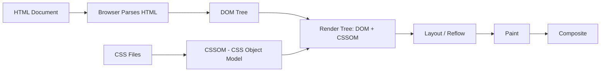

# Introduction to CSS

## What is CSS?

**CSS** (Cascading Style Sheets) is a stylesheet language used to describe the presentation of a document written in HTML or XML. It controls layout, colors, fonts, spacing, animations, and responsive behavior.

CSS separates **content (HTML)** from **presentation (CSS)**, enabling maintainable, flexible, and reusable design.

## Brief History

| Year | Milestone |
|------|-----------|
| 1994 | Håkon Wium Lie proposes CSS |
| 1996 | CSS Level 1 (W3C Recommendation) |
| 1998 | CSS Level 2 (positioning, z-index, media types) |
| 2000s | CSS 2.1 — widespread browser adoption |
| 2011 | CSS Level 3 — modular approach (selectors, colors, backgrounds, etc.) |
| 2012 | Flexbox, Media Queries reach CR |
| 2017 | CSS Grid shipped in browsers |
| 2020s | Container Queries, Cascade Layers, `:has()` selector, OKLCH colors |

CSS is now developed as a collection of **independent modules** at varying maturity levels (from drafts to recommendations).

## How CSS Works



1. **HTML** is parsed into the **DOM** (Document Object Model).
2. **CSS** is parsed into the **CSSOM** (CSS Object Model).
3. The **Render Tree** combines DOM and CSSOM — only visible elements.
4. **Layout** calculates geometry (position, size).
5. **Paint** fills pixels (colors, images, text).
6. **Composite** layers are drawn to the screen.

## The Cascade

The **cascade** is the algorithm that resolves conflicting CSS declarations. It considers:

1. **Origin and importance** — author styles, user styles, browser defaults; `!important` inverts the priority.
2. **Specificity** — which selector is more specific.
3. **Order of appearance** — later declarations override earlier ones when specificity is equal.

### Cascade Sort Order (ascending priority)

| Priority | Source |
|----------|--------|
| 1 | Browser default stylesheet |
| 2 | User `normal` declarations |
| 3 | Author `normal` declarations |
| 4 | Author `!important` declarations |
| 5 | User `!important` declarations |

```css
/* This will be overridden by a later rule with same specificity */
p { color: blue; }

/* This wins — same specificity, later in source */
p { color: red; }

/* This wins even if earlier — higher specificity */
.container p { color: green; }
```

## Specificity

Specificity is a weight calculated from selector types:

| Selector Type | Weight |
|---------------|--------|
| Inline `style` attribute | 1,0,0,0 |
| ID selectors (`#header`) | 0,1,0,0 |
| Class, pseudo-class, attribute (`.active`, `:hover`, `[type]`) | 0,0,1,0 |
| Element, pseudo-element (`div`, `::before`) | 0,0,0,1 |

## Browser Developer Tools

Every browser includes DevTools for CSS debugging:

- **Elements/Inspector panel** — view computed styles, edit CSS live, toggle rules
- **Styles pane** — see which rules apply, what's overridden (strikethrough)
- **Computed panel** — final computed values for any property
- **Box model visual** — see margin, border, padding, content dimensions
- **Layout pane** — inspect grid/flexbox overlays

### Key DevTools Shortcuts

| Action | Chrome/Firefox |
|--------|----------------|
| Open DevTools | `F12` or `Ctrl+Shift+I` |
| Inspect element | `Ctrl+Shift+C` |
| Toggle CSS rule | Click checkbox in Styles pane |
| Add style | Click `+` or double-click empty area |
| Force state | Right-click element → `:hover`, `:focus`, etc. |

## CSS Specifications

CSS specifications are maintained by the **CSS Working Group** at W3C. Each spec goes through stages:

1. **Editor's Draft (ED)** — very early, unstable
2. **First Public Working Draft (FPWD)** — first published
3. **Working Draft (WD)** — actively refined
4. **Candidate Recommendation (CR)** — stable enough for implementation
5. **Proposed Recommendation (PR)** — final review
6. **Recommendation (REC)** — official standard


**Important specs (2026):**

| Spec | Status |
|------|--------|
| CSS 2.2 | REC |
| Selectors Level 4 | CR |
| CSS Grid Level 1 | REC |
| Flexbox Level 1 | REC |
| CSS Custom Properties | REC |
| Media Queries Level 4 | CR |
| Containment Level 3 (Container Queries) | REC |
| CSS Nesting | REC |
| Color Level 4 (OKLCH, OKLab) | CR |
| View Transitions Level 1 | WD |

> CSS is not a monolithic spec — it is a collection of independent modules. This allows parts to evolve at their own pace. Browser support varies per module.
