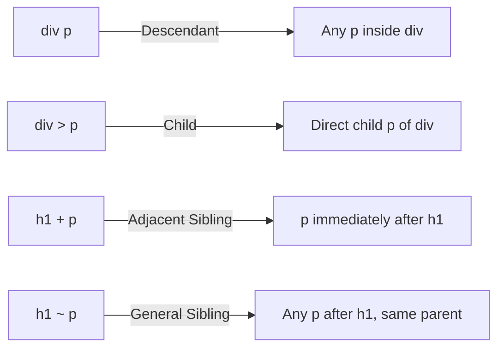
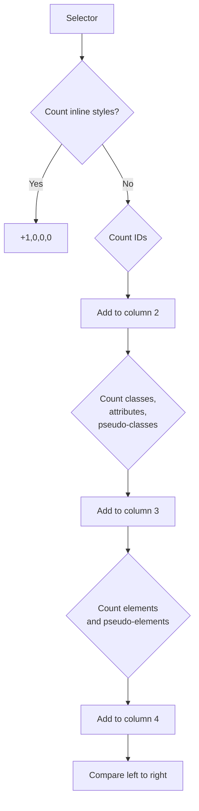

# CSS Selectors

## Overview

Selectors are patterns used to select the HTML elements you want to style. Understanding selectors is fundamental to writing efficient, maintainable CSS.

## Selector Types

### 1. Universal Selector

```css
* { margin: 0; padding: 0; }
```

Matches every element. Use sparingly — can cause performance issues if combined with other selectors broadly.

### 2. Type (Element) Selector

```css
h1 { color: navy; }
p { font-size: 1rem; }
```

Matches all elements of a given type.

### 3. Class Selector

```css
.card { border: 1px solid #ccc; }
.highlight { background: yellow; }
```

Matches elements with the class attribute. Reusable. One element can have multiple classes: `<div class="card highlight">`.

### 4. ID Selector

```css
#header { height: 80px; }
#main-nav { background: #333; }
```

Matches a single element by its `id` attribute. IDs must be unique per page. Avoid for styling — prefer classes.

### 5. Attribute Selectors

```css
/* Has attribute */
[disabled] { opacity: 0.5; }

/* Exact match */
[type="text"] { border: 1px solid gray; }

/* Contains word (space-separated) */
[rel~="nofollow"] { font-weight: bold; }

/* Starts with */
[href^="https"] { color: green; }

/* Ends with */
[src$=".jpg"] { border-radius: 4px; }

/* Contains substring */
[href*="example"] { text-decoration: underline; }

/* Case-insensitive (flag: i) */
[data-type="primary" i] { color: blue; }
```

### 6. Pseudo-classes

Pseudo-classes describe a **state** of an element. They start with a single colon `:`.

#### Interactive states

```css
:hover { }        /* Mouse over */
:focus { }        /* Focused (keyboard or click) */
:active { }       /* Being activated (clicked) */
:focus-within { } /* Element or any descendant is focused */
:focus-visible { } /* Focused via keyboard (not mouse) */
:target { }       /* Matches the element whose ID matches URL hash */
```

#### Structural pseudo-classes

```css
:first-child { }        /* First child of parent */
:last-child { }         /* Last child of parent */
:nth-child(2) { }       /* Second child */
:nth-child(odd) { }     /* Odd children */
:nth-child(3n+1) { }    /* Every 3rd starting from 1st */
:nth-last-child(2) { }  /* Second from last */
:first-of-type { }      /* First of its type among siblings */
:last-of-type { }       /* Last of its type among siblings */
:nth-of-type(2n) { }    /* Even instances of this type */
:only-child { }         /* Only child of parent */
:empty { }              /* No children (including text nodes) */
```

#### Logical pseudo-classes

```css
:not(.excluded) { }      /* Negation — matches all without .excluded */
:is(section, article) h1 { }   /* Matches h1 inside section OR article */
:where(section, article) h1 { } /* Like :is but specificity is always 0 */
:has(img) { }            /* Parent containing img (Level 4) — a parent selector */
```

### 7. Pseudo-elements

Pseudo-elements target a **specific part** of an element. They use double colons `::`.

```css
::before { content: ""; }    /* First child of element (generated) */
::after { content: ""; }     /* Last child of element (generated) */
::first-letter { }           /* First letter */
::first-line { }             /* First line */
::selection { }              /* Highlighted text */
::placeholder { }            /* Input placeholder text */
::marker { }                 /* List item marker */
```

> `::before` and `::after` require `content` property (can be empty string) to render.

### 8. Combinators

Combinators define relationships between selectors.



```css
/* Descendant (space) — any nested depth */
article p { line-height: 1.6; }

/* Child (>) — direct children only */
.menu > li { list-style: none; }

/* Adjacent sibling (+) — immediately after */
h2 + p { margin-top: 0; }

/* General sibling (~) — any later sibling */
h2 ~ p { color: #555; }

/* Combining multiple selectors */
input[type="email"]:focus { border-color: blue; }
```

### 9. Grouping Selectors

```css
h1, h2, h3 { font-family: "Helvetica", sans-serif; }
```

## Specificity Calculation

Specificity is a 4-part value: `(inline, IDs, classes, elements)`.

| Selector | Specificity |
|----------|-------------|
| `*` | (0,0,0,0) |
| `h1` | (0,0,0,1) |
| `h1 + p::first-line` | (0,0,0,3) |
| `ul > li` | (0,0,0,2) |
| `li.active` | (0,0,1,1) |
| `[type="email"]` | (0,0,1,0) |
| `#sidebar` | (0,1,0,0) |
| `#sidebar a:hover` | (0,1,1,1) |
| `style="color:red"` | (1,0,0,0) |



### Specificity Tips

- `:where()` selector **always has zero specificity** — useful for resets
- `:is()` and `:not()` take the specificity of their **most specific argument**
- `::before` and `::after` are pseudo-elements (add to element column)
- `style` attribute beats everything except `!important`
- `!important` should be the **last resort** — it breaks the natural cascade

## Performance Considerations

For performance, the browser reads selectors **right to left** (key selector).

```css
/* Inefficient — browser checks thousands of divs */
body .content .article p span { }

/* More efficient — fewer checks */
span.highlight { }
```

**Rules of thumb:**
- Keep selectors short (ideally 3 parts or fewer)
- Avoid universal selectors as key selectors (`*`)
- Don't qualify class selectors with element types (`div.active` → `.active`)
- Use classes over complex descendant selectors

## Selector Examples: Real-World Patterns

```css
/* Form validation styling */
input:required { border-left: 3px solid orange; }
input:valid { border-left-color: green; }
input:invalid:not(:placeholder-shown) { border-left-color: red; }

/* Zebra-stripe tables */
tbody tr:nth-child(even) { background: #f8f9fa; }

/* Custom checkbox labels */
label:has(input[type="checkbox"]) { cursor: pointer; }

/* Style the last item differently */
.nav-item:last-child { margin-right: 0; }

/* Article typography */
article > p:first-of-type::first-line { font-variant: small-caps; }
```
