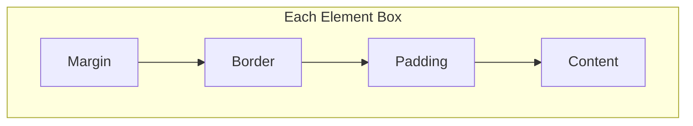

# The CSS Box Model

## Overview

Every element in CSS is a rectangular box. The **box model** defines how the total space of an element is calculated — from content inward, or border outward.

## The 4 Layers



```
┌─────────────────────────────────────────┐
│                 MARGIN                   │
│  ┌───────────────────────────────────┐  │
│  │              BORDER               │  │
│  │  ┌─────────────────────────────┐  │  │
│  │  │           PADDING           │  │  │
│  │  │  ┌───────────────────────┐  │  │  │
│  │  │  │       CONTENT         │  │  │  │
│  │  │  │  (width x height)     │  │  │  │
│  │  │  └───────────────────────┘  │  │  │
│  │  └─────────────────────────────┘  │  │
│  └───────────────────────────────────┘  │
└─────────────────────────────────────────┘
```

### 1. Content Area

The actual content: text, images, or child elements. Sized by `width` and `height`.

```css
.box { width: 300px; height: 200px; }
```

### 2. Padding Area

Space between content and border. Backgrounds extend into padding.

```css
.box { padding: 20px; }          /* All sides */
.box { padding: 10px 20px; }     /* vertical horizontal */
.box { padding: 10px 15px 20px 25px; } /* top right bottom left */
.box { padding-top: 10px; }
```

### 3. Border Area

Line drawn around padding. Has `width`, `style`, and `color`.

```css
.box {
  border: 2px solid #333;         /* Shorthand: width style color */
  border-radius: 8px;             /* Rounds corners */
  border-top: 1px dashed red;     /* Individual side */
}
```

### 4. Margin Area

Invisible space outside border. Pushes other elements away.

```css
.box { margin: 20px; }            /* All sides */
.box { margin: 0 auto; }         /* Center block elements horizontally */
```

## `box-sizing` Property

The most important box-model decision.

```css
/* Content-box (DEFAULT): width/height only includes content */
/* Total width = content width + padding + border */
.content-box {
  box-sizing: content-box;
  width: 300px;
  padding: 20px;
  border: 2px solid;
  /* Total width = 300 + 40 + 4 = 344px */
}

/* Border-box: width/height includes content + padding + border */
/* Total width = specified width */
.border-box {
  box-sizing: border-box;
  width: 300px;
  padding: 20px;
  border: 2px solid;
  /* Content width = 300 - 40 - 4 = 256px */
  /* Total width = 300px */
}
```

**Best practice:** Apply `border-box` globally:

```css
*, *::before, *::after {
  box-sizing: border-box;
}
```

## Width/Height Calculation Examples

### `content-box` (default)

```css
.element {
  width: 400px;
  padding: 20px;
  border: 5px solid;
  margin: 10px;
}
```

| Property | Value |
|----------|-------|
| Content width | 400px |
| Total width (content + padding + border) | 400 + 20×2 + 5×2 = **450px** |
| Outer width (including margin) | 450 + 10×2 = **470px** |

### `border-box`

```css
.element {
  box-sizing: border-box;
  width: 400px;
  padding: 20px;
  border: 5px solid;
}
```

| Property | Value |
|----------|-------|
| Content width | 400 - 40 - 10 = **350px** |
| Total width | **400px** (the specified width) |

## Visual Example

```
.content-box (width: 300px, padding: 20px, border: 3px)
┌──── margin: 0 ─────────────────────────────────────┐
│                                                      │
│  ┌── border: 3px ───────────────────────────────┐  │
│  │                                                │  │
│  │  ┌─ padding: 20px ─────────────────────────┐  │  │
│  │  │                                          │  │  │
│  │  │  content: 300px                         │  │  │
│  │  │                                          │  │  │
│  │  └──────────────────────────────────────────┘  │  │
│  │                                                │  │
│  └────────────────────────────────────────────────┘  │
│                                                      │
└──────────────────────────────────────────────────────┘
Total: 300 + 40 + 6 = 346px


.border-box (width: 300px, padding: 20px, border: 3px)
┌──── margin: 0 ─────────────────────────────────────┐
│                                                      │
│  ┌── border: 3px ───────────────────────────────┐  │
│  │                                                │  │
│  │  ┌─ padding: 20px ─────────────────────────┐  │  │
│  │  │                                          │  │  │
│  │  │  content: 254px                         │  │  │
│  │  │                                          │  │  │
│  │  └──────────────────────────────────────────┘  │  │
│  │                                                │  │
│  └────────────────────────────────────────────────┘  │
│                                                      │
└──────────────────────────────────────────────────────┘
Total: 300px (width includes padding and border)
```

## Margin Collapse

**Vertical margins** between adjacent block elements collapse into a single margin equal to the **larger** of the two.

```html
<div class="box-a">Box A (margin-bottom: 30px)</div>
<div class="box-b">Box B (margin-top: 20px)</div>
```

```css
.box-a { margin-bottom: 30px; }
.box-b { margin-top: 20px; }
```

The space between them is **30px** (the larger value), not 50px.

### Collapse Rules

- Only **vertical** margins collapse (top/bottom), not horizontal
- Only **block** elements in **normal flow** collapse
- Margins do **not** collapse on:
  - Flex items
  - Grid items
  - Absolutely positioned elements
  - Floated elements
  - Elements with `overflow: hidden` (creates a new BFC)
- Collapse also happens between parent and first/last child margins

### Preventing Collapse

```css
/* Create a new Block Formatting Context (BFC) */
.parent { overflow: auto; }
.parent { display: flow-root; } /* Modern way */
.parent { display: inline-block; }

/* Use padding instead of margin on the parent */
.parent { padding-top: 1px; }

/* Use flexbox or grid on the parent */
.parent { display: flex; flex-direction: column; }
```

## `min-width`, `max-width`, `min-height`, `max-height`

```css
.responsive-box {
  width: 80%;
  max-width: 1200px;  /* Stops growing at 1200px */
  min-width: 320px;   /* Never smaller than 320px */
}
```

## Negative Margins

Negative margins can pull elements in unexpected directions:

```css
.overlap {
  margin-top: -20px;  /* Pulls element upward */
  margin-left: -10px; /* Pulls element leftward */
}
```

## The `outline` Property

Outline draws a line **outside the border**, without affecting layout.

```css
button:focus {
  outline: 2px solid blue;
  outline-offset: 2px;
}
```

Unlike `border`, outline does **not** add to the element's total dimensions and can overlap other content.

## Common Box Model Bugs

| Issue | Cause | Fix |
|-------|-------|-----|
| Element wider than expected | `content-box` + padding/border | Set `box-sizing: border-box` |
| Extra gap between inline-blocks | Whitespace in HTML | Remove whitespace, use flex |
| Margins pushing parent | Collapse from child | Add `overflow: auto` or use `flow-root` |
| 100% width + padding overflows | Box model default | `box-sizing: border-box` |

## Real-World Example: Card Component

```css
.card {
  box-sizing: border-box;
  width: 320px;
  padding: 24px;
  border: 1px solid #e0e0e0;
  border-radius: 12px;
  margin: 16px;
  background: #fff;
  box-shadow: 0 2px 8px rgba(0,0,0,0.1);
}

.card-image {
  width: 100%;          /* Relative to card content width: 320 - 48 = 272px */
  border-radius: 8px;
  margin-bottom: 16px;
}

.card-title {
  margin: 0 0 8px 0;    /* title pushes description down 8px (collapsed) */
  font-size: 1.25rem;
}

.card-description {
  margin: 0;             /* Reset default margins */
  color: #666;
}
```
