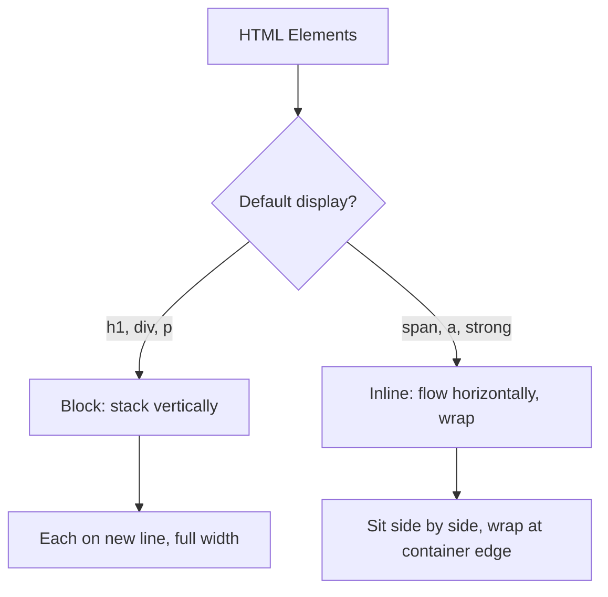

# The `display` Property

## Overview

The `display` property specifies the **type of box** an element generates. It is the single most important CSS property for layout — it determines whether an element is inline, block, or triggers a layout mode like flex or grid.

## Display Values

### `block`

- Takes up **100% of parent width** by default
- Starts on a **new line**
- Respects `width`, `height`, `margin`, `padding`
- Elements: `<div>`, `<p>`, `<h1>–<h6>`, `<section>`, `<header>`, `<footer>`

```css
.block-element {
  display: block;
  width: 50%;          /* Narrower than parent */
  margin: 10px auto;   /* Centered */
}
```

### `inline`

- Only takes **as much width as needed**
- **No new line** — flows with text
- `width` and `height` are **ignored**
- `margin-top/bottom` are ignored (only horizontal margins apply)
- `padding-top/bottom` visually expand but don't push content
- Elements: `<span>`, `<a>`, `<strong>`, `<em>`, `` (replaced inline)

```css
.inline-element {
  display: inline;
  width: 100px;      /* Ignored */
  height: 100px;     /* Ignored */
  margin: 20px;      /* Only left/right apply */
}
```

### `inline-block`

- Flows **inline** (no new line)
- Respects `width`, `height`, `margin`, `padding` (unlike inline)
- Creates a **block box** laid inline

```css
.button {
  display: inline-block;
  width: 120px;
  height: 40px;
  margin: 4px;
  padding: 8px 16px;
}
```

### `none`

- Element is **removed from the document flow** (not visible, not rendered)
- Unlike `visibility: hidden` — that hides but preserves space

```css
.hidden-element { display: none; }
.invisible-element { visibility: hidden; } /* Still takes up space */
```

### `flex`

Creates a **block-level flex container**. Children become flex items.

```css
.container { display: flex; }
```

### `inline-flex`

Creates an **inline-level flex container**. Behaves like `inline-block` but for flex.

```css
.inline-flex-container { display: inline-flex; }
```

### `grid`

Creates a **block-level grid container**.

```css
.container { display: grid; }
```

### `inline-grid`

Creates an **inline-level grid container**.

```css
.inline-grid-container { display: inline-grid; }
```

### `table` / `inline-table`

Makes an element behave like a `<table>` element.

```css
.table { display: table; }
.table-row { display: table-row; }
.table-cell { display: table-cell; }
```

### `flow-root`

Creates a new **Block Formatting Context (BFC)** without side effects.

```css
.parent { display: flow-root; } /* Contains floats, prevents margin collapse */
```

### `list-item`

Behaves like a `<li>` element — adds a marker (bullet).

```css
.custom-item { display: list-item; }
```

### `contents`

The element's **container is removed** but its children render normally. Useful with grid/flex to avoid extra wrapper markup.

```css
.wrapper { display: contents; }
```

## Comparison Table

| Value | New Line? | Respects `width`/`height`? | `margin` | `padding` | Use Case |
|-------|-----------|----------------------------|----------|-----------|----------|
| `none` | — | — | — | — | Hidden, removed from flow |
| `block` | Yes | Yes | All sides | All sides | Layout sections, paragraphs |
| `inline` | No | No | Horizontal only | Horizontal only; vertical paints but doesn't affect layout | Text elements, links |
| `inline-block` | No | Yes | All sides | All sides | Buttons, nav items, badges |
| `flex` | Yes | Yes | N/A (controls alignment) | N/A | One-dimensional layouts |
| `inline-flex` | No | Yes | N/A | N/A | Toolbars, inline groups |
| `grid` | Yes | Yes | N/A | N/A | Two-dimensional layouts |
| `inline-grid` | No | Yes | N/A | N/A | Widgets, component grids |
| `flow-root` | Yes | Yes | Yes | Yes | Containing floats, BFC |
| `contents` | N/A | N/A | N/A | N/A | Removing wrapper from layout |

## Normal Flow Layout

When no `display` is specified (or default), elements follow **normal flow**:



```html
<h1>Block</h1>
<p>This paragraph is a block element with a
 <strong>strong</strong> (inline) and <a href="#">link</a> (inline) inside.</p>
```

## The Inline-Block Gap

Inline-block elements have a **whitespace gap** between them:

```html
<div class="box"></div>
<div class="box"></div>
<div class="box"></div>
```

```css
.box {
  display: inline-block;
  width: 100px;
  height: 100px;
  background: teal;
}
```

The gap comes from whitespace in HTML. Fixes:

```html
<!-- No whitespace -->
<div class="box"></div><div class="box"></div><div class="box"></div>
```

```css
/* Flex instead */
.container { display: flex; }

/* Negative margin (messy) */
.container { font-size: 0; } .box { font-size: 1rem; }
```

## Real-World Patterns

### Navigation Bar

```css
.nav {
  display: flex;
  gap: 1rem;
  list-style: none;
  padding: 0;
}

/* Classic inline-block version */
.nav-classic li {
  display: inline-block;
  margin-right: 1rem;
}
```

### Button Group

```css
.btn-group button {
  display: inline-block;
  border: 1px solid #ccc;
  padding: 8px 16px;
}
.btn-group button:not(:first-child) {
  margin-left: -1px; /* Overlap borders */
}
```

### Hidden vs Invisible

```css
.removed { display: none; }         /* Totally gone, no space */
.hidden { visibility: hidden; }      /* Invisible but keeps space */
.opaque { opacity: 0; }             /* Invisible, keeps space, still interacts */
.opaque-pointer { opacity: 0; pointer-events: none; } /* Fully inert */
```

### Responsive Display

```css
.mobile-only { display: none; }
.desktop-only { display: block; }

@media (max-width: 768px) {
  .mobile-only { display: block; }
  .desktop-only { display: none; }
}
```
