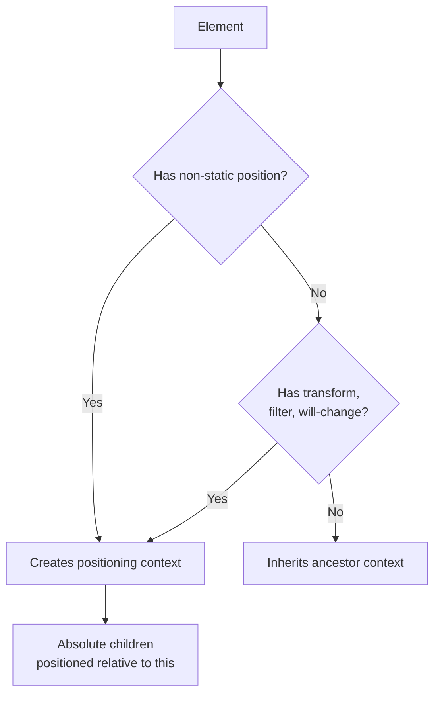

# CSS Positioning

## Overview

The `position` property controls how an element is placed in the document. It determines the **positioning context** and whether the element is in normal flow or removed from it.

## Position Values

### `static` (default)

- Element follows **normal flow**
- `top`, `right`, `bottom`, `left`, `z-index` have **no effect**

```css
.static-element { position: static; }
```

### `relative`

- Element follows **normal flow**
- Offset from its **normal position** using `top`/`right`/`bottom`/`left`
- Original space is **preserved** (other elements don't fill the gap)
- Becomes a **positioning context** for absolutely positioned children

```css
.relative-box {
  position: relative;
  top: 20px;     /* Moves 20px down from original position */
  left: 10px;    /* Moves 10px right */
}
```

### `absolute`

- Element is **removed from normal flow** (no space allocated)
- Positioned **relative to the nearest positioned ancestor** (non-static)
- If no positioned ancestor, positioned relative to the **initial containing block** (usually `<html>`)
- Becomes a positioning context for its children

```css
.parent {
  position: relative;
  width: 400px;
  height: 300px;
}

.child {
  position: absolute;
  top: 0;
  right: 0;
  /* Sticks to top-right corner of .parent */
}
```

### `fixed`

- Removed from normal flow
- Positioned relative to the **viewport** (or containing block if `transform`/`perspective`/`filter` on ancestor)
- Stays in place during scroll

```css
.fixed-header {
  position: fixed;
  top: 0;
  left: 0;
  width: 100%;
  z-index: 100;
}

.fixed-chat {
  position: fixed;
  bottom: 20px;
  right: 20px;
  z-index: 1000;
}
```

### `sticky`

- Hybrid of `relative` and `fixed`
- Behaves as `relative` until scroll threshold is reached
- Then "sticks" behaving as `fixed` within its parent

```css
.sticky-nav {
  position: sticky;
  top: 0;             /* Sticks when scrolled to top of viewport */
  z-index: 10;
  background: white;
}

/* Sticky sidebar */
.sticky-sidebar {
  position: sticky;
  top: 2rem;
  align-self: start;  /* Important with flexbox parent */
}
```

## Positioning Context

An element becomes a **positioning context** (containing block) for its absolutely positioned descendants when:

- `position: relative`
- `position: absolute`
- `position: fixed`
- `position: sticky`
- `transform` or `perspective` (non-none)
- `filter` (non-none)
- `will-change: transform`
- `contain: paint` or `contain: layout`



## Common Layout Patterns

### Centering with Absolute

```css
.center {
  position: absolute;
  top: 50%;
  left: 50%;
  transform: translate(-50%, -50%);
}
```

### Full Overlay

```css
.overlay {
  position: fixed;
  inset: 0;       /* top: 0; right: 0; bottom: 0; left: 0 */
  background: rgba(0,0,0,0.5);
  z-index: 999;
}
```

### Badge on Element

```css
.icon-wrapper {
  position: relative;
}

.badge {
  position: absolute;
  top: -8px;
  right: -8px;
  width: 20px;
  height: 20px;
  border-radius: 50%;
  background: red;
  color: white;
  font-size: 12px;
}
```

## Visual Diagrams

```
STATIC (default flow)
┌──────────────────────────────────────────┐
│ Box 1 (static)                            │
├──────────────────────────────────────────┤
│ Box 2 (static)                            │
├──────────────────────────────────────────┤
│ Box 3 (static)                            │
└──────────────────────────────────────────┘

RELATIVE (offset from normal position)
┌──────────────────────────────────────────┐
│ Box 1                                    │
├──────────────────────────────────────────┤
│ Box 2 — original space preserved         │
│          ┌─ offset by top:20px ────┐     │
│          │ Box 2 (actual position) │     │
│          └─────────────────────────┘     │
└──────────────────────────────────────────┘

ABSOLUTE (no space, relative to parent)
┌─── .parent (position: relative) ────────┐
│                                          │
│     ┌────────────────────────────┐       │
│     │ .child (absolute: top:0,   │       │
│     │         right:0)           │       │
│     └────────────────────────────┘       │
│                                          │
└──────────────────────────────────────────┘

FIXED (relative to viewport, always visible)
Viewport
┌──────────────────────────────────────────┐
│ ┌── .fixed-header ──────────────────┐   │  ← Always at top
│ └─────────────────────────────────────┘   │
│                                            │
│  (scrollable content passes behind)        │
│                                            │
│           ┌─── .fixed-chat ──────┐       │  ← Always bottom-right
│           └──────────────────────────┘     │
└──────────────────────────────────────────┘

STICKY (relative until scroll, then fixed)
┌─── Section ──────────────────────────────┐
│ Section header (sticky, top:0)            │  ← sticks when reaches top
│ Content...                                │
│ Content...                                │
│ Section footer                            │
└──────────────────────────────────────────┘
│ (scrolls out — header leaves)             │
```

## `z-index` and Stacking

`z-index` controls stack order of **positioned** elements (non-static).

```css
.front { position: relative; z-index: 10; }
.back { position: relative; z-index: 1; } /* Behind .front */
```

For non-positioned elements, `z-index` has no effect.

## Real-World Examples

### Sticky Scrollspy Nav

```css
.sidebar-nav {
  position: sticky;
  top: 80px;                     /* Below fixed header */
  max-height: calc(100vh - 100px);
  overflow-y: auto;
}
```

### Modal Backdrop

```css
.modal-backdrop {
  position: fixed;
  inset: 0;
  background: rgba(0, 0, 0, 0.5);
  display: flex;
  align-items: center;
  justify-content: center;
  z-index: 1000;
}

.modal-content {
  background: white;
  padding: 2rem;
  border-radius: 8px;
  position: relative;            /* Context for close button */
  z-index: 1001;
}

.modal-close {
  position: absolute;
  top: 8px;
  right: 8px;
  cursor: pointer;
}
```

### Tooltip

```css
.tooltip-trigger {
  position: relative;
  cursor: help;
}

.tooltip-trigger::after {
  content: attr(data-tooltip);
  position: absolute;
  bottom: 100%;
  left: 50%;
  transform: translateX(-50%);
  background: #333;
  color: white;
  padding: 4px 8px;
  border-radius: 4px;
  white-space: nowrap;
  display: none;
}

.tooltip-trigger:hover::after {
  display: block;
}
```

## Common Gotchas

| Issue | Cause | Solution |
|-------|-------|----------|
| Absolute element at viewport, not parent | Parent not positioned | Add `position: relative` to parent |
| Sticky not working | No threshold set (need `top`/`bottom`) | Specify `top: 0` or similar |
| Overflow:hidden clips fixed | Parent has `filter`/`transform` | Remove or restructure |
| z-index not working | Element not positioned | Add `position: relative` |
| Fixed inside scaled element | `transform` creates new containing block | Move fixed element outside |
