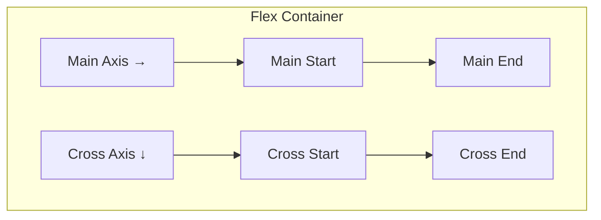
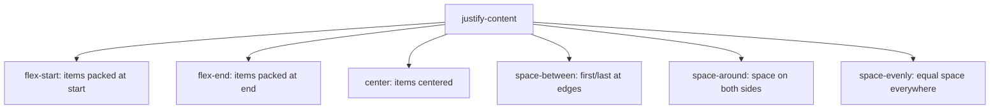

# CSS Flexbox — Complete Guide

## Overview

Flexbox (Flexible Box Layout) is a **one-dimensional** layout model designed for distributing space and aligning items in a container — either in a row or a column.

## Flexbox Terminology



```
┌─── flex-container (display: flex) ─────────────────┐
│                                                      │
│  Main Axis →                                         │
│  ┌────────┐  ┌────────┐  ┌────────┐                │
│  │ Item 1 │  │ Item 2 │  │ Item 3 │      Main End  │
│  │        │  │        │  │        │                │
│  └────────┘  └────────┘  └────────┘                │
│                                                      │
│  Cross Axis ↓                                        │
│                                                      │
└──────────────────────────────────────────────────────┘
```

**Main axis** = `flex-direction` direction (row: horizontal, column: vertical)
**Cross axis** = perpendicular to main axis

## Container Properties

### `display`

```css
.container {
  display: flex;        /* block-level flex container */
  display: inline-flex; /* inline-level flex container */
}
```

### `flex-direction`

```css
.row         { flex-direction: row; }            /* default: left to right */
.row-reverse { flex-direction: row-reverse; }    /* right to left */
.column      { flex-direction: column; }         /* top to bottom */
.column-rev  { flex-direction: column-reverse; } /* bottom to top */
```

### `flex-wrap`

```css
.nowrap  { flex-wrap: nowrap; }    /* default: items shrink to fit one line */
.wrap    { flex-wrap: wrap; }      /* items wrap to new lines */
.wrap-rev{ flex-wrap: wrap-reverse;} /* wrap in reverse cross direction */
```

### `flex-flow` (shorthand)

```css
.container { flex-flow: row wrap; }  /* direction + wrap */
```

### `justify-content` (main axis alignment)

```css
.start    { justify-content: flex-start; }    /* default */
.end      { justify-content: flex-end; }
.center   { justify-content: center; }
.between  { justify-content: space-between; }  /* first at start, last at end, equal space */
.around   { justify-content: space-around; }   /* equal space on each side */
.evenly   { justify-content: space-evenly; }   /* fully equal space */
```



### `align-items` (cross axis alignment — single line)

```css
.stretch { align-items: stretch; }    /* default: fill cross axis height */
.start   { align-items: flex-start; }
.end     { align-items: flex-end; }
.center  { align-items: center; }
.baseline{ align-items: baseline; }    /* align text baselines */
```

### `align-content` (cross axis alignment — multiple lines)

Only works when there are **multiple flex lines** (wrap is active).

```css
.stretch { align-content: stretch; }      /* default */
.start   { align-content: flex-start; }
.end     { align-content: flex-end; }
.center  { align-content: center; }
.between { align-content: space-between; }
.around  { align-content: space-around; }
```

### `gap`

```css
.container {
  gap: 16px;           /* row and column gap */
  row-gap: 16px;       /* vertical gap */
  column-gap: 12px;    /* horizontal gap */
}
```

## Item Properties

### `flex-grow`

Controls how much an item **grows** relative to siblings when there's extra space.

```css
.default  { flex-grow: 0; }      /* default: doesn't grow */
.grow-1   { flex-grow: 1; }      /* takes 1 share of extra space */
.grow-2   { flex-grow: 2; }      /* takes 2 shares (grows twice as much) */
```

### `flex-shrink`

Controls how much an item **shrinks** when space is tight.

```css
.default { flex-shrink: 1; }     /* default: can shrink */
.no-shrink { flex-shrink: 0; }   /* won't shrink even if overflow */
```

### `flex-basis`

Initial size of item **before** grow/shrink is applied.

```css
.auto   { flex-basis: auto; }     /* default: size based on content */
.fixed  { flex-basis: 200px; }    /* start at 200px */
.percent{ flex-basis: 30%; }      /* 30% of container */
.zero   { flex-basis: 0; }        /* ignore content size, distribute evenly */
```

### `flex` (shorthand)

Recommended: use `flex` shorthand instead of individual properties.

```css
.item { flex: 1; }                  /* flex-grow: 1, flex-shrink: 1, flex-basis: 0 */
.item { flex: 1 1 200px; }         /* grow: 1, shrink: 1, basis: 200px */
.item { flex: 0 0 auto; }          /* default: no grow, can shrink, auto basis */
.item { flex: 0 0 300px; }         /* fixed 300px, no grow/shrink */
.item { flex: 1 0 auto; }          /* grow but never shrink */
```

### `align-self`

Overrides `align-items` for a single item.

```css
.item { align-self: flex-start; }
.item { align-self: flex-end; }
.item { align-self: center; }
.item { align-self: stretch; }
.item { align-self: auto; }           /* inherit from container */
```

### `order`

Controls visual order (default is 0).

```css
.item-1 { order: 1; }    /* appears after items with order 0 */
.item-3 { order: -1; }   /* appears before all items with order 0+ */
```

Items with same `order` follow source order.

## Common Layout Patterns

### 1. Centering

```css
.center-container {
  display: flex;
  justify-content: center;
  align-items: center;
}
```

### 2. Equal Columns (Holy Grail-ish)

```css
.equal-columns {
  display: flex;
  gap: 20px;
}
.equal-columns > * {
  flex: 1;    /* each child gets equal space */
}
```

### 3. Sticky Footer

```html
<body class="page">
  <header>Header</header>
  <main>Content</main>
  <footer>Footer</footer>
</body>
```

```css
.page {
  display: flex;
  flex-direction: column;
  min-height: 100vh;
}
main { flex: 1; }
```

### 4. Holy Grail Layout

```css
.holy-grail {
  display: flex;
  flex-direction: column;
  min-height: 100vh;
}
.holy-grail body {
  display: flex;
  flex: 1;
}
.holy-grail nav    { order: -1; }
.holy-grail article { flex: 1; }
.holy-grail nav,
.holy-grail aside  { flex: 0 0 200px; }
```

### 5. Card Grid

```css
.card-grid {
  display: flex;
  flex-wrap: wrap;
  gap: 20px;
}
.card {
  flex: 1 1 300px;  /* grow, shrink, basis 300px */
  /* 3 cards on wide screens, 2 on medium, 1 on narrow */
}
```

### 6. Navbar

```css
.navbar {
  display: flex;
  align-items: center;
  justify-content: space-between;
  padding: 1rem 2rem;
}
.nav-links {
  display: flex;
  gap: 1rem;
}
```

## Flexbox Froggy Reference

The game [Flexbox Froggy](https://flexboxfroggy.com/) uses these concepts:

| Level | Concept | Equivalent CSS |
|-------|---------|----------------|
| 1 | justify-content | `justify-content: flex-end;` |
| 2 | justify-content | `justify-content: center;` |
| 3 | justify-content | `justify-content: space-around;` |
| 4 | justify-content | `justify-content: space-between;` |
| 5 | align-items | `align-items: flex-end;` |
| 6 | align-items + justify-content | `justify-content: center; align-items: center;` |
| 7 | flex-direction | `flex-direction: row-reverse;` |
| 8 | flex-direction | `flex-direction: column;` |
| 9 | flex-direction + justify-content | `flex-direction: column; justify-content: flex-end;` |
| 10-12 | flex-wrap + flex-direction | `flex-wrap: wrap; flex-direction: column-reverse;` |
| 13-15 | align-content | `align-content: center; space-between; flex-end;` |
| 16-19 | order | `order: 1; -1;` |
| 20-24 | align-self | `align-self: flex-end; center; stretch;` |

## Performance Notes

- Flexbox items respect `min-width`/`min-height` (auto minimum size based on content)
- To allow items to shrink below content size: `min-width: 0` or `min-height: 0`
- Avoid deeply nested flex containers — they can impact performance
- Use `gap` instead of margins for spacing items

## Browser Support

Flexbox is supported in all modern browsers. Prefixes not needed since ~2015. Some older properties like `gap` in flex are newer (2021+) but widely supported.
