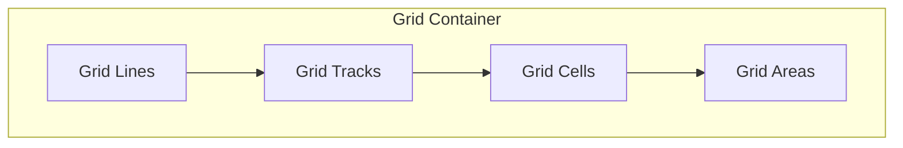

# CSS Grid — Complete Guide

## Overview

CSS Grid Layout is a **two-dimensional** layout system. It can handle both columns **and** rows simultaneously — unlike flexbox which is one-dimensional.

## Grid Terminology



```
┌───── column lines ────────────────────────────────┐
│   │ Column 1          │ Column 2          │ Col 3 │
│ ──┼───────────────────┼───────────────────┼────── │  ← row line
│   │                   │                   │       │
│ R │   1       2       │   3       4       │  5  6 │
│ o │   Area A          │   Area A          │       │
│ w │                   │                   │       │
│ 1 ┼───────────────────┼───────────────────┼────── │
│   │                   │                   │       │
│ R │   7       8       │   9      10       │ 11 12 │
│ o │   Area B          │   Area C          │       │
│ w │                   │                   │       │
│ 2 ┼───────────────────┼───────────────────┴────── │
```

## Grid Container Properties

### `display`

```css
.container {
  display: grid;         /* block-level grid */
  display: inline-grid;  /* inline-level grid */
}
```

### `grid-template-columns` & `grid-template-rows`

Define the **track list** (columns and rows).

```css
/* Fixed sizes */
.fixed {
  grid-template-columns: 200px 300px 200px;
  grid-template-rows: auto 200px;
}

/* Fr unit — fraction of available space */
.fr-grid {
  grid-template-columns: 1fr 2fr 1fr;  /* 25% 50% 25% */
}

/* Repeat function */
.repeat-grid {
  grid-template-columns: repeat(3, 1fr);    /* 3 equal columns */
  grid-template-columns: repeat(4, 100px);  /* 4 fixed columns */
}

/* Auto sizing */
.auto-grid {
  grid-template-columns: auto 1fr auto;  /* first/last sized by content */
}

/* Minmax function */
.minmax-grid {
  grid-template-columns: repeat(auto-fit, minmax(250px, 1fr));
  /* Responsive: as many 250px+ columns as fit */
}
```

### `grid-template-areas`

Define named grid areas.

```css
.layout {
  display: grid;
  grid-template-columns: 200px 1fr 200px;
  grid-template-rows: auto 1fr auto;
  grid-template-areas:
    "header  header  header"
    "nav     main    aside"
    "footer  footer  footer";
}

.header { grid-area: header; }
.nav    { grid-area: nav; }
.main   { grid-area: main; }
.aside  { grid-area: aside; }
.footer { grid-area: footer; }
```

### `gap`

```css
.container {
  gap: 20px;              /* row-gap and column-gap */
  row-gap: 10px;
  column-gap: 20px;
}
```

### `justify-items` / `align-items`

Align items **within their cells** (stretch by default).

```css
.container {
  justify-items: start | end | center | stretch;
  align-items: start | end | center | stretch;
}
```

### `justify-content` / `align-content`

Align the **entire grid** within the container (when total grid size < container).

```css
.container {
  justify-content: start | end | center | stretch | space-around | space-between | space-evenly;
  align-content: start | end | center | stretch | space-around | space-between | space-evenly;
}
```

## Explicit vs Implicit Grid

If there are more grid items than defined tracks, CSS Grid creates **implicit tracks**.

```css
.container {
  grid-template-columns: 1fr 1fr 1fr;  /* 3 explicit columns */
  grid-auto-rows: 150px;               /* implicit rows: 150px */
  grid-auto-columns: 200px;            /* implicit columns: 200px */
  grid-auto-flow: row;                 /* default: fill rows first */
  grid-auto-flow: column;              /* fill columns first */
  grid-auto-flow: dense;               /* fill gaps (reorders items!) */
}
```

## Item Properties

### `grid-column` / `grid-row`

Placing items by line numbers.

```css
.item {
  grid-column: 1 / 3;           /* from line 1 to line 3 (spans 2 columns) */
  grid-column: 1 / span 2;      /* same: start at 1, span 2 */
  grid-row: 1 / 3;
  grid-row: 1 / span 2;

  /* Shorthand */
  grid-area: 1 / 1 / 3 / 3;     /* row-start / col-start / row-end / col-end */
}
```

### Using Named Areas

```css
.item {
  grid-area: header;   /* matches name in grid-template-areas */
}
```

### `justify-self` / `align-self`

Override alignment for a single item.

```css
.item {
  justify-self: center;
  align-self: end;
}
```

## Key Functions

### `repeat()`

```css
grid-template-columns: repeat(4, 1fr);       /* 4 equal columns */
grid-template-columns: repeat(2, 1fr 2fr);   /* 1fr 2fr 1fr 2fr */
```

### `minmax()`

```css
grid-template-columns: repeat(3, minmax(200px, 1fr));
/* Each column: minimum 200px, maximum 1fr */
```

### `fit-content()`

```css
grid-template-columns: fit-content(300px) 1fr 1fr;
/* First column max 300px, shrinks if content smaller */
```

## `auto-fit` vs `auto-fill`

Both work with `repeat()` and `minmax()` to create responsive grids.

```css
.auto-fill {
  grid-template-columns: repeat(auto-fill, minmax(250px, 1fr));
  /* Creates as many tracks as fit in container —
     keeps empty tracks if fewer items */
}

.auto-fit {
  grid-template-columns: repeat(auto-fit, minmax(250px, 1fr));
  /* Creates tracks then collapses empty ones to 0 —
     items can grow to fill the row */
}
```

**Difference:** With 4 items and space for 6 tracks:
- `auto-fill`: 6 tracks (2 empty), items stay at 250px
- `auto-fit`: 4 tracks (2 collapsed to 0), items grow to fill

## Holy Grail Layout

```css
.holy-grail {
  display: grid;
  min-height: 100vh;
  grid-template-columns: 200px 1fr 200px;
  grid-template-rows: auto 1fr auto;
  grid-template-areas:
    "header header header"
    "nav    main   aside"
    "footer footer footer";
}

@media (max-width: 768px) {
  .holy-grail {
    grid-template-columns: 1fr;
    grid-template-areas:
      "header"
      "nav"
      "main"
      "aside"
      "footer";
  }
}
```

## Real-World Layouts

### Card Grid

```css
.card-grid {
  display: grid;
  grid-template-columns: repeat(auto-fill, minmax(300px, 1fr));
  gap: 20px;
}
```

### Dashboard

```css
.dashboard {
  display: grid;
  grid-template-columns: 250px 1fr 1fr;
  grid-template-rows: auto 1fr auto;
  grid-template-areas:
    "sidebar header  header"
    "sidebar stats   chart"
    "sidebar table   table";
}
```

### Magazine Layout

```css
.magazine {
  display: grid;
  grid-template-columns: repeat(4, 1fr);
  grid-auto-rows: 200px;
  gap: 16px;
}

.featured {
  grid-column: 1 / 3;
  grid-row: 1 / 3;     /* Spans 2x2 cells — bigger */
}
```

### Auto-Fill Gallery

```css
.gallery {
  display: grid;
  grid-template-columns: repeat(auto-fill, minmax(150px, 1fr));
  gap: 8px;
}
.gallery img {
  width: 100%;
  height: 200px;
  object-fit: cover;
}
```

## Grid vs Flexbox Comparison

| Feature | Flexbox | Grid |
|---------|---------|------|
| Dimensions | One-dimensional (row OR column) | Two-dimensional (rows AND columns) |
| Use case | Navigation, centering, small components | Full page layout, card grids, dashboards |
| Item arrangement | Items size based on content | Items placed in cells |
| Source order independence | Limited (`order` property) | Full control (`grid-area`, line placement) |
| Overlap support | Not natively | Yes (items can overlap) |
| Content-based sizing | Yes (natural) | Yes but needs `auto` or `min-content` |

## Grid Inspector (DevTools)

Both Chrome and Firefox have excellent **Grid Inspector** tools:
- Click the `grid` badge next to the container in Elements panel
- See grid lines, track sizes, area names overlaid on page
- Adjust gap and alignment visually

## Browser Support

CSS Grid is supported in all modern browsers since 2017-2018. `subgrid` is newer (2022-2023) but has good modern support.
