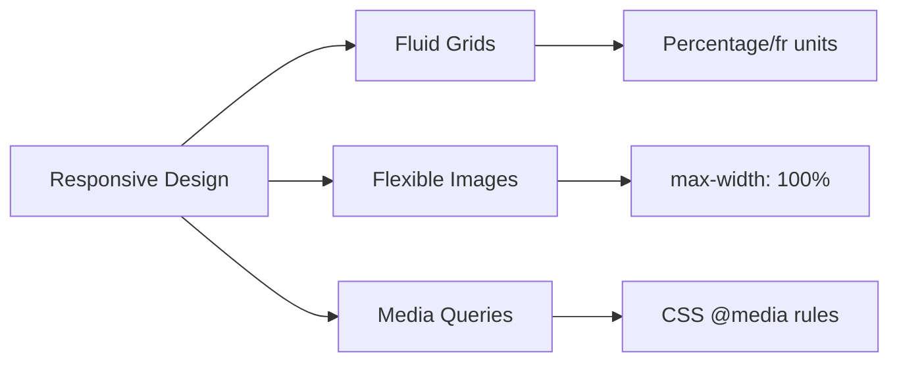
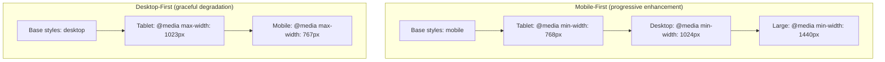

# Responsive Design

## Overview

**Responsive Web Design (RWD)** is an approach where a single website adapts its layout and content to different screen sizes, devices, and orientations. Coined by **Ethan Marcotte** in 2010.

## The Three Core Principles



### 1. Fluid Grids

Use relative units instead of fixed pixels.

```css
/* ❌ Fixed */
.container { width: 1200px; }

/* ✅ Fluid — percentage or max-width */
.container {
  width: 100%;
  max-width: 1200px;
  margin-inline: auto;
}
```

Relative units for grids:

| Unit | Description |
|------|-------------|
| `%` | Percentage of parent |
| `fr` | Fraction of free space (grid/flex) |
| `vw` / `vh` | Viewport width/height (1vw = 1%) |
| `vmin` / `vmax` | Minimum/maximum of vw/vh |
| `clamp()` | Clamp a value between min and max |
| `min()` / `max()` | Choose min/max of values |

```css
/* Modern fluid sizing */
.fluid-type {
  font-size: clamp(1rem, 2vw + 1rem, 3rem);
}

.fluid-container {
  width: min(100% - 2rem, 1200px);
  margin-inline: auto;
}
```

### 2. Flexible Images

Prevent images from overflowing their container.

```css
img, video, iframe, embed, object {
  max-width: 100%;
  height: auto;
}
```

**Art direction** with `<picture>`:

```html
<picture>
  <source media="(max-width: 768px)" srcset="image-mobile.jpg">
  <source media="(max-width: 1200px)" srcset="image-tablet.jpg">
  
</picture>
```

**Resolution switching** with `srcset`:

```html

```

### 3. Media Queries

Apply CSS conditionally based on viewport dimensions, device capabilities, or user preferences.

```css
@media (min-width: 768px) {
  .sidebar { display: block; }
}
```

## Mobile-First vs Desktop-First



### Mobile-First

```css
/* Base: mobile styles (no media query) */
.layout {
  display: flex;
  flex-direction: column;
}

/* Tablet */
@media (min-width: 768px) {
  .layout { flex-direction: row; }
}

/* Desktop */
@media (min-width: 1024px) {
  .layout { gap: 2rem; }
}
```

### Desktop-First

```css
/* Base: desktop styles */
.sidebar { display: block; }

/* Tablet */
@media (max-width: 1023px) {
  .sidebar { width: 250px; }
}

/* Mobile */
@media (max-width: 767px) {
  .sidebar { display: none; }
}
```

**Recommendation:** Mobile-first — simpler mental model, more natural cascade, base styles work for all devices.

## Common Breakpoints

| Name | Min Width | Target Devices |
|------|-----------|----------------|
| Mobile (small) | 0–480px | Phones portrait |
| Mobile (large) | 480px | Phones landscape |
| Tablet | 768px | iPads small tablets |
| Desktop (small) | 1024px | Laptops |
| Desktop (large) | 1440px | Desktops, wide screens |

**Note:** Breakpoints should be based on content needs, not devices. Use semantic breakpoints.

```css
/* ❌ Device-specific */
@media (max-width: 375px) { }  /* iPhone SE */

/* ✅ Content-based */
@media (max-width: 600px) {
  /* When sidebar gets too narrow, collapse it */
}
```

## Viewport Meta Tag

Required for responsive pages on mobile:

```html
<meta name="viewport" content="width=device-width, initial-scale=1.0">
```

| Property | Description |
|----------|-------------|
| `width=device-width` | Sets viewport width to device width (not the default 980px) |
| `initial-scale=1.0` | Sets initial zoom level |
| `minimum-scale=1.0` | Prevents zoom out (accessibility concern) |
| `maximum-scale=3.0` | Allows some zoom |
| `user-scalable=yes` | Ensures users can zoom |

**Avoid** `user-scalable=no` and `maximum-scale=1.0` — they break accessibility.

## Responsive Patterns

### 1. Mostly Fluid

Mostly fluid grid with some fixed sidebar.

```css
.layout {
  display: grid;
  grid-template-columns: 1fr;
  gap: 1rem;
}

@media (min-width: 768px) {
  .layout {
    grid-template-columns: 250px 1fr;
  }
}
```

### 2. Column Drop

Columns stack on small screens, side-by-side on larger.

```css
.column-drop {
  display: flex;
  flex-wrap: wrap;
}
.column-drop .col {
  flex: 1 1 100%;    /* Full width by default */
}
@media (min-width: 600px) {
  .column-drop .col { flex: 1 1 50%; }
}
@media (min-width: 900px) {
  .column-drop .col { flex: 1 1 33.33%; }
}
```

### 3. Layout Shifter

Layout changes completely at breakpoints.

```css
.shifter {
  display: grid;
  grid-template-areas:
    "content"
    "sidebar";
}
@media (min-width: 768px) {
  .shifter {
    grid-template-columns: 1fr 300px;
    grid-template-areas: "content sidebar";
  }
}
```

### 4. Off-Canvas

Navigation slides in from the side on mobile.

```css
.off-canvas-nav {
  position: fixed;
  top: 0;
  left: -250px;
  width: 250px;
  height: 100vh;
  transition: left 0.3s ease;
}

.off-canvas-nav.open {
  left: 0;
}

@media (min-width: 768px) {
  .off-canvas-nav {
    position: static;
    width: auto;
    height: auto;
  }
}
```

### 5. Responsive Table

```css
/* Stack table cells on mobile */
@media (max-width: 600px) {
  table, thead, tbody, th, td, tr {
    display: block;
  }
  thead tr { position: absolute; top: -9999px; left: -9999px; }
  td { border: none; padding: 0.5rem; }
  td::before {
    content: attr(data-label);
    font-weight: bold;
    display: inline-block;
    width: 120px;
  }
}
```

## Useful CSS for Responsiveness

```css
/* Hide visually but available for screenreaders */
.sr-only {
  position: absolute;
  width: 1px;
  height: 1px;
  overflow: hidden;
  clip: rect(0,0,0,0);
  white-space: nowrap;
}

/* Responsive container */
.container {
  width: 100%;
  padding-inline: 1rem;
  margin-inline: auto;
}

@media (min-width: 640px)  { .container { max-width: 640px; } }
@media (min-width: 768px)  { .container { max-width: 768px; } }
@media (min-width: 1024px) { .container { max-width: 1024px; } }
@media (min-width: 1280px) { .container { max-width: 1280px; } }
```
