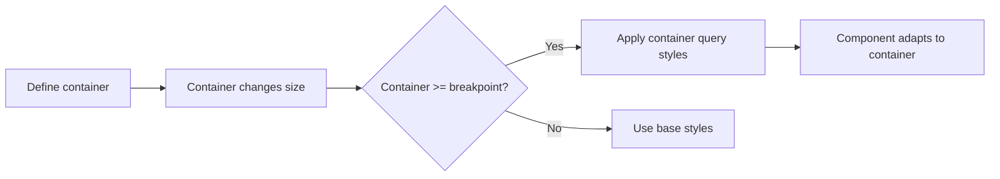
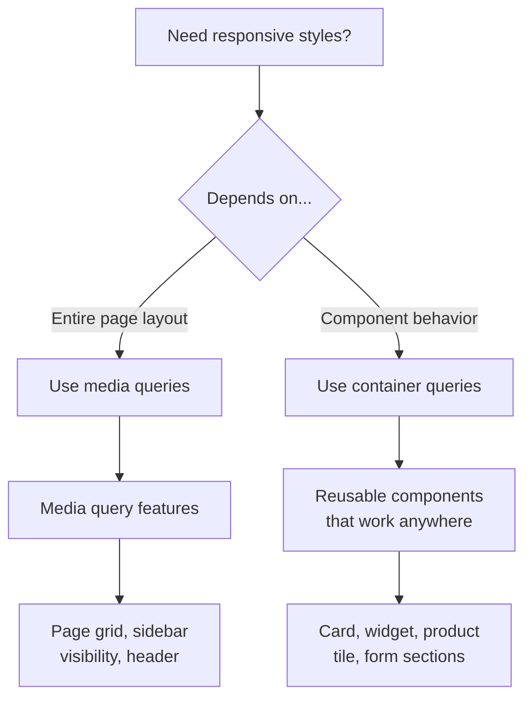

# Container Queries

## Overview

**Container queries** allow you to style elements based on the size of a **parent container** rather than the viewport (as media queries do). This enables truly reusable, context-aware components.

Before container queries, a component's responsive behavior depended on the viewport — making it hard to reuse the same component in different layouts (sidebar vs full-width).

## Container Query Flow



## Key Concepts

### 1. `container-type`

Defines what type of containment is used for size queries.

```css
.container {
  container-type: inline-size;    /* Query based on container width */
  container-type: size;           /* Query based on width AND height */
  container-type: normal;         /* No size containment (only style queries) */
}
```

Most common: `inline-size` — queries based on the inline axis (width in horizontal writing mode).

### 2. `container-name`

Gives the container a name for targeted queries.

```css
.sidebar {
  container-type: inline-size;
  container-name: sidebar;
}

.main-content {
  container-type: inline-size;
  container-name: content;
}
```

### 3. `container` (shorthand)

```css
.container {
  container: sidebar / inline-size;   /* name / type */
  container: inline-size;             /* just type, no name */
}
```

### 4. `@container`

The query itself — similar syntax to `@media`.

```css
/* Target nearest named/unnamed container */
@container (min-width: 400px) {
  .card { flex-direction: row; }
}

/* Target specific named container */
@container sidebar (min-width: 300px) {
  .widget { font-size: 1rem; }
}
```

## Full Example

```html
<div class="dashboard">
  <div class="sidebar">
    <div class="widget">
      <h2>Recent Posts</h2>
      <ul>...</ul>
    </div>
  </div>
  <div class="main">
    <div class="widget">
      <h2>Featured Article</h2>
      <p>...</p>
    </div>
  </div>
</div>
```

```css
/* Define containers */
.sidebar {
  container: sidebar / inline-size;
  width: 300px;
}

.main {
  container: main / inline-size;
  flex: 1;
}

/* Base widget styles (small) */
.widget {
  display: flex;
  flex-direction: column;
  padding: 1rem;
  border: 1px solid #ddd;
  border-radius: 8px;
}

/* When widget is in a container at least 400px wide */
@container (min-width: 400px) {
  .widget {
    flex-direction: row;
    align-items: center;
  }
  .widget h2 { font-size: 1.25rem; }
}

/* Specific behavior in sidebar */
@container sidebar (min-width: 350px) {
  .widget {
    background: #f0f4f8;
  }
}
```

## Container Query Units

| Unit | Equivalent to 1% of |
|------|---------------------|
| `cqw` | Container query width |
| `cqh` | Container query height |
| `cqi` | Container query inline size |
| `cqb` | Container query block size |
| `cqmin` | Smaller of `cqi` or `cqb` |
| `cqmax` | Larger of `cqi` or `cqb` |

```css
.card {
  font-size: clamp(0.875rem, 2cqi, 1.5rem);
  padding: 2cqi;
}

.sidebar-card {
  font-size: 3cqw;  /* 3% of sidebar width */
}
```

## Use Cases vs Media Queries



### When to Use Container Queries

| Scenario | Media Query | Container Query |
|----------|-------------|-----------------|
| Page grid layout | ✅ Best | ❌ |
| Sidebar collapses | ✅ Best | ❌ |
| Product card layout | ❌ | ✅ Best |
| Widget adapts to sidebar or full-width | ❌ | ✅ Best |
| Global font size adjustment | ✅ Best | ❌ |
| Component design system | ❌ | ✅ Best |
| Email newsletter | ✅ Only option | ❌ |

## Advanced: Container Query + Custom Properties

```css
.card-container {
  container: card / inline-size;
}

@container card (min-width: 500px) {
  .card {
    --card-layout: row;
    --card-image-size: 200px;
    --card-font-size: 1.125rem;
  }
}

@container card (min-width: 300px) and (max-width: 499px) {
  .card {
    --card-layout: column;
    --card-image-size: 100%;
    --card-font-size: 1rem;
  }
}

.card {
  display: flex;
  flex-direction: var(--card-layout, column);
}
```

## Browser Support

Container queries are supported in all modern browsers (Chrome 105+, Firefox 110+, Safari 16+). As of 2026, they are a **stable CSS feature** (W3C Recommendation).

## Limitations

- `container-type: inline-size` requires `contain: layout style inline-size` — ensure this doesn't break complex layouts
- Container queries cannot be used for the `html` or `body` elements
- Nested containers can create complexity
- No `@container` support for print media (yet)

## Performance

Container queries are performant — browsers are optimized for containment-based recalculation. However, deeply nested containers may add overhead. Keep container depth to 2–3 levels for best performance.
