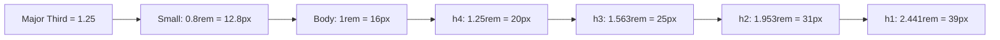

# CSS Typography

## Overview

Typography is the art of arranging text. In CSS, typography controls font selection, sizing, spacing, alignment, decoration, and more. Good typography is critical for readability and user experience.

## Font Properties

### `font-family`

Defines which typeface to use. Provide fallbacks:

```css
body {
  font-family: "Helvetica Neue", Arial, sans-serif;
}

.serif-text {
  font-family: Georgia, "Times New Roman", Times, serif;
}

.monospace-text {
  font-family: "Fira Code", "Cascadia Code", Consolas, monospace;
}
```

### System Font Stack

```css
/* Modern system font — matches the OS */
body {
  font-family: -apple-system, BlinkMacSystemFont, "Segoe UI", Roboto,
    Oxygen-Sans, Ubuntu, Cantarell, "Helvetica Neue", sans-serif;
}

/* System UI font stack */
font-family: system-ui, -apple-system, sans-serif;
```

### `font-size`

Absolute, relative, and fluid sizing:

```css
.absolute { font-size: 16px; }
.relative { font-size: 1.2rem; }    /* Relative to root */
.fluid    { font-size: clamp(1rem, 2vw + 1rem, 2rem); }
```

| Unit | Description |
|------|-------------|
| `px` | Fixed pixels (not resizable by user in some browsers) |
| `em` | Relative to **parent** font-size (compound) |
| `rem` | Relative to **root** font-size (`html`) |
| `%` | Percentage of parent font-size |
| `vw` | 1% of viewport width |
| `clamp()` | Fluid range: min, preferred, max |

```css
html { font-size: 100%; }     /* 16px default */
h1   { font-size: 2.5rem; }   /* 40px */
p    { font-size: 1rem; }     /* 16px */

/* Typographic scale example */
h1 { font-size: 3rem; }       /* 48px */
h2 { font-size: 2.25rem; }    /* 36px */
h3 { font-size: 1.75rem; }    /* 28px */
h4 { font-size: 1.25rem; }    /* 20px */
body { font-size: 1rem; }     /* 16px */
small { font-size: 0.875rem; }/* 14px */
```

### `font-weight`

```css
.normal { font-weight: 400; }
.bold   { font-weight: 700; }
.light  { font-weight: 300; }

/* Keyword values */
.thin     { font-weight: 100; }
.extra-light { font-weight: 200; }
.light    { font-weight: 300; }
.normal   { font-weight: 400; }
.medium   { font-weight: 500; }
.semi-bold{ font-weight: 600; }
.bold     { font-weight: 700; }
.extra-bold{ font-weight: 800; }
.black    { font-weight: 900; }
```

### `line-height`

Controls vertical space between lines. **Use unitless values:**

```css
body { line-height: 1.6; }       /* Recommended for readability */
h1, h2, h3 { line-height: 1.2; } /* Tight for headings */
.small-text { line-height: 1.4; }

/* Fixed line-height */
.exact { line-height: 24px; }
```

### `font-style`

```css
.italic { font-style: italic; }
.oblique { font-style: oblique; }
.normal { font-style: normal; }
```

### `font-variant`

```css
.small-caps { font-variant: small-caps; }
```

## Text Layout Properties

### `text-align`

```css
.left    { text-align: left; }
.center  { text-align: center; }
.right   { text-align: right; }
.justify { text-align: justify; }
```

### `text-decoration`

```css
.underline      { text-decoration: underline; }
.line-through   { text-decoration: line-through; }
.overline       { text-decoration: overline; }
.none           { text-decoration: none; }

/* Modern: decoration with color and style */
.link {
  text-decoration: underline;
  text-decoration-color: blue;
  text-decoration-style: wavy;     /* solid, double, dotted, dashed, wavy */
  text-decoration-thickness: 2px;
  text-underline-offset: 4px;
}
```

### `text-transform`

```css
.uppercase  { text-transform: uppercase; }
.lowercase  { text-transform: lowercase; }
.capitalize { text-transform: capitalize; }
```

### `letter-spacing` and `word-spacing`

```css
.tight   { letter-spacing: -0.02em; }
.loose   { letter-spacing: 0.1em; }
.wide    { word-spacing: 0.25em; }
```

### `text-overflow` and `white-space`

```css
.truncate {
  white-space: nowrap;
  overflow: hidden;
  text-overflow: ellipsis;   /* Shows "..." */
}

/* Multi-line truncation (line-clamp) */
.clamp-3 {
  display: -webkit-box;
  -webkit-line-clamp: 3;
  -webkit-box-orient: vertical;
  overflow: hidden;
}
```

## Web Fonts

### `@font-face`

```css
@font-face {
  font-family: "MyCustomFont";
  src: url("fonts/myfont.woff2") format("woff2"),
       url("fonts/myfont.woff") format("woff");
  font-weight: 400;
  font-style: normal;
  font-display: swap;   /* Show fallback until font loads */
}

body {
  font-family: "MyCustomFont", Arial, sans-serif;
}
```

### Google Fonts

```html
<!-- In HTML <head> -->
<link rel="preconnect" href="https://fonts.googleapis.com">
<link rel="preconnect" href="https://fonts.gstatic.com" crossorigin>
<link href="https://fonts.googleapis.com/css2?family=Inter:wght@400;700&display=swap" rel="stylesheet">
```

```css
/* In CSS */
body {
  font-family: "Inter", system-ui, sans-serif;
}
```

### `font-display`

| Value | Behavior |
|-------|----------|
| `auto` | Browser default (usually block) |
| `block` | Hide text briefly, then swap (FOUT) |
| `swap` | Show fallback, swap when loaded |
| `fallback` | Show fallback, swap if loaded within ~100ms, else keep fallback |
| `optional` | Show fallback, use web font only if loaded before paint |

**Best practice:** Use `font-display: swap` or `optional`.

## Typographic Scale

A **type scale** creates harmonious font sizing. Common scales:



```css
/* Perfect Fourth scale (1.333) */
:root {
  --text-sm: 0.75rem;      /* 12px */
  --text-base: 1rem;       /* 16px */
  --text-md: 1.125rem;     /* 18px */
  --text-lg: 1.5rem;       /* 24px */
  --text-xl: 2rem;         /* 32px */
  --text-2xl: 2.666rem;    /* ~43px */
  --text-3xl: 3.555rem;    /* ~57px */
}
```

## Best Practices

```css
/* Base typography */
html {
  font-size: 100%;                     /* 16px — respects user preferences */
  -webkit-font-smoothing: antialiased; /* Smoother on macOS */
}

body {
  font-family: system-ui, -apple-system, sans-serif;
  font-size: 1rem;
  line-height: 1.6;
  color: #1a1a1a;
  text-rendering: optimizeLegibility;  /* Better kerning */
}

/* Measure (line length) */
.content {
  max-width: 65ch;            /* 65 characters — optimal readability */
}

/* Prevent font size inflation on mobile */
html { -moz-text-size-adjust: none; -webkit-text-size-adjust: none; text-size-adjust: none; }
```
