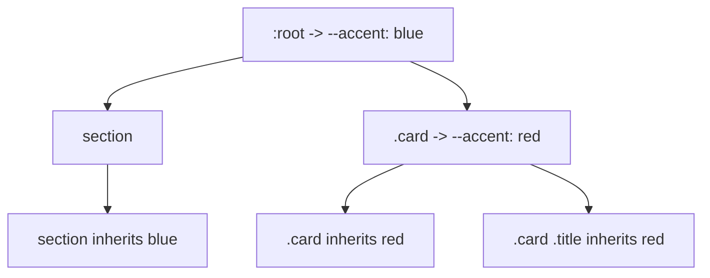

# CSS Custom Properties (Variables)

## Overview

**CSS Custom Properties** (CSS variables) allow you to store values and reuse them throughout a stylesheet. Unlike preprocessor variables (Sass/LESS), they are **live** in the browser, can be overridden by cascade, and can be manipulated with JavaScript.

## Basic Syntax

### Defining Variables

```css
:root {
  --primary: #007bff;
  --secondary: #6c757d;
  --spacing: 1rem;
  --font-size-base: 16px;
}
```

### Using Variables

```css
.button {
  background: var(--primary);
  margin: var(--spacing);
  font-size: var(--font-size-base);
}
```

### Fallbacks

```css
.element {
  /* If --primary is not set, use #333 */
  color: var(--primary, #333);

  /* Nested fallback: if --primary not set, check --brand, else #333 */
  color: var(--primary, var(--brand, #333));
}
```

## Scope and Inheritance

Custom properties respect the **cascade** and inherit through the DOM.

```css
:root {
  --accent: blue;
}

.card {
  --accent: red;           /* Overrides inside .card */
  border: 2px solid var(--accent);  /* red */
}

.card .title {
  color: var(--accent);    /* Inherits red from .card */
}

/* But this doesn't leak outside .card */
section {
  color: var(--accent);    /* Gets blue from :root */
}
```



## Theming with CSS Variables

### Dark Mode

```css
:root {
  --bg: #ffffff;
  --text: #1a1a1a;
  --surface: #f5f5f5;
  --border: #e0e0e0;
  --primary: #007bff;
}

[data-theme="dark"] {
  --bg: #1a1a2e;
  --text: #e0e0e0;
  --surface: #16213e;
  --border: #2a2a4a;
  --primary: #4dabf7;
}

body {
  background: var(--bg);
  color: var(--text);
  transition: background 0.3s, color 0.3s;
}

.card {
  background: var(--surface);
  border: 1px solid var(--border);
}
```

### System Preference + Manual Override

```css
:root {
  --bg: #fff;
  --text: #222;
}

@media (prefers-color-scheme: dark) {
  :root {
    --bg: #111;
    --text: #eee;
  }
}

[data-theme="light"] {
  --bg: #fff;
  --text: #222;
}

[data-theme="dark"] {
  --bg: #111;
  --text: #eee;
}
```

## Dynamic Theming with JavaScript

```js
// Toggle theme
document.documentElement.dataset.theme = 'dark';

// Set a custom property via JS
document.documentElement.style.setProperty('--primary', '#ff5733');

// Read a custom property
const primary = getComputedStyle(document.documentElement)
  .getPropertyValue('--primary').trim();

// Interactive color picker
colorPicker.addEventListener('input', (e) => {
  document.documentElement.style.setProperty('--accent', e.target.value);
});
```

## Benefits Over Preprocessor Variables

| Feature | CSS Custom Properties | Sass/LESS Variables |
|---------|-----------------------|---------------------|
| Cascade | ✅ Yes — inherit, override | ❌ Compiled once |
| Dynamic | ✅ Changes at runtime | ❌ Static after compile |
| JavaScript | ✅ Read and modify | ❌ Cannot access |
| Media queries | ✅ Can change in `@media` | ❌ Cannot |
| Animations | ✅ Can animate | ❌ Cannot |
| `calc()` | ✅ Can use in calculations | ❌ Limited |
| Pseudo-elements | ✅ Accessible via `inherit` | ❌ Not available |
| Browser support | ✅ Modern browsers | ❌ Requires compile step |

## Advanced Usage

### Variables in `calc()`

```css
:root {
  --spacing: 1rem;
  --cols: 3;
}

.grid {
  gap: var(--spacing);
  grid-template-columns: repeat(var(--cols), 1fr);
}

.panel {
  padding: calc(var(--spacing) * 2);
  margin: var(--spacing);
  width: calc(100% - var(--spacing) * 4);
}
```

### Animating Variables

```css
:root {
  --rotation: 0deg;
}

.spinner {
  animation: spin 2s linear infinite;
  transform: rotate(var(--rotation));
}

@keyframes spin {
  100% { --rotation: 360deg; }
}

/* Note: @property needed for animation of custom properties */
@property --rotation {
  syntax: "<angle>";
  initial-value: 0deg;
  inherits: false;
}
```

### `@property` — Registered Custom Properties

```css
/* Register for typed values, animations, and validation */
@property --primary-color {
  syntax: "<color>";
  initial-value: #007bff;
  inherits: true;
}

@property --spacing {
  syntax: "<length>";
  initial-value: 16px;
  inherits: false;
}

/* Now we can animate the variable */
.element {
  transition: --primary-color 0.3s;
}
.element:hover {
  --primary-color: #ff5733;
}
```

### Component-Level Variables

```css
.button {
  --btn-bg: #007bff;
  --btn-text: white;
  --btn-padding: 0.5em 1em;

  background: var(--btn-bg);
  color: var(--btn-text);
  padding: var(--btn-padding);
  border: none;
  border-radius: 4px;
}

.button--secondary {
  --btn-bg: #6c757d;
}

.button--large {
  --btn-padding: 1em 2em;
}
```

### Responsive Variables

```css
:root {
  --grid-cols: 1;
  --font-size: 1rem;
}

@media (min-width: 768px) {
  :root {
    --grid-cols: 2;
    --font-size: 1.125rem;
  }
}

@media (min-width: 1024px) {
  :root {
    --grid-cols: 3;
    --font-size: 1.25rem;
  }
}

.layout {
  display: grid;
  grid-template-columns: repeat(var(--grid-cols), 1fr);
  font-size: var(--font-size);
}
```

## Performance Notes

- CSS variables are resolved at **computed value time** — no performance penalty over static values
- DOM changes to `style` property trigger **recalc** — batch updates if changing many variables
- `@property` registered variables with `<length>` or `<number>` types perform better in animations than unregistered strings

## Browser Support

CSS custom properties supported since:
- Chrome 49+ (2016)
- Firefox 31+ (2014)
- Safari 9.1+ (2016)
- Edge 15+ (2017)

`@property` supported in Chrome 85+, Firefox 128+, Safari 16+.
