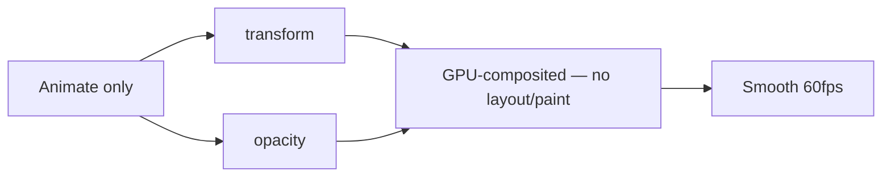

# CSS Animations

## Overview

CSS Animations allow elements to transition between styles using **keyframes** — without JavaScript. They offer more control than transitions (multiple steps, iteration, direction).

## `@keyframes`

Define the animation sequence:

```css
@keyframes slide-in {
  from {
    transform: translateX(-100%);
    opacity: 0;
  }
  to {
    transform: translateX(0);
    opacity: 1;
  }
}

@keyframes bounce {
  0%   { transform: translateY(0); }
  50%  { transform: translateY(-30px); }
  70%  { transform: translateY(-15px); }
  90%  { transform: translateY(-5px); }
  100% { transform: translateY(0); }
}

@keyframes color-cycle {
  0%   { background: red; }
  25%  { background: blue; }
  50%  { background: green; }
  75%  { background: orange; }
  100% { background: red; }
}
```

## Animation Properties

### `animation-name`

```css
.element {
  animation-name: slide-in;   /* References @keyframes name */
}
```

### `animation-duration`

```css
.element {
  animation-duration: 0.5s;   /* Seconds (s) or milliseconds (ms) */
  animation-duration: 500ms;
}
```

### `animation-timing-function`

```css
.element {
  animation-timing-function: ease;           /* Default */
  animation-timing-function: linear;
  animation-timing-function: ease-in;
  animation-timing-function: ease-out;
  animation-timing-function: ease-in-out;

  /* Cubic bezier — custom curve */
  animation-timing-function: cubic-bezier(0.68, -0.55, 0.27, 1.55);

  /* Steps — discrete jumps */
  animation-timing-function: steps(4, end);   /* 4 frames, end at end */
  animation-timing-function: steps(4, start); /* 4 frames, end at start */
  animation-timing-function: step-start;      /* = steps(1, start) */
  animation-timing-function: step-end;        /* = steps(1, end) */
}
```

### `animation-delay`

```css
.element {
  animation-delay: 0.5s;       /* Wait 0.5s before starting */
  animation-delay: -1s;        /* Start 1s into the animation */
}
```

### `animation-iteration-count`

```css
.element {
  animation-iteration-count: 1;       /* Default */
  animation-iteration-count: 3;
  animation-iteration-count: infinite; /* Loops forever */
}
```

### `animation-direction`

```css
.element {
  animation-direction: normal;        /* Default: 0% → 100% */
  animation-direction: reverse;       /* 100% → 0% */
  animation-direction: alternate;     /* 0% → 100% → 0% → 100% ... */
  animation-direction: alternate-reverse; /* 100% → 0% → 100% ... */
}
```

### `animation-fill-mode`

Controls styles **before** and **after** animation runs.

```css
.element {
  animation-fill-mode: none;      /* Default — no styles applied outside animation */
  animation-fill-mode: forwards;  /* Retain final keyframe state */
  animation-fill-mode: backwards; /* Apply first keyframe during delay */
  animation-fill-mode: both;      /* forwards + backwards */
}
```

### `animation-play-state`

```css
.element {
  animation-play-state: running;  /* Default */
  animation-play-state: paused;   /* Freeze animation */
}

/* Pause on hover */
.element:hover {
  animation-play-state: paused;
}
```

## `animation` Shorthand

```css
/* animation: name duration timing-function delay iteration-count direction fill-mode play-state; */

.element {
  animation: slide-in 0.5s ease-out 0.2s 1 normal forwards;
}

/* Minimal */
.element {
  animation: bounce 1s infinite;
}

/* Multiple animations */
.element {
  animation:
    slide-in 0.5s ease-out,
    fade-in 0.3s linear;
}
```

## Complex Multi-Step Animation Examples

### Loading Spinner

```css
@keyframes spin {
  0%   { transform: rotate(0deg); }
  100% { transform: rotate(360deg); }
}

.spinner {
  width: 40px;
  height: 40px;
  border: 4px solid #ccc;
  border-top-color: #007bff;
  border-radius: 50%;
  animation: spin 0.8s linear infinite;
}
```

### Pulsing Button

```css
@keyframes pulse {
  0% { transform: scale(1); box-shadow: 0 0 0 0 rgba(0,123,255,0.7); }
  70% { transform: scale(1.05); box-shadow: 0 0 0 10px rgba(0,123,255,0); }
  100% { transform: scale(1); box-shadow: 0 0 0 0 rgba(0,123,255,0); }
}

.btn-pulse {
  animation: pulse 2s infinite;
}
```

### Skeleton Loading

```css
@keyframes shimmer {
  0% { background-position: -200% 0; }
  100% { background-position: 200% 0; }
}

.skeleton {
  background: linear-gradient(
    90deg,
    #f0f0f0 25%,
    #e0e0e0 50%,
    #f0f0f0 75%
  );
  background-size: 200% 100%;
  animation: shimmer 1.5s infinite;
  border-radius: 4px;
  height: 16px;
  margin-bottom: 8px;
}

.skeleton.title { width: 60%; height: 24px; }
.skeleton.text { width: 100%; }
.skeleton.text.short { width: 40%; }
```

### Staggered Fade-In

```css
@keyframes fade-in-up {
  from {
    opacity: 0;
    transform: translateY(20px);
  }
  to {
    opacity: 1;
    transform: translateY(0);
  }
}

.list-item {
  animation: fade-in-up 0.4s ease-out both;
}

.list-item:nth-child(1) { animation-delay: 0s; }
.list-item:nth-child(2) { animation-delay: 0.1s; }
.list-item:nth-child(3) { animation-delay: 0.2s; }
.list-item:nth-child(4) { animation-delay: 0.3s; }
```

### Text Reveal

```css
@keyframes reveal {
  from { clip-path: inset(0 100% 0 0); }
  to   { clip-path: inset(0 0 0 0); }
}

.reveal-text {
  animation: reveal 1.5s cubic-bezier(0.77, 0, 0.18, 1) forwards;
  white-space: nowrap;
  overflow: hidden;
}
```

## `steps()` Function

Used for **frame-by-frame** animations (sprite sheets, typing effects):

```css
/* Typing effect */
@keyframes typing {
  from { width: 0; }
  to   { width: 100%; }
}

.typing-text {
  overflow: hidden;
  white-space: nowrap;
  animation: typing 3s steps(40) forwards;  /* 40 characters, 40 steps */
  width: 0;
}
```

## Animation Events (JavaScript)

```js
element.addEventListener('animationstart', () => {});
element.addEventListener('animationend', () => {});
element.addEventListener('animationiteration', () => {});  // Infinite loops
```

## Performance Optimization



```css
/* ❌ Bad — triggers layout */
.element {
  animation: move 1s infinite;
}
@keyframes move {
  from { left: 0; }
  to   { left: 100px; }
}

/* ✅ Good — only composited properties */
.element {
  animation: move 1s infinite;
}
@keyframes move {
  from { transform: translateX(0); }
  to   { transform: translateX(100px); }
}
```

**Properties to animate:** `transform`, `opacity` (cheap).  
**Properties to avoid:** `width`, `height`, `top`, `left`, `margin`, `padding`, `border`, `font-size`, `background` (expensive — trigger layout/paint).

## Accessibility

```css
@media (prefers-reduced-motion: reduce) {
  *, *::before, *::after {
    animation-duration: 0.01ms !important;
    animation-iteration-count: 1 !important;
    scroll-behavior: auto !important;
  }
}
```

## Browser Support

CSS Animations supported in all modern browsers. `@keyframes` + `animation` properties are Level 1 (REC, 2023+).
