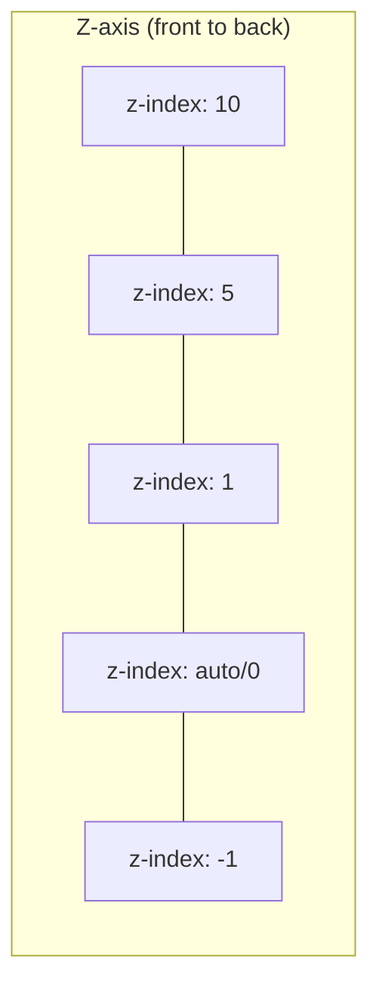

# Z-Index

## Overview

The `z-index` property controls the **stacking order** of elements along the Z-axis (front-to-back). It only works on **positioned elements** (non-static) or flex/grid items.

## Basic Usage

```css
.element {
  position: relative;    /* or absolute, fixed, sticky */
  z-index: 1;            /* Higher value = closer to viewer */
}
```

- Higher `z-index` appears on top of lower values
- Can be negative (appears behind elements with no z-index)
- Default is `auto` (treated as 0 within stacking context)



```
Viewer (screen)
    │
    │  ┌─────────────┐  z-index: 10  ──── Front
    │  │ Box 3       │
    │  └─────────────┘
    │  ┌─────────────┐  z-index: 5
    │  │ Box 2       │
    │  └─────────────┘
    │  ┌─────────────┐  z-index: 1
    │  │ Box 1       │
    │  └─────────────┘
    │  ┌─────────────┐  z-index: auto/0
    │  │ Background  │
    │  └─────────────┘
    │
    ▼ Page / Canvas (back)
```

## How Z-Index Works

```css
/* z-index only works on positioned elements */
.static {
  position: static;
  z-index: 10;          /* ❌ No effect */
}

.relative {
  position: relative;
  z-index: 10;          /* ✅ Works */
}

/* Also works on flex and grid items without explicit position */
.flex-item {
  z-index: 5;           /* ✅ Works — flex items are stacking contexts */
}
```

## Stacking Order Without Z-Index

When no elements have explicit z-index, the stacking order is (back to front):

1. Background and borders of root element
2. Negative z-index elements (in tree order)
3. Non-positioned blocks (in tree order)
4. Floated elements
5. Inline content
6. Positioned elements (in tree order — later in source = on top)

```html
<div class="box blue">Blue (no position)</div>
<div class="box red" style="position:relative;">Red (positioned — on top)</div>
<div class="box green" style="position:relative;">Green (positioned, later source — on top of red)</div>
```

## Z-Index and Stacking Contexts

A **stacking context** is a group of elements that share a common parent for stacking purposes. Within a stacking context, z-index values are relative to that context only.

```mermaid
flowchart TD
    subgraph Root Stacking Context
        A[Parent: z-index: 10] --> B[Child A: z-index 999]
        C[Parent: z-index: 1] --> D[Child B: z-index 1]
    end
    subgraph "❗ Even with z-index: 999, Child A is behind Parent C"
        B -.- E[Parent C (z-index: 1) is above<br>Parent A (z-index: 10)]
    end
```

```html
<div class="parent-a" style="position:relative; z-index:10;">
  <div class="child" style="position:absolute; z-index:999;">Child (z:999)</div>
</div>
<div class="parent-b" style="position:relative; z-index:1;">
  <div class="child" style="position:absolute; z-index:1;">Child (z:1)</div>
</div>
<!-- parent-b (z:1) appears ABOVE parent-a (z:10)'s child (z:999) -->
```

## What Creates a Stacking Context

Any element with:

| Property | Value |
|----------|-------|
| `position` | `relative` / `absolute` with `z-index` not `auto` |
| `position` | `fixed` or `sticky` (always creates context) |
| `opacity` | Less than 1 |
| `transform` | Any value other than `none` |
| `filter` | Any value other than `none` |
| `perspective` | Any value other than `none` |
| `clip-path` | Any value other than `none` |
| `mask` / `mask-image` | Any value other than `none` |
| `mix-blend-mode` | Any value other than `normal` |
| `isolation` | `isolate` |
| `will-change` | Any property that creates context |
| `contain` | `paint` or `layout` / `strict` / `content` |

## Common Z-Index Issues

### Issue 1: Child Can't Escape Parent

```css
.parent { position: relative; z-index: 1; }
.child { position: absolute; z-index: 999; }
/* Child z-index is relative to parent stacking context.
   If another element has a higher stacking context, child stays behind. */
```

**Fix:** Adjust parent z-index, or restructure HTML.

### Issue 2: Positioned Behind Non-Positioned Elements

```css
.box1 { position: absolute; z-index: 1; }
.box2 { /* static — non-positioned */ }
/* box1 appears behind box2 because it comes first in source. */
```

**Fix:** Give `box1` a higher z-index or reorder HTML.

### Issue 3: Modal Overlap

```css
.modal { position: fixed; z-index: 100; }
.sidebar { position: fixed; z-index: 50; }
.select-dropdown { position: absolute; z-index: 200; }
/* Dropdown in sidebar has z-index 200, but it's inside sidebar (z:50).
   It won't appear above the modal (z:100) */
```

## Best Practices

```css
/* 1. Use a z-index scale */
:root {
  --z-dropdown: 100;
  --z-sticky: 200;
  --z-modal-backdrop: 300;
  --z-modal: 400;
  --z-toast: 500;
  --z-tooltip: 600;
}

/* 2. Keep z-index values logical */
.header { z-index: var(--z-sticky); }
.modal { z-index: var(--z-modal); }
.tooltip { z-index: var(--z-tooltip); }

/* 3. Use isolation to create containment */
.modal-container {
  isolation: isolate;   /* Creates new stacking context — contains children */
}

/* 4. Avoid z-index: 999999 */
/* Instead, increase parent's stacking context */
```

## Z-Index Scale (Recommended)

| Layer | z-index | Usage |
|-------|---------|-------|
| Base content | `auto` / `0` | Normal flow |
| Dropdown menus | `100` | Navigation menus |
| Sticky headers | `200` | Sticky elements |
| Sidebar overlays | `300` | Off-canvas panels |
| Modal backdrops | `400` | Semi-transparent overlays |
| Modals | `500` | Dialog popups |
| Toast notifications | `600` | Popup alerts |
| Tooltips | `700` | Hover tooltips |
| Loading spinners | `800` | Full-page loaders |
| Custom context | `900` | Edge cases |

## Debugging Z-Index

Chrome DevTools:
1. Inspect element → **Computed** panel → check `z-index`
2. Look for stacking context indicators (e.g., `position: relative; z-index: 1;`)
3. Use **3D View** (Layers tool) to visualize stacking
4. Toggle `z-index` values to find conflicts
