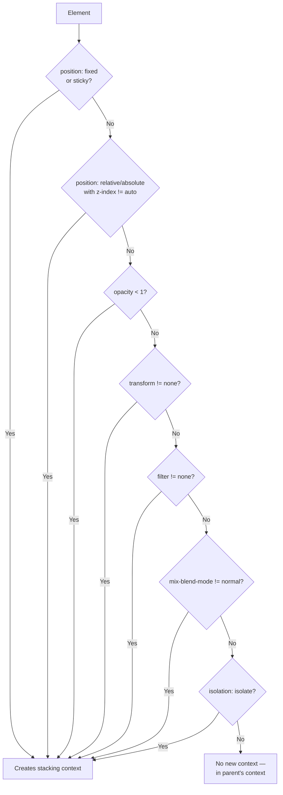

# Stacking Context — Deep Dive

## Overview

A **stacking context** is a conceptual container in which elements are stacked along the Z-axis. Elements within the same stacking context are stacked relative to each other. A stacking context can contain child stacking contexts.

Understanding stacking contexts is crucial for resolving z-index issues.

## When Stacking Contexts Are Created



### Complete List of Properties That Create Stacking Contexts

| Property | Condition | Example |
|----------|-----------|---------|
| `position` | `fixed` or `sticky` (always) | `position: fixed;` |
| `position` + `z-index` | `relative/absolute` + `z-index` not `auto` | `position: relative; z-index: 1;` |
| `opacity` | Value less than 1 | `opacity: 0.99;` |
| `transform` | Any value other than `none` | `transform: scale(1.05);` |
| `filter` | Any value other than `none` | `filter: blur(2px);` |
| `perspective` | Any value other than `none` | `perspective: 800px;` |
| `clip-path` | Any value other than `none` | `clip-path: circle(50%);` |
| `mask` / `mask-image` | Any value other than `none` | `mask-image: url(mask.png);` |
| `mix-blend-mode` | Any value other than `normal` | `mix-blend-mode: multiply;` |
| `isolation` | `isolate` | `isolation: isolate;` |
| `will-change` | Values that would create context | `will-change: transform;` |
| `contain` | `paint`, `layout`, `strict`, `content` | `contain: paint;` |
| `-webkit-overflow-scrolling` | `touch` | (iOS legacy) |

## How Stacking Contexts Affect Z-Index

```html
<div class="context-a">
  <div class="child-a1" style="z-index: 100">Child A1</div>
  <div class="child-a2" style="z-index: 1">Child A2</div>
</div>
<div class="context-b">
  <div class="child-b1" style="z-index: 10">Child B1</div>
</div>
```

```css
.context-a { position: relative; z-index: 10; }
.context-b { position: relative; z-index: 1; }
```

**Result:** All children of `.context-b` appear above all children of `.context-a`, regardless of the children's z-index values. Child A1 has z-index 100 but is limited by its parent's stacking context (z-index 10), which is lower than `.context-b`'s context (z-index 1) in the **root** stacking order.

```
Viewer
  │
  ├── context-b (z: 1)             ← context-b entire group is above
  │    └── child-b1 (z: 10)             even though child-b1 has
  │                                       lower z than child-a1
  │
  ├── context-a (z: -1)
  │    └── child-a1 (z: 100)       ← child-a1 is behind context-b
  │    └── child-a2 (z: 1)              because its parent is behind
  │
  └── root
```

## Nested Stacking Contexts

```css
.level1 {
  position: relative;
  z-index: 10;
}

.level2 {
  position: relative;
  z-index: 5;   /* Created within level1's context */
}

.level3 {
  position: relative;
  z-index: 100; /* Created within level2's context */
}

/* level3 (z:100) is still behind anything inside level1
   that has z-index > 10 within the root context */
```

## Stacking Order Within a Context

Within a single stacking context, elements are painted in this order (back to front):

1. Background and borders of the context element
2. Elements with **negative z-index** (in order of appearance)
3. **Non-positioned** block-level elements (in order of appearance)
4. **Floated** elements
5. **Inline** elements (text, inline-level)
6. Elements with **z-index: 0** or **z-index: auto**
7. Elements with **positive z-index** (in order of appearance)

```mermaid
flowchart TD
    subgraph Painting Order (back → front)
        A[1. Background & borders of context]
        B[2. Negative z-index elements]
        C[3. Non-positioned blocks]
        D[4. Floated elements]
        E[5. Inline content]
        F[6. z-index: 0 / auto]
        G[7. Positive z-index elements]
    end
    A --> B --> C --> D --> E --> F --> G
```

## `isolation: isolate`

A clean way to create a stacking context without side effects (no visual changes):

```css
.component {
  isolation: isolate;
  /* Creates a new stacking context — contains all children */
  /* No visual side effects unlike opacity/transform */
}

.modal-wrapper {
  isolation: isolate;  /* Guarantees modal is above all page content */
}
```

## Real-World Complex Examples

### Example 1: Modal with Dropdown

```html
<div class="page">
  <header class="header">Header</header>
  <main>
    <div class="modal-backdrop">
      <div class="modal">
        <button class="dropdown-toggle">Menu</button>
        <div class="dropdown-menu">...</div>
      </div>
    </div>
  </main>
</div>
```

```css
.header { position: sticky; top: 0; z-index: 100; }

.modal-backdrop {
  position: fixed;
  inset: 0;
  background: rgba(0,0,0,0.5);
  z-index: 200;
  /* Creates stacking context via position + z-index */
  isolation: isolate;  /* Keep dropdown inside */
}

.modal {
  position: relative;
  z-index: 1;          /* Inside backdrop's context */
}

.dropdown-menu {
  position: absolute;
  z-index: 999;        /* Still limited to backdrop's context */
}

/* Even at z-index: 999, dropdown won't go above header
   if header has higher z-index in root context */
```

### Example 2: Card Hover Effect

```css
.card {
  position: relative;
  transition: transform 0.3s;
  /* transform creates stacking context on hover */
}

.card:hover {
  transform: scale(1.05);
  z-index: 10;   /* But z-index is relative to parent stacking context */
}
```

### Example 3: Fixed Header with Scrollable Content

```css
body {
  /* No stacking context on body */
}

.header {
  position: fixed;
  top: 0;
  z-index: 100;
  /* Creates stacking context (fixed = always) */
}

.content {
  position: relative;
  z-index: 50;
  /* Creates stacking context */
  /* But content is still BEHIND header because header is later */
}

.popup {
  position: fixed;
  z-index: 200;
  /* OK — this is in root context, above header */
}
```

## Debugging Stacking Contexts

### Chrome DevTools

1. Open **Elements** panel
2. Select element → **Computed** tab
3. Check "Stacking context" section (if available)
4. Use **3D View** (three dots menu → More tools → Layers)
5. Toggle `z-index` and stacking-context-creating properties

### Firefox DevTools

1. Open **Inspector** panel
2. Select element → **Layout** section
3. Check "Stacking context" overlay
4. Firefox shows stacking context indicators in the HTML tree

## Common Stacking Context Antipatterns

```css
/* ❌ Creating accidental contexts */
.card { opacity: 0.99; }              /* Creates context — can cause z-index bugs */
.card { transform: translateZ(0); }   /* Creates context — may be intentional */
.card { will-change: transform; }    /* Creates context — optimization side effect */

/* ✅ Intentional context creation with isolation */
.wrapper { isolation: isolate; }      /* Creates context without visual change */

/* ✅ Using contain instead of overflow: hidden */
.wrapper { contain: paint; }          /* Creates context, clips, no scrollbar side effect */
```

## Key Takeaways

1. **z-index is relative to the stacking context**, not the document root
2. **position: fixed** always creates a stacking context
3. **opacity < 1, transform, filter** create stacking contexts (common source of bugs)
4. Use **isolation: isolate** to create a clean stacking context
5. The **root element** (html) is always the initial stacking context
6. Children with z-index 999 can still be behind parents with z-index 1
