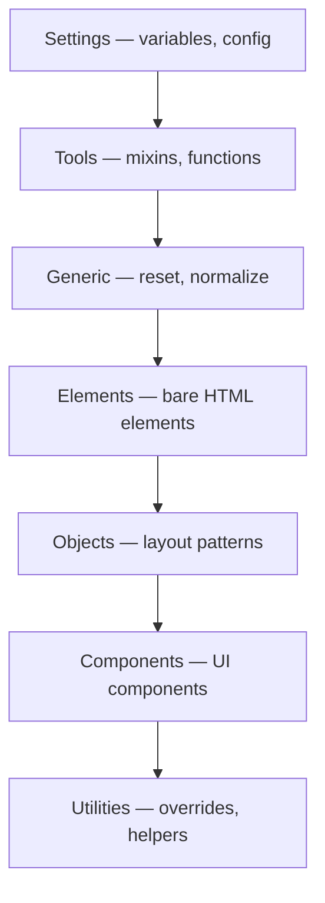

# CSS Architecture

## Overview

CSS Architecture refers to how you organize, name, and structure CSS in a project. Good architecture ensures scalability, maintainability, and team collaboration.

## Methodologies

### 1. OOCSS (Object-Oriented CSS)

**Principle:** Separate structure from skin. Create reusable "objects" rather than page-specific styles.

```css
/* Structure */
.media {
  display: flex;
  gap: 1rem;
}

.media__body {
  flex: 1;
}

/* Skin */
.media--bordered {
  border: 1px solid #ddd;
  padding: 1rem;
}

.media--highlight {
  background: #f0f8ff;
}
```

```html
<div class="media media--bordered">
  
  <div class="media__body">
    <h3>Title</h3>
    <p>Content</p>
  </div>
</div>
```

### 2. BEM (Block Element Modifier)

**Block:** standalone component  
**Element:** part of a block (double underscore)  
**Modifier:** variant of block/element (double dash)

```css
/* Block */
.card { }

/* Element — parts of the block */
.card__title { }
.card__image { }
.card__content { }
.card__button { }

/* Modifier — variations */
.card--featured { }
.card--compact { }
.card__button--primary { }
.card__button--secondary { }
```

```html
<div class="card card--featured">
  
  <div class="card__content">
    <h2 class="card__title">Card Title</h2>
    <button class="card__button card__button--primary">Action</button>
  </div>
</div>
```

### 3. SMACSS (Scalable and Modular Architecture for CSS)

Categories CSS into five types:

| Category | Prefix | Description |
|----------|--------|-------------|
| Base | — | Default styles (reset, typography) |
| Layout | `l-` | Page structure (header, footer, grid) |
| Module | — | Reusable components (card, nav) |
| State | `is-` | Dynamic states (is-active, is-hidden) |
| Theme | `theme-` | Visual variations (theme-dark) |

```css
/* Base */
body { font-family: sans-serif; line-height: 1.5; }

/* Layout */
.l-header { width: 100%; }
.l-grid { display: flex; gap: 20px; }

/* Module */
.card { border: 1px solid #ddd; }
.card-title { font-size: 1.25rem; }

/* State */
.is-active { background: blue; color: white; }
.is-hidden { display: none; }

/* Theme */
.theme-dark { --bg: #111; --text: #eee; }
```

### 4. ITCSS (Inverted Triangle CSS)

Organizes CSS by **specificity** from low to high:



```
ITCSS Layer Order:
1. Settings      : --color-primary, --font-base
2. Tools         : @mixin respond-to, @function em
3. Generic       : box-sizing, reset
4. Elements      : h1 { }, a { }, ul { }
5. Objects       : .o-container, .o-grid
6. Components    : .c-card, .c-nav, .c-button
7. Utilities     : .u-hidden, .u-text-center
```

## File Organization

### By Feature

```
styles/
├── base/
│   ├── _reset.css
│   ├── _typography.css
│   └── _animations.css
├── components/
│   ├── _button.css
│   ├── _card.css
│   ├── _nav.css
│   └── _modal.css
├── layouts/
│   ├── _header.css
│   ├── _footer.css
│   └── _grid.css
├── pages/
│   ├── _home.css
│   └── _about.css
├── utils/
│   ├── _variables.css
│   └── _helpers.css
└── main.css
```

### By Page (for small projects)

```
pages/
├── home.css
├── about.css
└── contact.css
```

## Naming Conventions

| Convention | Example | Pros | Cons |
|------------|---------|------|------|
| BEM | `.card__title--large` | Clear, scalable | Verbose |
| Camel case | `.cardTitle` | Short | Mixes CSS/JS |
| Kebab case | `.card-title` | Natural in CSS | Ambiguous hierarchy |
| Prefix | `.c-card-title` | Namespaces | Extra characters |
| Utility | `.text-center` | Atomic, reusable | Can get messy |

**Recommended:** BEM for components, utility classes for spacing/typography.

## Methodology Comparison

| Criteria | OOCSS | BEM | SMACSS | ITCSS |
|----------|-------|-----|--------|-------|
| Complexity | Medium | Low | Medium | High |
| Specificity | Low | Low | Medium | Low→High |
| Scalability | Good | Excellent | Good | Excellent |
| Learning curve | Medium | Low | Medium | High |
| File structure | Loose | Loose | Categorized | Strict layers |
| Naming | Object/modifier | Block__Element--Mod | Prefix-based | Prefix-based |
| Best for | Large apps | Teams of any size | Medium-large apps | Large enterprise |

## Practical Architecture Example

```css
/* =========================================
   SETTINGS — Variables
   ========================================= */
:root {
  --color-primary: #007bff;
  --color-text: #333;
  --spacing-unit: 8px;
  --font-base: system-ui, sans-serif;
}

/* =========================================
   GENERIC — Reset
   ========================================= */
*, *::before, *::after {
  box-sizing: border-box;
  margin: 0;
  padding: 0;
}

/* =========================================
   ELEMENTS — Base HTML styles
   ========================================= */
body {
  font-family: var(--font-base);
  color: var(--color-text);
  line-height: 1.6;
}

a { color: var(--color-primary); }

/* =========================================
   OBJECTS — Layout patterns
   ========================================= */
.o-container {
  width: 100%;
  max-width: 1200px;
  margin-inline: auto;
  padding-inline: 1rem;
}

.o-grid {
  display: grid;
  gap: 1.5rem;
  grid-template-columns: repeat(auto-fill, minmax(300px, 1fr));
}

/* =========================================
   COMPONENTS — UI widgets
   ========================================= */
.c-card {
  border: 1px solid #e0e0e0;
  border-radius: var(--spacing-unit);
  padding: calc(var(--spacing-unit) * 2);
  transition: box-shadow 0.2s;
}

.c-card:hover {
  box-shadow: 0 4px 12px rgba(0,0,0,0.1);
}

.c-card__title {
  font-size: 1.25rem;
  margin-bottom: var(--spacing-unit);
}

.c-card__text {
  color: #666;
}

.c-card--featured {
  border-color: var(--color-primary);
  border-width: 2px;
}

.c-btn {
  display: inline-flex;
  align-items: center;
  padding: 0.5em 1em;
  border: none;
  border-radius: 4px;
  cursor: pointer;
  font-size: 1rem;
}

.c-btn--primary {
  background: var(--color-primary);
  color: white;
}

/* =========================================
   UTILITIES — Single-purpose helpers
   ========================================= */
.u-text-center { text-align: center; }
.u-mt-1 { margin-top: var(--spacing-unit); }
.u-mt-2 { margin-top: calc(var(--spacing-unit) * 2); }
.u-hidden { display: none; }
@media (min-width: 768px) {
  .u-hidden\@md { display: none; }
}
```

## Best Practices

1. **Be consistent** — choose a methodology and stick to it
2. **Use CSS custom properties** for theming and tokens
3. **Avoid deep nesting** — 2-3 levels max
4. **Aim for 0.0.1.0 specificity** — class-based selectors
5. **Use utility classes** for common patterns (spacing, text alignment)
6. **Separate layout from skin** — float/grid in objects, colors in components
7. **Document with section comments** for file organization
8. **Use a linter** (Stylelint) to enforce conventions
