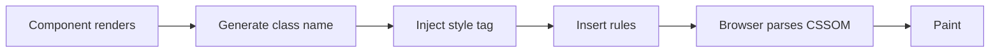
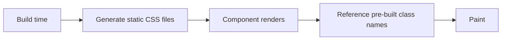

# CSS-in-JS

## Overview

**CSS-in-JS** approaches allow you to write CSS directly in JavaScript/TypeScript files. Styles are typically scoped to components, can use JS logic, and may be extracted at build time or injected at runtime.

## Major CSS-in-JS Libraries

| Library | Runtime/Zero-Runtime | Bundle Size | Popularity |
|---------|---------------------|-------------|------------|
| **Styled Components** | Runtime | ~15KB gzipped | Very High |
| **Emotion** | Runtime | ~11KB gzipped | Very High |
| **Vanilla Extract** | Zero-runtime | 0KB runtime | Growing |
| **StyleX** | Zero-runtime | 0KB runtime (Meta) | Growing |
| **Linaria** | Zero-runtime | 0KB runtime | Moderate |
| **Stitches** | Runtime | ~5KB gzipped | Moderate |
| **Panda CSS** | Zero-runtime | 0KB runtime (Chakra team) | New |
| **Radix UI** | Runtime | Minimal | Niche |

## Styled Components

```bash
npm install styled-components
```

```jsx
import styled from 'styled-components';

const Button = styled.button`
  background: ${props => props.primary ? '#007bff' : 'transparent'};
  color: ${props => props.primary ? 'white' : '#007bff'};
  border: 2px solid #007bff;
  border-radius: 4px;
  padding: 0.5em 1em;
  cursor: pointer;

  &:hover {
    opacity: 0.8;
  }

  @media (max-width: 768px) {
    width: 100%;
  }
`;

function App() {
  return (
    <>
      <Button>Default</Button>
      <Button primary>Primary</Button>
    </>
  );
}
```

### Theming

```jsx
import { ThemeProvider } from 'styled-components';

const theme = {
  colors: {
    primary: '#007bff',
    secondary: '#6c757d',
    background: '#fff',
    text: '#333',
  },
  spacing: (n) => `${n * 0.25}rem`,
};

const Heading = styled.h1`
  color: ${({ theme }) => theme.colors.primary};
  margin-bottom: ${({ theme }) => theme.spacing(4)};
`;

function App() {
  return (
    <ThemeProvider theme={theme}>
      <Heading>Styled Components with Theming</Heading>
    </ThemeProvider>
  );
}
```

## Emotion

```bash
npm install @emotion/react @emotion/styled
```

```jsx
/** @jsxImportSource @emotion/react */
import { css } from '@emotion/react';
import styled from '@emotion/styled';

// With styled
const Button = styled.button`
  background: ${props => props.color || '#007bff'};
  color: white;
  padding: 0.5em 1em;
  border-radius: 4px;
`;

// With css prop (no styled needed)
const styles = css`
  display: flex;
  gap: 1rem;
  padding: 2rem;
`;

function Card() {
  return (
    <div css={styles}>
      <h2 css={{ fontSize: '1.5rem', margin: 0 }}>Title</h2>
      <p>Content</p>
    </div>
  );
}
```

## Vanilla Extract

**Zero-runtime** — all styles are extracted to CSS files at build time.

```bash
npm install @vanilla-extract/css @vanilla-extract/vite-plugin
```

```ts
// styles.css.ts (processed at build time)
import { style, createThemeContract, createTheme } from '@vanilla-extract/css';

export const button = style({
  background: '#007bff',
  color: 'white',
  border: 'none',
  borderRadius: 4,
  padding: '0.5em 1em',
  selectors: {
    '&:hover': { opacity: 0.8 },
    '&:disabled': { opacity: 0.5, cursor: 'not-allowed' },
  },
});

// Theming with contract
export const themeVars = createThemeContract({
  color: { primary: null, background: null },
});

export const lightTheme = createTheme(themeVars, {
  color: { primary: '#007bff', background: '#fff' },
});

export const darkTheme = createTheme(themeVars, {
  color: { primary: '#4dabf7', background: '#111' },
});
```

```tsx
import { button, themeVars, lightTheme, darkTheme } from './styles.css.ts';

function App() {
  const [isDark, setIsDark] = useState(false);
  return (
    <div className={isDark ? darkTheme : lightTheme}>
      <button className={button}
        style={{ background: themeVars.color.primary }}
      >
        Click
      </button>
    </div>
  );
}
```

## StyleX (Meta)

Zero-runtime CSS-in-JS from Meta (used in Facebook, Instagram, WhatsApp Web).

```bash
npm install stylex
```

```jsx
import stylex from '@stylexjs/stylex';

const styles = stylex.create({
  button: {
    backgroundColor: '#007bff',
    color: 'white',
    border: 'none',
    borderRadius: '4px',
    padding: '0.5em 1em',
  },
  primary: {
    backgroundColor: '#0056b3',
  },
});

function Button({ primary }) {
  return (
    <button {...stylex.props(styles.button, primary && styles.primary)}>
      Click
    </button>
  );
}
```

## Performance Considerations

### Runtime CSS-in-JS (Styled Components, Emotion)



**Costs:**
- Styles re-evaluated on every render (use `React.memo` or static styles)
- JavaScript bundle includes CSS parser/serializer (~10-15KB)
- Style injection can cause layout thrash if not batched
- SSR requires collecting + injecting styles (extra setup)

### Zero-runtime (Vanilla Extract, StyleX, Linaria)



**Benefits:**
- Zero runtime JS for styles
- Smaller bundle
- No SSR complexity
- Faster paint (no style injection)
- Type-safe by default (TS)

## Comparison Table

| Feature | Styled Components | Emotion | Vanilla Extract | StyleX |
|---------|------------------|---------|----------------|--------|
| Runtime size | ~15KB | ~11KB | 0KB | 0KB |
| TypeScript | Good | Good | Excellent | Excellent |
| SSR | Built-in | Built-in | Automatic | Plugin needed |
| Dynamic props | ✅ Template literals | ✅ Template/object | ❌ (static only) | ❌ (static only) |
| Theming | ThemeProvider | ThemeProvider | Contract-based | CSS variables |
| Dev experience | Great | Great | TS-first | TS-first |
| Build time | None | None | CSS files | CSS files |
| Bundle CSS | Inline `<style>` | Inline `<style>` | Separate CSS | Separate CSS |
| File extension | `.js/.tsx` | `.js/.tsx` | `.css.ts` | `.js/.ts` |
| Learning curve | Low | Low | Medium | Medium |

## When to Use What

| Use Case | Recommended |
|----------|-------------|
| Quick prototyping | Styled Components / Emotion |
| Large production app | Vanilla Extract / StyleX (performance) |
| Design system library | Vanilla Extract (type-safe tokens) |
| Existing Tailwind project | Tailwind (don't add CSS-in-JS) |
| Next.js app | CSS Modules / Vanilla Extract / StyleX |
| Micro-frontends | CSS-in-JS (scoped by default) |
| High-traffic public site | Zero-runtime (Vanilla Extract, StyleX) |
| Admin dashboard | Any approach works |

## CSS-in-JS Best Practices

```jsx
// ✅ GOOD: Extract static styles outside component
const staticStyles = css`
  color: blue;
  font-weight: bold;
`;

function Component() {
  return <div className={staticStyles}>Static</div>;
}

// ✅ GOOD: Use props for variants
const Button = styled.button`
  font-size: ${p => p.size === 'lg' ? '1.25rem' : '1rem'};
`;

// ❌ AVOID: Dynamic styles that change on every render
function Bad({ color }) {
  return <div style={{ color }}>Bad</div>;
  // Better: pass color as CSS variable or class
}

// ✅ GOOD: CSS custom properties for dynamic values
const Box = styled.div`
  --box-color: ${p => p.color};
  background: var(--box-color);
`;
```

## The Future

Trend is moving toward **zero-runtime** solutions. The CSS community is converging on:
- CSS Modules (built-in, no library)
- Vanilla Extract / StyleX (type-safe, performant)
- PostCSS-based solutions (Panda CSS)

Runtime CSS-in-JS is still popular but declining for new large-scale projects due to performance overhead.
