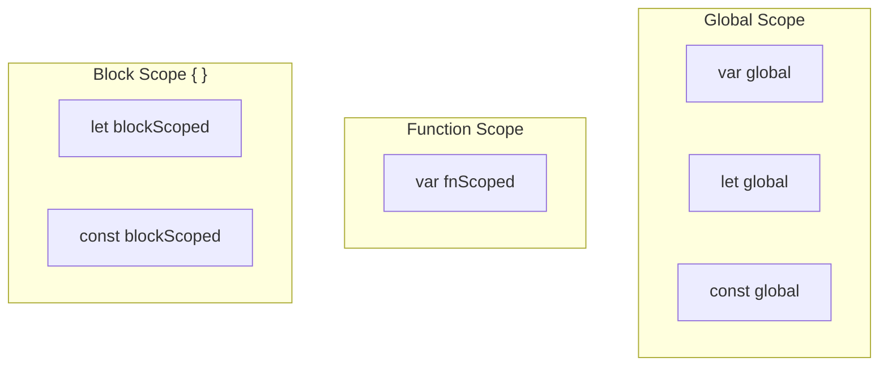

# JavaScript Basics — Variables, Data Types, Operators

## Variables: `var`, `let`, `const`

```js
var a = 1;      // function scoped, hoisted
let b = 2;      // block scoped, hoisted (TDZ)
const c = 3;    // block scoped, immutable binding
```

### Scope Comparison



### Reassignment Rules

| Keyword | Redeclare | Reassign | Temporal Dead Zone |
|---------|-----------|----------|-------------------|
| `var` | Yes | Yes | No |
| `let` | No | Yes | Yes |
| `const` | No | No | Yes |

## Data Types (7 primitives + Object)

```js
typeof undefined   // "undefined"
typeof true        // "boolean"
typeof 42          // "number"
typeof "hello"     // "string"
typeof 9007199254740991n // "bigint"
typeof Symbol()    // "symbol"
typeof null        // "object" (language bug!)
typeof {}          // "object"

// Primitive vs Reference
let a = 42;          // primitive — stored in stack
let b = a;           // copy of value
b = 10;              // a is still 42

let obj1 = { x: 1 }; // reference — stored in heap
let obj2 = obj1;     // copy of reference
obj2.x = 2;          // obj1.x is also 2!
```

### Memory Diagram for Primitives vs Objects

```
Stack                    Heap
+--------+              +----------+
| a: 42  |              |          |
| b: 10  |              | obj1 ---→| { x: 2 }
| obj1   |——ref————→   | obj2 —→  +----------+
| obj2   |——ref————→   |          |
+--------+              +----------+
```

## Type Coercion

```js
// Implicit coercion
5 + "5"      // "55" (number → string)
"5" - 2      // 3  (string → number)
"5" * "2"    // 10
+"42"        // 42
!!"hello"    // true
if ("hello") // truthy → executes

// Explicit coercion (always prefer)
String(123)  // "123"
Number("42") // 42
Boolean(0)   // false
```

## Operators

```js
// Arithmetic
+ - * / % ** ++ --

// Assignment
= += -= *= /= %= **= ??= &&= ||=

// Comparison
==  // loose equality (coerces)
=== // strict equality (no coercion)
!=  !==  >  <  >=  <=

// Logical
&&  ||  ??  // nullish coalescing

// Ternary
condition ? exprTrue : exprFalse

// Optional Chaining
obj?.prop        // undefined if obj is null/undefined
arr?.[index]     // safe array access
func?.()         // safe function call

// Nullish Coalescing
const name = input ?? "default";
// Only uses default if input is null or undefined (not for "")
```

## Truthy & Falsy

**Falsy values (6 total):**
```js
false, 0, -0, 0n, "", '', ``, null, undefined, NaN
```

**Truthy:** Everything else, including:
```js
"0", "false", [], {}, function(){}, Infinity
```

## Comments

```js
// Single line

/*
  Multi-line
  block comment
*/

/**
 * JSDoc comment
 * @param {string} name
 * @returns {string}
 */
```

## Strict Mode

```js
"use strict"; // at top of file or function
// Prevents:
// - Using undeclared variables
// - Deleting variables/functions
// - Duplicate parameter names
// - Octal literals
// - this in global → undefined instead of window
```
