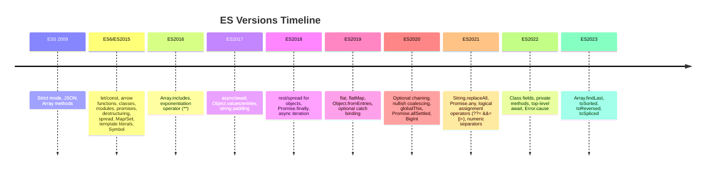

# ES6+ (ECMAScript 2015+) Features

## Timeline of Modern JavaScript



## Template Literals

```js
const name = "Alice";
const greeting = `Hello, ${name}!
This is a multi-line string.`;

// Tagged templates
function highlight(strings, ...values) {
  return strings.reduce((acc, str, i) =>
    `${acc}${str}<strong>${values[i] || ""}</strong>`, "");
}
highlight`User: ${name}, Age: ${30}`;
```

## Destructuring

```js
// Array destructuring
const [a, b, ...rest] = [1, 2, 3, 4];

// Swap variables
[x, y] = [y, x];

// Default values
const [name = "Guest"] = [];

// Object destructuring
const { name, age, ...rest } = user;

// Rename
const { name: userName, age: userAge } = user;

// Nested
const { address: { city } } = user;

// Function params
function connect({ host = "localhost", port = 3000 } = {}) {}
```

## Spread & Rest

```js
// Spread — expands iterables
Math.max(...arr);
const clone = [...arr];
const merged = { ...obj1, ...obj2 };

// Rest — collects remaining
function log(first, ...rest) {}
const [head, ...tail] = arr;
const { a, ...others } = obj;
```

## Arrow Functions

```js
const add = (a, b) => a + b;
const square = x => x * x;
const empty = () => ({});

// No own this, arguments, super, new.target
function Outer() {
  this.val = 42;
  setTimeout(() => console.log(this.val), 100); // 42 (lexical this)
}
```

## Classes

```js
class Animal {
  #privateField = "secret";     // private field (ES2022)
  static species = "Mammal";    // static property
  
  constructor(name) { this.name = name; }
  speak() { return `${this.name} speaks`; }
  get upperName() { return this.name.toUpperCase(); }
  set upperName(val) { this.name = val; }
  static create(name) { return new Animal(name); }
}

class Dog extends Animal {
  constructor(name, breed) {
    super(name);
    this.breed = breed;
  }
  speak() { return `${super.speak()} loudly`; }
}
```

## Modules

```js
// math.js
export const add = (a, b) => a + b;
export default class Calculator {}
export { add as sum };

// app.js
import Calculator, { add as sum } from "./math.js";
import * as Math from "./math.js";
import("./math.js").then(m => m.add(1, 2)); // dynamic import
```

## Map & Set

```js
// Map — any type key
const map = new Map();
map.set("key", "value");
map.get("key");
map.has("key");
map.delete("key");
map.size;
map.clear();
for (const [k, v] of map) {}

// Object vs Map
// Map: ordered, any keys, iterable, O(1) size
// Object: string/Symbol keys only, prototype inheritance

// Set — unique values
const set = new Set([1, 2, 3, 3]);
set.add(4);
set.has(1); // true
set.delete(1);
[...set]; // [2, 3, 4]

// WeakMap / WeakSet — keys held weakly (no GC prevention)
```

## Symbol

```js
const id = Symbol("id");
const obj = { [id]: "secret" };
obj[Symbol("id")]; // undefined (different symbol)

const ITERATE = Symbol.iterator;
const arr = [1, 2, 3];
arr[ITERATE]; // function

Symbol.for("global"); // global registry
```

## BigInt

```js
const big = 9007199254740991n;
const big2 = BigInt("9007199254740991");
big + 1n; // works
big + 1;  // TypeError!

// Operations
big * 2n / 3n; // integer division
big ** 2n;
big > 100;     // mixed comparison OK, not mixed math
```

## Optional Chaining & Nullish Coalescing

```js
// Safe nested access
user?.profile?.address?.zip;
users?.[0]?.name;
obj?.method?.();

// Default only for null/undefined
const value = input ?? "default";
input || "default";  // different: falsy check
```

## globalThis

```js
// Universal global object
globalThis.setTimeout; // works everywhere
// before: window (browser) || global (Node) || self (WebWorker)
```
