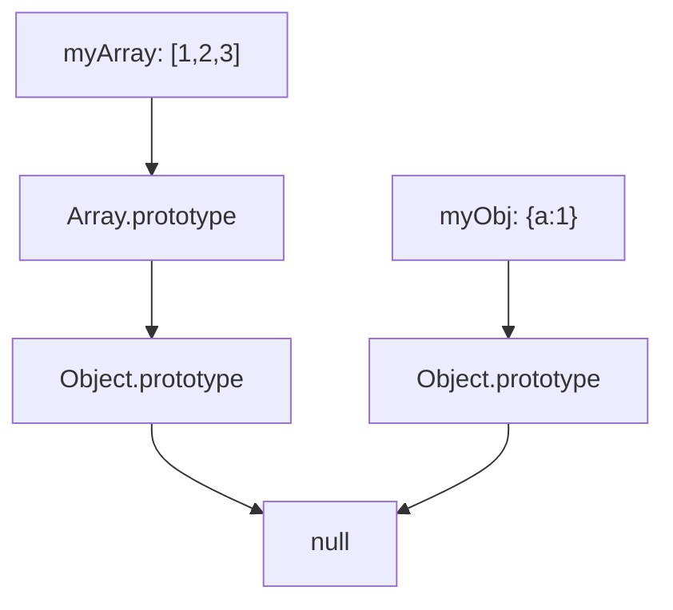

# Prototypes & Prototypal Inheritance

## What is a Prototype?

Every JavaScript object has an internal `[[Prototype]]` property (accessible via `__proto__` or `Object.getPrototypeOf()`) that links to another object. Property lookups traverse this chain until found or `null`.

## Prototype Chain



```js
const arr = [1, 2, 3];
arr.__proto__ === Array.prototype;           // true
arr.__proto__.__proto__ === Object.prototype; // true
arr.__proto__.__proto__.__proto__ === null;   // true

// Property lookup:
arr.map(...)  // 1. Check own properties   → not found
              // 2. Check Array.prototype   → found! → call it
```

## `__proto__` vs `prototype`

```js
function Person(name) {
  this.name = name;
}

const p = new Person("Alice");

p.__proto__ === Person.prototype;           // true — instance link
Person.__proto__ === Function.prototype;    // true — function is object
Person.prototype.constructor === Person;    // true — circular
```

| Property | Belongs to | Purpose |
|----------|-----------|---------|
| `__proto__` | Instance | Points to constructor's prototype |
| `prototype` | Constructor functions | Object shared by all instances |
| `Object.getPrototypeOf(obj)` | — | Modern way to get prototype |

## Constructor Functions (Pre-ES6)

```js
function Animal(name) {
  this.name = name;
}

// Add methods to prototype (shared by all instances)
Animal.prototype.speak = function() {
  return `${this.name} makes a sound`;
};

Animal.prototype.eat = function() {
  return `${this.name} is eating`;
};

const dog = new Animal("Rex");
const cat = new Animal("Whiskers");

dog.speak === cat.speak; // true — same function, not copied
dog.hasOwnProperty("speak"); // false — on prototype
dog.hasOwnProperty("name");  // true — own property
```

## `Object.create`

```js
const animalProto = {
  speak() { return `${this.name} makes a sound`; },
  init(name) { this.name = name; return this; }
};

const dog = Object.create(animalProto);
dog.init("Rex");
dog.speak(); // "Rex makes a sound"

// vs new — Object.create is more explicit about inheritance
// Object.create(null) — creates object with NO prototype
const pure = Object.create(null);
pure.toString; // undefined
```

## Class Syntax (Under the Hood)

```js
// Modern syntax — still uses prototypes
class Animal {
  constructor(name) { this.name = name; }
  speak() { return `${this.name} makes a sound`; }
}
class Dog extends Animal {
  constructor(name, breed) {
    super(name);
    this.breed = breed;
  }
  speak() { return `${super.speak()} loudly`; }
}

// Desugars to:
function Animal(name) { this.name = name; }
Animal.prototype.speak = function() { ... };
function Dog(name, breed) {
  Animal.call(this, name);
  this.breed = breed;
}
Dog.prototype = Object.create(Animal.prototype);
Dog.prototype.constructor = Dog;
Dog.prototype.speak = function() { ... };
```

## Inheritance Chain

```
Dog instance
  ├── own: name, breed
  ├── __proto__ → Dog.prototype
  │     ├── speak()
  │     ├── constructor → Dog
  │     └── __proto__ → Animal.prototype
  │           ├── speak()
  │           ├── constructor → Animal
  │           └── __proto__ → Object.prototype
  │                 ├── toString()
  │                 ├── hasOwnProperty()
  │                 └── __proto__ → null
```

## Property Shadowing

```js
function Animal(name) { this.name = name; }
Animal.prototype.speak = function() { return "generic sound"; };

const dog = new Animal("Rex");
dog.speak = function() { return "Woof!"; };

dog.speak();           // "Woof!" — own property shadows prototype
delete dog.speak;
dog.speak();           // "generic sound" — prototype used
```

## Checking Prototypes

```js
const arr = [];

arr instanceof Array;            // true
arr instanceof Object;           // true
Array.prototype.isPrototypeOf(arr);  // true
Object.getPrototypeOf(arr) === Array.prototype; // true

// Safer than __proto__
Object.getPrototypeOf(arr);
```

## Performance Considerations

```js
// Methods on prototype are shared → memory efficient
// Methods in constructor are copied → memory per instance
function Bad(name) {
  this.name = name;
  this.speak = function() { ... }; // created for every instance!
}

// Property lookup walks the chain — very deep chains hurt performance
// Keep prototype chains shallow (3-4 levels max)
```

## Common Interview Questions

```js
// 1. What does this log?
const obj = { a: 1 };
console.log(obj.b); // undefined (walked chain to null)

// 2. Prototype chain mutation
Array.prototype.custom = function() { return "custom"; };
[].custom(); // "custom" (but DON'T modify built-in prototypes!)

// 3. hasOwnProperty vs in
obj.hasOwnProperty("a"); // true — own
"a" in obj;              // true — own or prototype
"toString" in obj;       // true — from Object.prototype
obj.hasOwnProperty("toString"); // false
```
