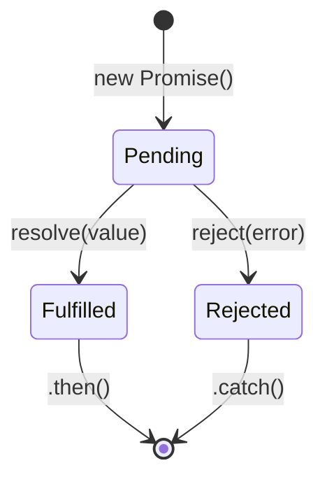

# Promises in JavaScript

## Promise States



A Promise represents a value that may be available now, later, or never.

## Creating a Promise

```js
const promise = new Promise((resolve, reject) => {
  // Async operation
  setTimeout(() => {
    const success = true;
    if (success) {
      resolve("Operation completed");
    } else {
      reject(new Error("Operation failed"));
    }
  }, 1000);
});
```

## Consuming Promises

```js
promise
  .then(result => {
    console.log(result); // "Operation completed"
    return "Next value";
  })
  .then(next => {
    console.log(next); // "Next value"
  })
  .catch(error => {
    console.error(error.message);
  })
  .finally(() => {
    console.log("Always runs");
  });
```

## Promise Chaining

```js
fetch("/api/user")
  .then(res => {
    if (!res.ok) throw new Error(`HTTP ${res.status}`);
    return res.json();
  })
  .then(user => fetch(`/api/posts?userId=${user.id}`))
  .then(res => res.json())
  .then(posts => {
    console.log(posts);
  })
  .catch(err => {
    console.error("Request failed:", err);
  });
```

## Error Handling

```js
// .catch catches any rejection in the chain
Promise.resolve(1)
  .then(v => { throw new Error("Oops"); })
  .then(v => console.log("skipped")) // skipped
  .catch(err => console.log(err.message)) // "Oops"
  .then(v => console.log("continues")); // "continues"

// Unhandled rejection
window.addEventListener("unhandledrejection", event => {
  console.error("Unhandled:", event.reason);
  event.preventDefault();
});
```

## Static Methods

### Promise.all
```js
const p1 = fetch("/api/users").then(r => r.json());
const p2 = fetch("/api/posts").then(r => r.json());
const p3 = fetch("/api/comments").then(r => r.json());

try {
  const [users, posts, comments] = await Promise.all([p1, p2, p3]);
  // All must resolve — if any rejects, all reject
} catch (err) {
  // First rejection
}
```

### Promise.allSettled
```js
const results = await Promise.allSettled([
  fetch("/api/success").then(r => r.json()),
  fetch("/api/fail").then(r => r.json())
]);

results.forEach(r => {
  if (r.status === "fulfilled") {
    console.log("Value:", r.value);
  } else {
    console.log("Reason:", r.reason);
  }
});
```

### Promise.race
```js
// Timeout pattern
const data = await Promise.race([
  fetch("/api/data").then(r => r.json()),
  new Promise((_, reject) =>
    setTimeout(() => reject(new Error("Timeout")), 5000)
  )
]);
```

### Promise.any
```js
const result = await Promise.any([
  fetch("/api/mirror1").then(r => r.json()),
  fetch("/api/mirror2").then(r => r.json()),
  fetch("/api/mirror3").then(r => r.json())
]);
// First fulfilled — ignores rejections
// If all reject → AggregateError
```

## Promise vs Callback

| Aspect | Callbacks | Promises |
|--------|-----------|----------|
| Readability | Nested (callback hell) | Chained (.then) |
| Error handling | Manual per callback | .catch at end |
| Composition | Manual | .all, .race, chaining |
| Single call | Can be called multiple times | Resolved once (guaranteed) |
| Stack traces | Lost between callbacks | Better stack traces |

## Converting Callback → Promise

```js
const fs = require("fs");

// Callback version
fs.readFile("file.txt", "utf8", (err, data) => {
  if (err) console.error(err);
  else console.log(data);
});

// Promisified version
function readFilePromise(path) {
  return new Promise((resolve, reject) => {
    fs.readFile(path, "utf8", (err, data) => {
      if (err) reject(err);
      else resolve(data);
    });
  });
}

// Or use util.promisify (Node.js)
const { promisify } = require("util");
const readFile = promisify(fs.readFile);
```

## Real-World Patterns

### Retry Logic
```js
async function fetchWithRetry(url, retries = 3) {
  for (let i = 0; i < retries; i++) {
    try {
      const res = await fetch(url);
      if (!res.ok) throw new Error(`HTTP ${res.status}`);
      return await res.json();
    } catch (err) {
      if (i === retries - 1) throw err;
      await new Promise(r => setTimeout(r, 1000 * (i + 1)));
    }
  }
}
```

### Sequential vs Parallel
```js
// Sequential (one by one)
async function sequential(items) {
  const results = [];
  for (const item of items) {
    results.push(await process(item)); // wait each
  }
  return results;
}

// Parallel (all at once)
async function parallel(items) {
  return Promise.all(items.map(item => process(item)));
}

// Controlled concurrency (max 3 at once)
async function batch(items, limit = 3) {
  const results = [];
  for (let i = 0; i < items.length; i += limit) {
    const batch = items.slice(i, i + limit);
    results.push(...await Promise.all(batch.map(item => process(item))));
  }
  return results;
}
```

## Common Mistakes

```js
// ❌ Forgetting to return promise from .then
fetch("/api")
  .then(res => res.json()) // returns promise
  .then(data => {          // forgot return!
    process(data);
  })
  .catch(err => console.log(err));

// ❌ Creating promise instead of returning
function getData() {
  return fetch("/api").then(r => r.json()); // ✓
}
function getDataBad() {
  fetch("/api").then(r => r.json()); // undefined!
}

// ❌ Promise constructor antipattern
new Promise((resolve, reject) => {
  fetch("/api").then(resolve).catch(reject); // unnecessary!
});
// Just: fetch("/api")
```
