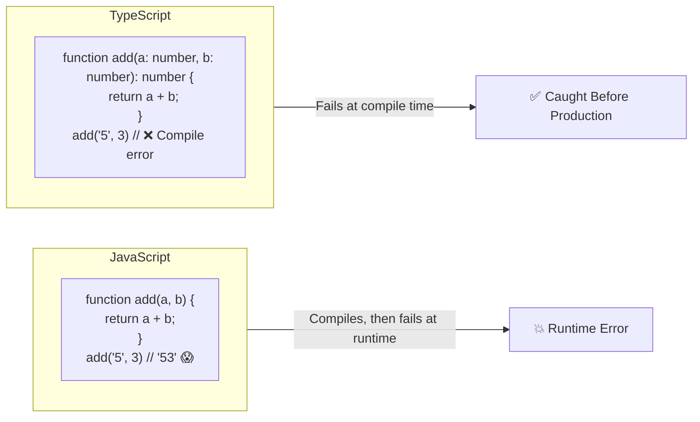
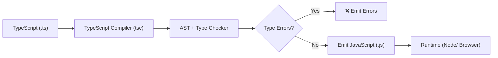

# 01 — Introduction to TypeScript

## What is TypeScript?

TypeScript is a **superset of JavaScript** developed by Microsoft that adds **static type checking** to the language. It compiles down to plain JavaScript that runs anywhere JS runs.

```
TypeScript = JavaScript + Static Type System
```

## Why Use TypeScript?

| Benefit | Explanation |
|---|---|
| **Catch bugs early** | Type errors are caught at compile time, not runtime |
| **Better IDE support** | Autocomplete, refactoring, inline docs |
| **Self-documenting code** | Types serve as living documentation |
| **Safer refactoring** | The compiler tells you what breaks |
| **Team scalability** | Large codebases are easier to navigate |

## TypeScript vs JavaScript — A Visual Comparison



## Setting Up TypeScript

### 1. Install

```bash
npm install -g typescript
# or locally
npm install --save-dev typescript
```

### 2. Create `tsconfig.json`

```bash
tsc --init
```

### 3. Basic `tsconfig.json`

```json
{
  "compilerOptions": {
    "target": "ES2020",
    "module": "ESNext",
    "strict": true,
    "outDir": "./dist",
    "rootDir": "./src",
    "esModuleInterop": true,
    "skipLibCheck": true,
    "forceConsistentCasingInFileNames": true
  },
  "include": ["src/**/*"],
  "exclude": ["node_modules", "dist"]
}
```

### 4. Compile

```bash
tsc                    # compiles everything
tsc --watch           # watch mode
tsc --noEmit          # type-check only, no output
tsc --project tsconfig.prod.json  # specific config
```

## Strict Mode

The single most impactful compiler option. Turn it on:

```json
{
  "compilerOptions": {
    "strict": true
  }
}
```

`strict: true` enables these checks:

| Flag | What it does |
|---|---|
| `strictNullChecks` | `null`/`undefined` are not assignable to other types |
| `noImplicitAny` | Error when TS cannot infer a type |
| `strictFunctionTypes` | Stronger function type variance checks |
| `strictBindCallApply` | Correctly typed `bind`, `call`, `apply` |
| `strictPropertyInitialization` | Class properties must be initialized |
| `noImplicitThis` | `this` must have a type |
| `alwaysStrict` | Emit `"use strict"` always |

## Without vs With strictNullChecks

```typescript
// strictNullChecks: false (legacy behavior)
const element = document.getElementById('missing');
element.textContent = 'Hello'; // No error, but crashes at runtime!

// strictNullChecks: true
const element = document.getElementById('missing');
element.textContent = 'Hello';
// ^ ❌ Object is possibly 'null'.

// Fix
if (element !== null) {
  element.textContent = 'Hello'; // ✅ Safe
}
```

## Benefits Over JavaScript — Detailed

### 1. Catching Entire Categories of Bugs

```typescript
// JS — silent failures
function getFullName(user) {
  return user.firstName + ' ' + user.lastName; // crashes if user is null
}

// TS — compiler prevents this
function getFullName(user: { firstName: string; lastName: string }) {
  return user.firstName + ' ' + user.lastName;
}

getFullName(null); // ❌ Argument of type 'null' is not assignable
```

### 2. Refactoring at Scale

```typescript
// Rename this property — TS finds every usage
interface User {
  name: string; // rename to fullName
}

// In another file, 1000 lines away
function greet(user: User) {
  console.log(`Hello, ${user.name}`);
  // change to user.fullName — TS tells you if this is wrong
}
```

### 3. IDE Intelligence

- **Autocomplete** for object properties
- **Jump to definition** for types
- **Inline errors** as you type
- **Automatic imports** from type information

### 4. Type Inference

You don't always need to write types — TS infers them:

```typescript
let count = 0; // TS infers: number
const name = 'Alice'; // TS infers: "Alice" (literal type)

function add(a: number, b: number) {
  return a + b; // TS infers return type: number
}
```

## The TypeScript Compilation Pipeline



## When NOT to Use TypeScript

- Quick prototypes or throwaway scripts
- Small projects with a single developer (though still beneficial)
- When the build step adds unacceptable latency
- When the team isn't willing to adopt it

## Summary

```
TypeScript = JavaScript + Types

         ✅ Catches bugs at compile time
         ✅ Better tooling & DX
         ✅ Scales with your team
         ✅ Optional — adopt gradually
         ✅ Compiles to clean JS
```

TypeScript doesn't make your app run faster — it makes **you** faster by catching mistakes before they reach production.

**Next:** [02-Types.md](02-Types.md) — Understanding TypeScript's type system
