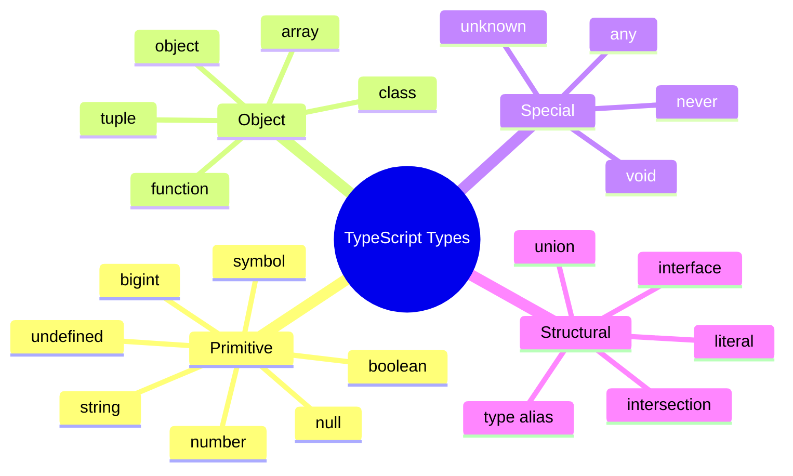

# 02 — Types in TypeScript

## Overview

Every value in TypeScript has a **type**. The type system describes the shape and behavior of values.



## Primitive Types

```typescript
// String
let name: string = 'Alice';
let greeting = `Hello, ${name}`; // inferred as string

// Number (all floats in JS)
let age: number = 30;
let price: number = 99.99;
let hex: number = 0xff;
let binary: number = 0b1010;

// Boolean
let isActive: boolean = true;
let isComplete: boolean = false;

// Null & Undefined
let n: null = null;
let u: undefined = undefined;

// Symbol
let sym: symbol = Symbol('unique');

// BigInt
let big: bigint = 100n;
```

## Object Types

```typescript
// Inline object type
function printCoord(pt: { x: number; y: number }) {
  console.log(`X: ${pt.x}, Y: ${pt.y}`);
}

printCoord({ x: 3, y: 7 });

// Optional properties
function printName(obj: { first: string; last?: string }) {
  console.log(obj.first + ' ' + (obj.last ?? ''));
}

printName({ first: 'Bob' }); // ✅
printName({ first: 'Alice', last: 'Smith' }); // ✅
```

## Array Types

```typescript
// Two syntaxes — equivalent
let numbers1: number[] = [1, 2, 3];
let numbers2: Array<number> = [1, 2, 3]; // generic syntax

// Multi-dimensional
let matrix: number[][] = [[1, 2], [3, 4]];
let cube: number[][][] = [[[1]]];

// Readonly array
let readonly: readonly number[] = [1, 2, 3];
// readonly.push(4); // ❌ Property 'push' does not exist
```

## Tuple Types

Fixed-length arrays where each position has a specific type.

```typescript
// Basic tuple
let pair: [string, number] = ['age', 30];
// pair = [30, 'age']; ❌ wrong order
// pair = ['age'];     ❌ too short

// Destructuring
const [label, value] = pair; // label: string, value: number

// Optional tuple elements
type OptTuple = [string, number?];
let t1: OptTuple = ['hello'];
let t2: OptTuple = ['hello', 42];

// Labeled tuples
type Range = [start: number, end: number];

// rest elements in tuples
type StringNumberBooleans = [string, number, ...boolean[]];
```

## Enum Types

```typescript
enum Direction {
  Up,     // 0
  Down,   // 1
  Left,   // 2
  Right,  // 3
}

enum Status {
  Success = 200,
  NotFound = 404,
  Error = 500,
}
```

> **Detailed coverage in [07-Enums.md](07-Enums.md)**

## Special Types

```typescript
// any — opt out of type checking (AVOID)
let loose: any = 4;
loose = 'string';
loose = {};

// unknown — type-safe version of any
let safe: unknown = 4;
safe = 'string';
// safe.toUpperCase(); // ❌ Object is of type 'unknown'
if (typeof safe === 'string') {
  safe.toUpperCase(); // ✅ narrowed
}

// never — values that never occur
function fail(msg: string): never {
  throw new Error(msg);
}

function infiniteLoop(): never {
  while (true) {}
}

// void — return value is ignored
function log(msg: string): void {
  console.log(msg); // no return
}
```

## Type Annotations

TypeScript uses **colon syntax** for type annotations:

```typescript
// Variable annotations
let count: number = 0;
let message: string;

// Function parameter annotations
function greet(name: string): string {
  return `Hello, ${name}`;
}

// Function return type
function add(a: number, b: number): number {
  return a + b;
}
```

## Type Inference

Often, TypeScript can infer types without annotations:

```typescript
let x = 3;          // inferred as number
let y = 'hello';    // inferred as string
let z = true;       // inferred as boolean

const PI = 3.14;    // inferred as 3.14 (literal type, not number)

let arr = [1, 2, 3]; // inferred as number[]
```

## Literal Types

```typescript
// String literal type
type Direction = 'up' | 'down' | 'left' | 'right';
let dir: Direction = 'up'; // ✅
// dir = 'diagonal';       // ❌

// Numeric literal type
type DiceRoll = 1 | 2 | 3 | 4 | 5 | 6;

// Boolean literal type
type True = true;

// Combining with inference
function move(direction: 'up' | 'down') {}
move('up'); // ✅
// move('left'); // ❌
```

## Type Aliases

Create reusable type names:

```typescript
// Basic alias
type Point = {
  x: number;
  y: number;
};

function draw(pt: Point) {}

// Union alias
type ID = string | number;

// Complex alias
type Container<T> = { value: T };
type Tree<T> = {
  value: T;
  left?: Tree<T>;
  right?: Tree<T>;
};
```

## Type Relationships

```mermaid
flowchart TD
    subgraph "Type Hierarchy"
        unknown --> any
        string --> string_literal["'hello'"]
        number --> number_literal[42]
        Object --> Point["{ x: number }"]
    end

    subgraph "Assignability"
        A["'hello' (literal)"] -->|"is assignable to"| B[string]
        B -->|"is assignable to"| C[string | number]
        C -->|"is assignable to"| D[unknown]
        E[never] -->|"is assignable to"| F[anything]
    end
```

## Quick Reference

| Category | Examples |
|---|---|
| **Primitive** | `string`, `number`, `boolean`, `null`, `undefined`, `symbol`, `bigint` |
| **Object** | `{ x: number }`, `{ name: string; age?: number }` |
| **Array** | `number[]`, `Array<string>`, `readonly boolean[]` |
| **Tuple** | `[string, number]`, `[number, ...number[]]` |
| **Special** | `any`, `unknown`, `never`, `void` |
| **Literal** | `'up'`, `42`, `true` |
| **Union** | `string \| number`, `'red' \| 'blue'` |
| **Intersection** | `A & B` |
| **Alias** | `type Point = { x: number; y: number }` |

**Next:** [03-Interfaces.md](03-Interfaces.md) — Defining shapes with interfaces
