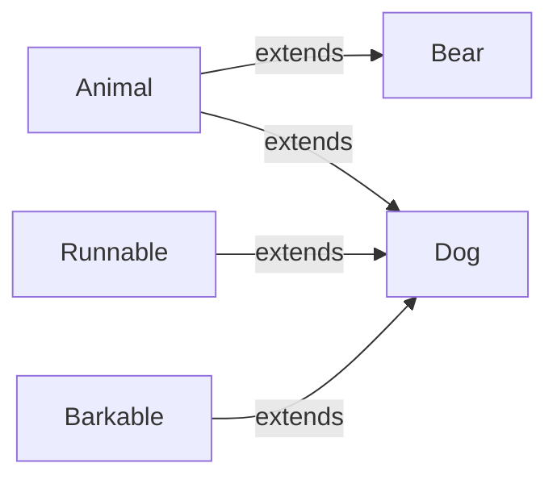

# 03 — Interfaces in TypeScript

## What is an Interface?

An **interface** defines the shape (structure) of an object. It describes what properties and methods an object should have.

```typescript
interface User {
  name: string;
  email: string;
  age: number;
}
```

## Interface Syntax

```typescript
interface Person {
  firstName: string;
  lastName: string;
  age: number;
  greet(): string;
}

const alice: Person = {
  firstName: 'Alice',
  lastName: 'Smith',
  age: 30,
  greet() {
    return `Hello, I'm ${this.firstName}`;
  },
};
```

## Optional Properties

```typescript
interface Config {
  url: string;
  method?: 'GET' | 'POST';  // optional
  timeout?: number;          // optional
  headers?: Record<string, string>;
}

function fetchData(config: Config) {
  const method = config.method ?? 'GET'; // provide default
  // ...
}

fetchData({ url: '/api' }); // ✅ method and timeout are optional
```

## Readonly Properties

```typescript
interface Point {
  readonly x: number;
  readonly y: number;
}

const p: Point = { x: 10, y: 20 };
// p.x = 5;  ❌ Cannot assign to 'x' because it is a read-only property

// ReadonlyArray — for arrays
let arr: readonly number[] = [1, 2, 3];
// arr.push(4); ❌
```

## Extending Interfaces

```typescript
interface Animal {
  name: string;
}

interface Bear extends Animal {
  honey: boolean;
}

const bear: Bear = {
  name: 'Winnie',
  honey: true,
};

// Multiple inheritance
interface Runnable {
  run(): void;
}

interface Barkable {
  bark(): void;
}

interface Dog extends Animal, Runnable, Barkable {
  breed: string;
}
```



## Interface Merging (Declaration Merging)

**Unique to interfaces** — multiple declarations with the same name are merged:

```typescript
interface User {
  name: string;
}

interface User {
  age: number;
}

// Result: interface User { name: string; age: number; }
const user: User = { name: 'Alice', age: 30 }; // ✅

// Practical use: augmenting 3rd-party types
interface Window {
  myApp: { version: string };
}

// Now window.myApp is typed
```

## Index Signatures

```typescript
interface StringDictionary {
  [key: string]: string;
}

const dict: StringDictionary = {
  hello: 'world',
  foo: 'bar',
};
// dict.number = 42; ❌

// Combining with known properties
interface HttpHeaders {
  'content-type': string;
  'accept'?: string;
  [header: string]: string; // must match the above types
}

// Index with number
interface NumberArray {
  [index: number]: string;
}

const arr: NumberArray = ['a', 'b', 'c'];
```

## Interface vs Type — Comparison

| Feature | `interface` | `type` |
|---|---|---|
| **Object shape** | ✅ Yes | ✅ Yes |
| **Union types** | ❌ | ✅ `type A = X \| Y` |
| **Intersection** | `extends` | `&` operator |
| **Declaration merging** | ✅ **Yes** | ❌ |
| **Mapped types** | ❌ | ✅ `type O = { [K in keyof T]: ... }` |
| **Computed properties** | ❌ | ✅ `type Key = 'a'; type T = { [Key]: string }` |
| **Tuple types** | ✅ (since TS 4.0) | ✅ |
| **Performance** | Slightly faster (cached) | Slightly slower with complex types |
| **Extending** | `extends` | `&` |
| **Class implements** | ✅ | ✅ |

### When to Use Which?

```typescript
// ✅ Use interface for public API / object shapes
interface User {
  id: number;
  name: string;
}

// ✅ Use type for unions, intersections, computed types
type Result<T> = { success: true; data: T } | { success: false; error: string };

// ✅ Use type for primitive aliases
type ID = string | number;

// ✅ Use interface when you need declaration merging
// (e.g., extending `Window`, `ProcessEnv`)

// Either works for simple object types
type PointT = { x: number; y: number };
interface PointI {
  x: number;
  y: number;
}
```

## Interfaces for Classes

```typescript
interface ClockInterface {
  currentTime: Date;
  setTime(d: Date): void;
}

class Clock implements ClockInterface {
  currentTime: Date = new Date();
  setTime(d: Date) {
    this.currentTime = d;
  }
}

// A class can implement multiple interfaces
interface Printable {
  print(): void;
}

interface Serializable {
  serialize(): string;
}

class Report implements Printable, Serializable {
  print() { /* ... */ }
  serialize() { return JSON.stringify(this); }
}
```

## Interface Best Practices

```typescript
// ✅ Prefer interfaces for objects (more ergonomic, faster)
interface APIResponse {
  status: number;
  data: unknown;
}

// ✅ Use descriptive names
interface UserProfile {} // ✅
interface Obj1 {}        // ❌

// ❌ Don't prefix with I (Hungarian notation)
interface IUser {}   // ❌ avoid
interface User {}    // ✅

// ✅ Mark readonly when the property shouldn't change after creation
interface Config {
  readonly apiKey: string;
  readonly endpoint: string;
}
```

## Practical Example

```typescript
interface ApiConfig {
  readonly baseUrl: string;
  timeout?: number;
  headers?: Record<string, string>;
}

interface PaginatedResponse<T> {
  items: T[];
  total: number;
  page: number;
  pageSize: number;
}

interface Product {
  id: number;
  name: string;
  price: number;
  category: string;
  tags: readonly string[];
  inStock: boolean;
}

async function fetchProducts(config: ApiConfig): Promise<PaginatedResponse<Product>> {
  const response = await fetch(config.baseUrl + '/products');
  return response.json();
}
```

**Next:** [04-Functions.md](04-Functions.md) — Functions in TypeScript
