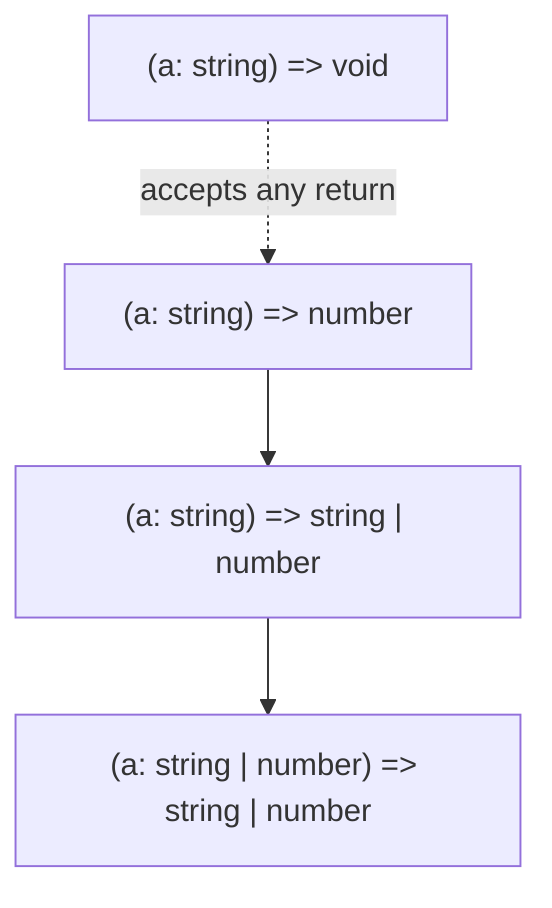

# 04 — Functions in TypeScript

## Function Type Expressions

Functions have types too:

```typescript
// Type annotation for a function
type GreetFn = (name: string) => string;
type MathOp = (a: number, b: number) => number;

// Using the type
const greet: GreetFn = (name) => `Hello, ${name}`;
const add: MathOp = (a, b) => a + b;

// Inline function type
function map<T>(arr: T[], fn: (item: T, index: number) => T): T[] {
  return arr.map(fn);
}
```

## Call Signatures

Used when a function also has properties:

```typescript
type DescribableFunction = {
  description: string;       // property
  (someArg: number): boolean; // call signature
};

function doSomething(fn: DescribableFunction) {
  console.log(fn.description);
  return fn(6);
}
```

## Construct Signatures

```typescript
type SomeConstructor = {
  new (s: string): SomeObject;
};

function fn(ctor: SomeConstructor) {
  return new ctor('hello');
}
```

## Generic Functions

```typescript
// Simple generic
function firstElement<T>(arr: T[]): T | undefined {
  return arr[0];
}

const num = firstElement([1, 2, 3]); // number | undefined
const str = firstElement(['a', 'b']); // string | undefined

// Multiple type parameters
function pair<T, U>(a: T, b: U): [T, U] {
  return [a, b];
}

const p = pair('hello', 42); // [string, number]

// Generic constraints
function longest<T extends { length: number }>(a: T, b: T): T {
  return a.length >= b.length ? a : b;
}

longest('hello', 'world');   // ✅ strings have length
longest([1, 2], [1, 2, 3]);  // ✅ arrays have length
// longest(10, 20);           ❌ numbers don't have length
```

## Optional Parameters

```typescript
// Optional param (must come after required params)
function greet(name: string, greeting?: string): string {
  return `${greeting ?? 'Hello'}, ${name}`;
}

greet('Alice');           // "Hello, Alice"
greet('Bob', 'Hi');       // "Hi, Bob"

// Default parameter (creates optional behavior)
function greet2(name: string, greeting = 'Hello'): string {
  return `${greeting}, ${name}`;
}

// Rest parameters
function sum(...numbers: number[]): number {
  return numbers.reduce((a, b) => a + b, 0);
}

sum(1, 2, 3, 4); // 10
```

## Overloads

Multiple call signatures for the same function:

```typescript
// Overload signatures
function processValue(x: string): string;
function processValue(x: number): number;
function processValue(x: boolean): boolean;

// Implementation signature (must be compatible with all overloads)
function processValue(x: string | number | boolean): string | number | boolean {
  if (typeof x === 'string') return x.toUpperCase();
  if (typeof x === 'number') return x * 2;
  return !x;
}

processValue('hello'); // string
processValue(42);      // number
processValue(true);    // boolean
// processValue([]);   ❌ not in overloads
```

## `this` Parameters

TypeScript's `this` is a **fake parameter** that controls what `this` refers to:

```typescript
interface User {
  name: string;
}

function greetUser(this: User, message: string) {
  console.log(`${message}, ${this.name}`);
}

const user: User = { name: 'Alice' };
greetUser.call(user, 'Hello'); // ✅

// With event handlers
interface Button {
  text: string;
  onClick: (this: HTMLElement, e: MouseEvent) => void;
}

// Arrow functions capture outer `this` — cannot use `this` param
```

## Void vs Undefined

```typescript
// void — return value is ignored (not necessarily undefined)
function logError(msg: string): void {
  console.error(msg);
  // return undefined; // ✅ this is fine
  // return null;      // ❌ only if strictNullChecks is off
}

// undefined — must explicitly return undefined
function returnNothing(): undefined {
  return undefined;
}

// void is different from undefined!
type T1 = void;      // any return value is accepted
type T2 = undefined; // must be exactly undefined

const f1: () => void = () => 42;     // ✅ void return accepts anything
// const f2: () => undefined = () => 42; ❌
```

## Practical Examples

```typescript
// Callback with typed parameters
type AsyncCallback<T> = (error: Error | null, result: T) => void;

function fetchUser(id: number, callback: AsyncCallback<User>) {
  // ...
}

// Function returning a function
type Greeter = (greeting: string) => (name: string) => string;

const createGreeter: Greeter = (greeting) => (name) => `${greeting}, ${name}`;

const sayHello = createGreeter('Hello');
sayHello('Alice'); // "Hello, Alice"

// Predicate function (type guard)
function isString(value: unknown): value is string {
  return typeof value === 'string';
}
```

## Function Type Inference

```typescript
// TS infers parameter and return types where possible
const numbers = [1, 2, 3];
numbers.forEach((num) => {
  console.log(num.toFixed(2)); // ✅ num inferred as number
});

// Contextual typing
window.addEventListener('click', (event) => {
  console.log(event.clientX); // ✅ event inferred as MouseEvent
});
```

## Function Type Hierarchy



**Next:** [05-Classes.md](05-Classes.md) — Classes in TypeScript
