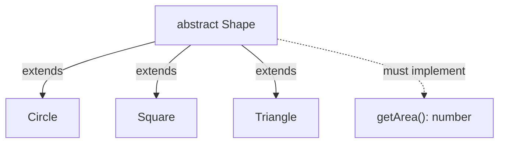
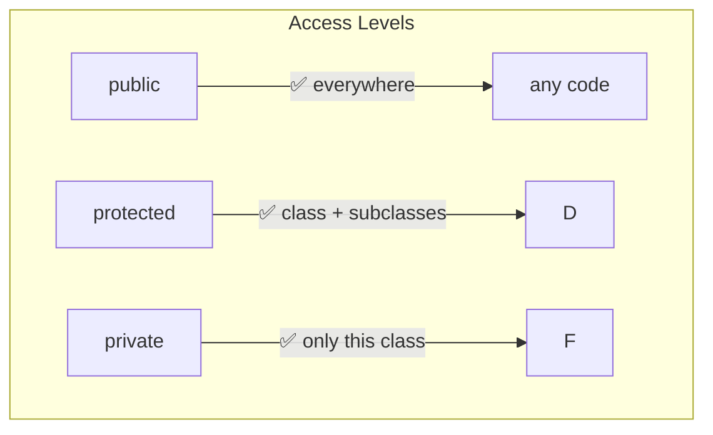

# 05 — Classes in TypeScript

## Class Syntax

TypeScript classes combine ES6 class syntax with type annotations:

```typescript
class Person {
  name: string;       // property declaration
  age: number;

  constructor(name: string, age: number) {
    this.name = name;
    this.age = age;
  }

  greet(): string {
    return `Hi, I'm ${this.name}`;
  }
}

const alice = new Person('Alice', 30);
console.log(alice.greet()); // "Hi, I'm Alice"
```

## `implements` Clause

A class can implement an interface:

```typescript
interface Printable {
  print(): void;
}

interface Loggable {
  log(): void;
}

class Report implements Printable, Loggable {
  print() {
    console.log('Printing...');
  }

  log() {
    console.log('Logging...');
  }
}
```

## Access Modifiers

### `public` (default)

```typescript
class Animal {
  public name: string; // visible everywhere

  constructor(name: string) {
    this.name = name;
  }
}

const a = new Animal('Dog');
console.log(a.name); // ✅ accessible
```

### `private`

```typescript
class BankAccount {
  private balance: number = 0; // only accessible within this class

  deposit(amount: number) {
    this.balance += amount;
  }

  getBalance(): number {
    return this.balance;
  }
}

const account = new BankAccount();
// account.balance = 100; // ❌ Property 'balance' is private
account.deposit(100);      // ✅
```

### `protected`

```typescript
class Base {
  protected secret: string = 'hidden';

  public reveal(): string {
    return this.secret;
  }
}

class Derived extends Base {
  show() {
    return this.secret; // ✅ accessible in subclasses
  }
}

const d = new Derived();
// d.secret; // ❌ not accessible outside
```

## `readonly`

```typescript
class Config {
  readonly apiKey: string;
  readonly endpoint: string;

  constructor(apiKey: string) {
    this.apiKey = apiKey;
    this.endpoint = 'https://api.example.com';
  }

  // updateKey() { this.apiKey = 'new'; } ❌ readonly
}

const config = new Config('abc123');
// config.apiKey = 'xyz'; ❌
```

## Parameter Properties

Shorthand to declare and initialize in one step:

```typescript
class User {
  constructor(
    public name: string,       // declares `this.name` and assigns
    private _age: number,      // declares `this._age` and assigns
    readonly id: number,       // declares `this.id` and assigns
    protected role: string = 'user' // with default
  ) {}
}

// Equivalent to:
class UserVerbose {
  public name: string;
  private _age: number;
  readonly id: number;
  protected role: string;

  constructor(name: string, _age: number, id: number, role: string = 'user') {
    this.name = name;
    this._age = _age;
    this.id = id;
    this.role = role;
  }
}
```

## Abstract Classes

```typescript
abstract class Shape {
  abstract getArea(): number; // must be implemented by subclasses

  describe(): string {
    return `Area: ${this.getArea()}`;
  }
}

class Circle extends Shape {
  constructor(private radius: number) {
    super();
  }

  getArea(): number {
    return Math.PI * this.radius ** 2;
  }
}

class Square extends Shape {
  constructor(private side: number) {
    super();
  }

  getArea(): number {
    return this.side ** 2;
  }
}

// const shape = new Shape(); ❌ Cannot create instance of abstract class
const circle = new Circle(5);
console.log(circle.describe());
```



## Static Members

```typescript
class MathUtils {
  static PI = 3.14159;         // static property

  static add(a: number, b: number): number {
    return a + b;
  }

  static readonly MAX_INT = 2 ** 31 - 1; // readonly static
}

console.log(MathUtils.PI);          // 3.14159
console.log(MathUtils.add(2, 3));   // 5

// Static members are not on instances
const utils = new MathUtils();
// utils.PI; ❌
```

## Getters and Setters

```typescript
class Temperature {
  private _celsius: number = 0;

  get celsius(): number {
    return this._celsius;
  }

  set celsius(value: number) {
    if (value < -273.15) {
      throw new Error('Temperature below absolute zero');
    }
    this._celsius = value;
  }

  get fahrenheit(): number {
    return this._celsius * 9 / 5 + 32;
  }

  set fahrenheit(value: number) {
    this._celsius = (value - 32) * 5 / 9;
  }
}

const temp = new Temperature();
temp.celsius = 100;
console.log(temp.fahrenheit); // 212
// temp.celsius = -300; ❌ throws error
```

## Inheritance

```typescript
class Animal {
  constructor(public name: string) {}

  speak(): string {
    return `${this.name} makes a sound`;
  }
}

class Dog extends Animal {
  constructor(name: string, public breed: string) {
    super(name); // must call super()
  }

  speak(): string {
    return `${this.name} barks`; // override
  }
}

const dog = new Dog('Rex', 'German Shepherd');
console.log(dog.speak()); // "Rex barks"
```

## Member Visibility Comparison



## Complete Example

```typescript
abstract class Repository<T> {
  protected items: T[] = [];

  abstract validate(item: T): boolean;

  add(item: T): void {
    if (!this.validate(item)) {
      throw new Error('Validation failed');
    }
    this.items.push(item);
  }

  getAll(): readonly T[] {
    return this.items;
  }
}

interface Product {
  id: number;
  name: string;
  price: number;
}

class ProductRepository extends Repository<Product> {
  validate(item: Product): boolean {
    return item.id > 0 && item.name.length > 0 && item.price >= 0;
  }
}

class Logger {
  private static instance: Logger;
  private constructor() {} // prevent external instantiation

  static getInstance(): Logger {
    if (!Logger.instance) {
      Logger.instance = new Logger();
    }
    return Logger.instance;
  }

  log(message: string): void {
    console.log(`[${new Date().toISOString()}] ${message}`);
  }
}
```

**Next:** [06-Generics.md](06-Generics.md) — Generics in TypeScript
