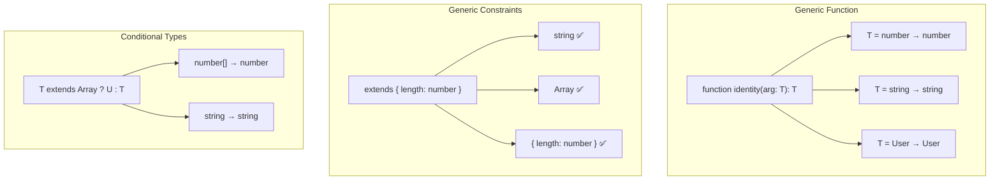

# 06 — Generics in TypeScript

## What are Generics?

Generics allow you to write **reusable code** that works with **multiple types** while maintaining type safety.

```typescript
// Without generics — loose typing
function identity(arg: any): any {
  return arg;
}
// We lose type information

// With generics
function identity<T>(arg: T): T {
  return arg;
}

const num = identity(42);      // type: number
const str = identity('hello'); // type: string
```

## Generic Functions

```typescript
// Return first element
function first<T>(arr: T[]): T | undefined {
  return arr[0];
}

const firstNum = first([1, 2, 3]);   // number | undefined
const firstStr = first(['a', 'b']);  // string | undefined

// Multiple type parameters
function zip<T, U>(a: T[], b: U[]): [T, U][] {
  return a.map((item, idx) => [item, b[idx]]);
}

const zipped = zip([1, 2], ['a', 'b']); // [number, string][]

// Generic with arrow functions
const map = <T, U>(arr: T[], fn: (item: T) => U): U[] => arr.map(fn);
const lengths = map(['hello', 'world'], s => s.length); // number[]
```

## Generic Types

```typescript
// Generic type alias
type Box<T> = { value: T };

const stringBox: Box<string> = { value: 'hello' };
const numberBox: Box<number> = { value: 42 };

// Generic interface
interface ApiResponse<T> {
  data: T;
  status: number;
  message: string;
}

type UserResponse = ApiResponse<{ id: number; name: string }>;

// Generic type for functions
type Transformer<T, U> = (input: T) => U;
const toString: Transformer<number, string> = (n) => n.toString();
```

## Generic Classes

```typescript
class Stack<T> {
  private items: T[] = [];

  push(item: T): void {
    this.items.push(item);
  }

  pop(): T | undefined {
    return this.items.pop();
  }

  peek(): T | undefined {
    return this.items[this.items.length - 1];
  }

  get size(): number {
    return this.items.length;
  }
}

const numberStack = new Stack<number>();
numberStack.push(1);
numberStack.push(2);
console.log(numberStack.pop()); // 2

const stringStack = new Stack<string>();
stringStack.push('hello');
```

## Generic Constraints (`extends`)

```typescript
// Constrain to types with .length
function longest<T extends { length: number }>(a: T, b: T): T {
  return a.length >= b.length ? a : b;
}

longest('hello', 'world');   // ✅
longest([1, 2], [1, 2, 3]);  // ✅
// longest(10, 20);           ❌

// Constrain with interface
interface HasId {
  id: number;
}

function findById<T extends HasId>(items: T[], id: number): T | undefined {
  return items.find(item => item.id === id);
}

// keyof constraint
function getProperty<T, K extends keyof T>(obj: T, key: K): T[K] {
  return obj[key];
}

const user = { name: 'Alice', age: 30, email: 'alice@example.com' };
getProperty(user, 'name'); // ✅ string
// getProperty(user, 'ssn'); ❌ 'ssn' not in keyof
```

## Conditional Types

```typescript
type IsString<T> = T extends string ? true : false;

type A = IsString<'hello'>;  // true
type B = IsString<42>;       // false

// Practical: Extract return type
type ReturnOf<T> = T extends (...args: unknown[]) => infer R ? R : never;

function greet(name: string): string {
  return `Hello, ${name}`;
}

type GreetReturn = ReturnOf<typeof greet>; // string

// Flatten arrays
type Flatten<T> = T extends Array<infer U> ? U : T;
type Num = Flatten<number[]>; // number
type Str = Flatten<string>;   // string

// Filter by condition
type NonNullable2<T> = T extends null | undefined ? never : T;
type T1 = NonNullable2<string | null>; // string
```

## Mapped Types

```typescript
// Make all properties optional
type Partial2<T> = {
  [K in keyof T]?: T[K];
};

// Make all properties readonly
type Readonly2<T> = {
  readonly [K in keyof T]: T[K];
};

// Practical usage
interface User {
  name: string;
  age: number;
  email: string;
}

type PartialUser = Partial2<User>;
// { name?: string; age?: number; email?: string; }

type ReadonlyUser = Readonly2<User>;
// { readonly name: string; readonly age: number; readonly email: string; }

// Mapped types with key remapping (TS 4.1+)
type Getters<T> = {
  [K in keyof T as `get${Capitalize<string & K>}`]: () => T[K];
};

type UserGetters = Getters<User>;
// { getName: () => string; getAge: () => number; getEmail: () => string; }
```

## `infer` Keyword

Used within conditional types to **extract** a type:

```typescript
// Extract element type from array
type ElementType<T> = T extends (infer U)[] ? U : T;

type E1 = ElementType<number[]>;    // number
type E2 = ElementType<string[]>;    // string
type E3 = ElementType<boolean>;     // boolean (not array → unchanged)

// Extract promise value
type Unwrap<T> = T extends Promise<infer U> ? U : T;

type P1 = Unwrap<Promise<string>>; // string
type P2 = Unwrap<number>;          // number

// Extract first parameter type
type FirstParam<T> = T extends (arg: infer P, ...args: unknown[]) => unknown ? P : never;
type FP = FirstParam<(name: string, age: number) => void>; // string
```

## Template Literal Types (TS 4.1+)

```typescript
type EventName = `on${Capitalize<string>}`;
type ClickEvent = `onClick`;   // ✅
type ChangeEvent = `onChange`; // ✅
// type Bad = `onclick`;        ❌ doesn't match `on${Capitalize<string>}`

// Combine with mapped types
type EventHandlers<T extends string> = {
  [K in T as `on${Capitalize<K>}`]: () => void;
};

type ButtonEvents = EventHandlers<'click' | 'hover' | 'focus'>;
// { onClick: () => void; onHover: () => void; onFocus: () => void; }
```

## Real-World Generic Utilities

```typescript
// 1. API Client
class ApiClient {
  async get<T>(url: string): Promise<T> {
    const response = await fetch(url);
    return response.json();
  }
}

interface Product {
  id: number;
  name: string;
  price: number;
}

const client = new ApiClient();
const product = await client.get<Product>('/products/1');
// product is typed as Product

// 2. State Manager
type Listener<T> = (state: T) => void;

class Store<T extends Record<string, unknown>> {
  private state: T;
  private listeners: Set<Listener<T>> = new Set();

  constructor(initial: T) {
    this.state = initial;
  }

  getState(): Readonly<T> {
    return this.state;
  }

  setState(partial: Partial<T>) {
    this.state = { ...this.state, ...partial };
    this.listeners.forEach(l => l(this.state));
  }

  subscribe(listener: Listener<T>) {
    this.listeners.add(listener);
    return () => this.listeners.delete(listener);
  }
}

// 3. Builder pattern
class QueryBuilder<T extends Record<string, unknown>> {
  private conditions: Partial<T> = {};

  where<K extends keyof T>(key: K, value: T[K]): this {
    this.conditions[key] = value;
    return this;
  }

  build(): Partial<T> {
    return this.conditions;
  }
}
```

## The Power of Generics — Visual Summary



**Next:** [07-Enums.md](07-Enums.md) — Enums in TypeScript
