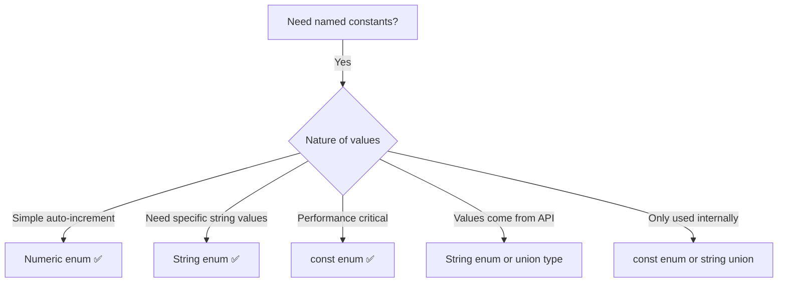

# 07 — Enums in TypeScript

## What is an Enum?

Enums define a set of **named constants** — either numeric or string-based.

```typescript
enum Direction {
  Up,
  Down,
  Left,
  Right,
}
```

## Numeric Enums (Default)

```typescript
enum Direction {
  Up,     // 0
  Down,   // 1
  Left,   // 2
  Right,  // 3
}

// Access by name or value
console.log(Direction.Up);    // 0
console.log(Direction[0]);    // "Up" (reverse mapping)

// Custom start value
enum StatusCode {
  Success = 200,
  Redirect = 301,
  NotFound = 404,
  Error = 500,
}

// Auto-increment from a set start
enum Index {
  First = 1,
  Second,  // 2
  Third,   // 3
}
```

## String Enums

```typescript
enum Direction {
  Up = 'UP',
  Down = 'DOWN',
  Left = 'LEFT',
  Right = 'RIGHT',
}

console.log(Direction.Up); // "UP"
// No reverse mapping for string enums
// Direction["UP"] ❌ undefined

// Use string enums when:
// - Values need to be human-readable
// - Values come from API responses
// - Debugging / logging clarity
```

## Heterogeneous Enums (Mixed)

```typescript
// Allowed but NOT recommended
enum Mixed {
  Yes = 1,
  No = 'NO',
}
```

## Computed Members

```typescript
enum Computed {
  A = 1,
  B = 2,
  C = A + B,    // 3 (computed)
  D = 'hello'.length, // 5 (computed)
  // E = Math.random(), ❌ needs to be a constant enum
}
```

## Const Enums

```typescript
// const enum — completely inlined, no runtime code
const enum Colors {
  Red = '#FF0000',
  Green = '#00FF00',
  Blue = '#0000FF',
}

const myColor = Colors.Red;
// Compiles to: const myColor = '#FF0000';
// No Colors variable in JavaScript output

// Regular enum — produces runtime object
enum RegularColors {
  Red = '#FF0000',
  Green = '#00FF00',
  Blue = '#0000FF',
}
// Compiles to an IIFE with reverse mapping
```

**Const enums** are erased at compile time. Use them for performance-critical code where the enum lookups are hot paths.

## Reverse Mapping

```typescript
// Only numeric enums get reverse mapping
enum Status {
  Active = 1,
  Inactive = 0,
}

// Generates:
// { 0: "Inactive", 1: "Active", Active: 1, Inactive: 0 }

const name = Status[1]; // "Active"
const value = Status.Active; // 1

// String enums DO NOT have reverse mapping
enum Direction {
  Up = 'UP',
}
// Only: { Up: "UP" }
// Direction["UP"] ❌
```

## When to Use Enums



## Enum vs Union Type

```typescript
// Enum approach
enum Color {
  Red = 'red',
  Green = 'green',
  Blue = 'blue',
}

function paint(color: Color) {
  console.log(`Painting ${color}`);
}

paint(Color.Red); // ✅
paint('red');     // ❌ (unless you use string enums loosely)

// Union type approach
type ColorUnion = 'red' | 'green' | 'blue';

function paint2(color: ColorUnion) {
  console.log(`Painting ${color}`);
}

paint2('red'); // ✅ (simpler, no runtime cost)
```

| Feature | Enum | Union Type |
|---|---|---|
| **Runtime cost** | Yes (object created) | None |
| **Tree-shakable** | No (regular enums) | Yes |
| **Auto-complete** | Good | Good |
| **Reverse mapping** | Yes (numeric) | No |
| **Iteration** | Yes (numeric) | No |
| **Const version** | const enum (inlined) | Already free |
| **Type safety** | Strong | Strong |
| **When to use** | Need runtime enum object | Simple string choice |

## Practical Examples

```typescript
// 1. API Status codes
enum HttpStatus {
  OK = 200,
  Created = 201,
  BadRequest = 400,
  Unauthorized = 401,
  NotFound = 404,
  InternalServerError = 500,
}

function handleResponse(status: HttpStatus) {
  switch (status) {
    case HttpStatus.OK:
    case HttpStatus.Created:
      return 'Success';
    case HttpStatus.BadRequest:
    case HttpStatus.Unauthorized:
    case HttpStatus.NotFound:
      return 'Client Error';
    case HttpStatus.InternalServerError:
      return 'Server Error';
  }
}

// 2. State machine
enum OrderState {
  Pending = 'pending',
  Confirmed = 'confirmed',
  Shipped = 'shipped',
  Delivered = 'delivered',
  Cancelled = 'cancelled',
}

class Order {
  constructor(public state: OrderState = OrderState.Pending) {}

  confirm() {
    if (this.state !== OrderState.Pending) throw new Error('Invalid state');
    this.state = OrderState.Confirmed;
  }

  ship() {
    if (this.state !== OrderState.Confirmed) throw new Error('Invalid state');
    this.state = OrderState.Shipped;
  }
}

// 3. Flags with bitwise operators
enum Permissions {
  None = 0,
  Read = 1 << 0,   // 1
  Write = 1 << 1,  // 2
  Execute = 1 << 2, // 4
  Admin = Read | Write | Execute, // 7
}

const userPerms = Permissions.Read | Permissions.Write;
const canRead = (userPerms & Permissions.Read) !== 0; // true
const canExecute = (userPerms & Permissions.Execute) !== 0; // false
```

## Enum Best Practices

```typescript
// ✅ Use PascalCase for enum names and members
enum UserRole {
  Admin = 'admin',
  Editor = 'editor',
  Viewer = 'viewer',
}

// ✅ Use const enums when you want zero runtime cost
const enum Direction {
  Up, Down, Left, Right,
}

// ❌ Avoid heterogeneous enums
enum Bad {
  A = 1,
  B = 'hello', // confusing
}

// ❌ Avoid numeric enums without explicit values (fragile)
enum Fragile {
  A, // 0
  B, // 1
  // if you insert a value above, everything shifts
}

// ✅ Prefer string enums or union types for external-facing APIs
type ApiMethod = 'GET' | 'POST' | 'PUT' | 'DELETE';
// vs enum ApiMethod { Get = 'GET', ... }

// ✅ Use const assertion for zero-cost constant objects
const DirectionObj = {
  Up: 0,
  Down: 1,
  Left: 2,
  Right: 3,
} as const;

type DirectionObjType = (typeof DirectionObj)[keyof typeof DirectionObj]; // 0 | 1 | 2 | 3
```

## Compiled Output Comparison

```typescript
// TypeScript input: regular enum
enum Color { Red, Green, Blue }

// JavaScript output (regular)
var Color;
(function (Color) {
    Color[Color["Red"] = 0] = "Red";
    Color[Color["Green"] = 1] = "Green";
    Color[Color["Blue"] = 2] = "Blue";
})(Color || (Color = {}));

// TypeScript input: const enum
const enum Size { Small, Medium, Large }
const mySize = Size.Medium;

// JavaScript output (const enum — completely inlined)
const mySize = 1; /* Medium */
```

**Next:** [08-Utility-Types.md](08-Utility-Types.md) — Utility Types
