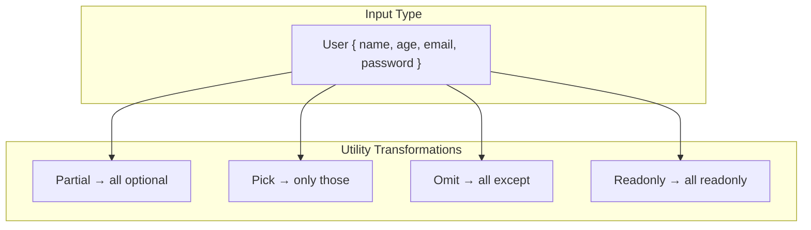

# 08 — Utility Types

TypeScript provides built-in **utility types** that transform existing types. They save you from writing complex conditional/mapped types yourself.

## 1. `Partial<T>`

Makes all properties **optional**.

```typescript
interface User {
  name: string;
  age: number;
  email: string;
}

// Manual version
type PartialUser = {
  name?: string;
  age?: number;
  email?: string;
};

// Using Partial
type PartialUser = Partial<User>;
// { name?: string; age?: number; email?: string; }

// Common use: updating a subset of properties
function updateUser(id: number, updates: Partial<User>) {
  // merge updates with existing user
}
```

## 2. `Required<T>`

Makes all properties **required** (removes `?`).

```typescript
interface Config {
  url?: string;
  method?: string;
  timeout?: number;
}

type StrictConfig = Required<Config>;
// { url: string; method: string; timeout: number; }
```

## 3. `Readonly<T>`

Makes all properties **readonly**.

```typescript
interface Point {
  x: number;
  y: number;
}

type ImmutablePoint = Readonly<Point>;
// { readonly x: number; readonly y: number; }

const point: ImmutablePoint = { x: 10, y: 20 };
// point.x = 5; ❌
```

## 4. `Pick<T, K>`

Creates a type with only the **specified keys**.

```typescript
interface User {
  id: number;
  name: string;
  email: string;
  age: number;
  role: string;
}

type PublicUser = Pick<User, 'id' | 'name' | 'email'>;
// { id: number; name: string; email: string; }

// Use: returning public user data from an API
function getPublicUser(user: User): Pick<User, 'id' | 'name' | 'email'> {
  return { id: user.id, name: user.name, email: user.email };
}
```

## 5. `Omit<T, K>`

Creates a type with all keys **except** the specified ones.

```typescript
interface User {
  id: number;
  name: string;
  email: string;
  passwordHash: string;
  ssn: string;
}

type SafeUser = Omit<User, 'passwordHash' | 'ssn'>;
// { id: number; name: string; email: string; }

// Useful for: DTOs, sanitized responses
```

## 6. `Record<K, T>`

Creates an object type with keys `K` and values `T`.

```typescript
type PageName = 'home' | 'about' | 'contact';

type PageInfo = {
  title: string;
  url: string;
};

const pages: Record<PageName, PageInfo> = {
  home: { title: 'Home', url: '/' },
  about: { title: 'About', url: '/about' },
  contact: { title: 'Contact', url: '/contact' },
};

// Common: dictionary/ map pattern
type Cache = Record<string, { data: unknown; timestamp: number }>;
type HttpHeaders = Record<string, string>;
```

## 7. `Exclude<T, U>`

Removes types from `T` that are assignable to `U`.

```typescript
type T = Exclude<string | number | boolean, boolean>;
// string | number

type Status = 'active' | 'inactive' | 'pending';
type ActiveStatus = Exclude<Status, 'pending'>;
// 'active' | 'inactive'
```

## 8. `Extract<T, U>`

Extracts types from `T` that are **assignable** to `U`.

```typescript
type T = Extract<string | number | boolean, boolean | number>;
// number | boolean

type Action = 'create' | 'update' | 'delete' | 'read';
type WriteActions = Extract<Action, 'create' | 'update' | 'delete'>;
// 'create' | 'update' | 'delete'
```

## 9. `NonNullable<T>`

Removes `null` and `undefined` from `T`.

```typescript
type T = NonNullable<string | number | null | undefined>;
// string | number

function safeLength(value: string | null): number {
  const cleaned = value!; // non-null assertion
  return cleaned.length;
}

// Better:
function safeLength(value: string | null): number {
  return value?.length ?? 0;
}
```

## 10. `ReturnType<T>`

Extracts the **return type** of a function type.

```typescript
function createUser(name: string, age: number) {
  return { id: Date.now(), name, age, createdAt: new Date() };
}

type UserCreated = ReturnType<typeof createUser>;
// { id: number; name: string; age: number; createdAt: Date; }

// Useful with async functions
async function fetchUsers() {
  const res = await fetch('/api/users');
  return res.json() as Promise<User[]>;
}

type FetchResult = ReturnType<typeof fetchUsers>;
// Promise<User[]>
```

## 11. `Parameters<T>`

Extracts **parameter types** of a function as a tuple.

```typescript
function greet(name: string, greeting?: string): string {
  return `${greeting ?? 'Hello'}, ${name}`;
}

type GreetParams = Parameters<typeof greet>;
// [name: string, greeting?: string]

// Spread into another function
function greetWrapper(...args: Parameters<typeof greet>): string {
  console.log('greet was called');
  return greet(...args);
}
```

## 12. `Awaited<T>` (TS 4.5+)

Unwraps promises recursively.

```typescript
type PromiseResult = Awaited<Promise<string>>;                 // string
type NestPromise = Awaited<Promise<Promise<number>>>;          // number
type PromiseAllResult = Awaited<Promise<{ data: string }[]>>; // { data: string }[]
```

## Comparison Table

| Utility | Effect | Example |
|---|---|---|
| `Partial<T>` | All optional | `Partial<User>` |
| `Required<T>` | All required | `Required<Config>` |
| `Readonly<T>` | All readonly | `Readonly<Point>` |
| `Pick<T, K>` | Pick keys K | `Pick<User, 'id' \| 'name'>` |
| `Omit<T, K>` | Remove keys K | `Omit<User, 'password'>` |
| `Record<K, T>` | Object K→T | `Record<'a' \| 'b', number>` |
| `Exclude<T, U>` | Remove U from T | `Exclude<string \| number, number>` |
| `Extract<T, U>` | Keep only U from T | `Extract<string \| number, string>` |
| `NonNullable<T>` | Remove null/undefined | `NonNullable<string \| null>` |
| `ReturnType<T>` | Return type of fn | `ReturnType<typeof fn>` |
| `Parameters<T>` | Params tuple of fn | `Parameters<typeof fn>` |
| `Awaited<T>` | Unwrap Promise | `Awaited<Promise<string>>` |

## Combining Utilities

```typescript
interface User {
  id: number;
  name: string;
  email: string;
  password: string;
  role: 'admin' | 'user';
  createdAt: Date;
}

// Create a safe user type for API responses
type SafeUser = Readonly<Omit<User, 'password'>>;
// { readonly id: number; readonly name: string; readonly email: string;
//   readonly role: 'admin' | 'user'; readonly createdAt: Date; }

// Partial updates
type UserUpdatePayload = Partial<Pick<User, 'name' | 'email' | 'role'>>;

// Required subset
type UserMinimal = Required<Pick<User, 'id' | 'name'>>;

// Record with specific keys
type UserCache = Record<string, Readonly<Omit<User, 'password'>>>;
```

## DIY: Build Your Own Utility Types

```typescript
// MyPartial
type MyPartial<T> = {
  [K in keyof T]?: T[K];
};

// MyReadonly
type MyReadonly<T> = {
  readonly [K in keyof T]: T[K];
};

// MyPick
type MyPick<T, K extends keyof T> = {
  [P in K]: T[P];
};

// MyRecord
type MyRecord<K extends keyof any, T> = {
  [P in K]: T;
};

// MyNonNullable
type MyNonNullable<T> = T extends null | undefined ? never : T;
```



**Next:** [09-Advanced-Types.md](09-Advanced-Types.md) — Advanced Types
