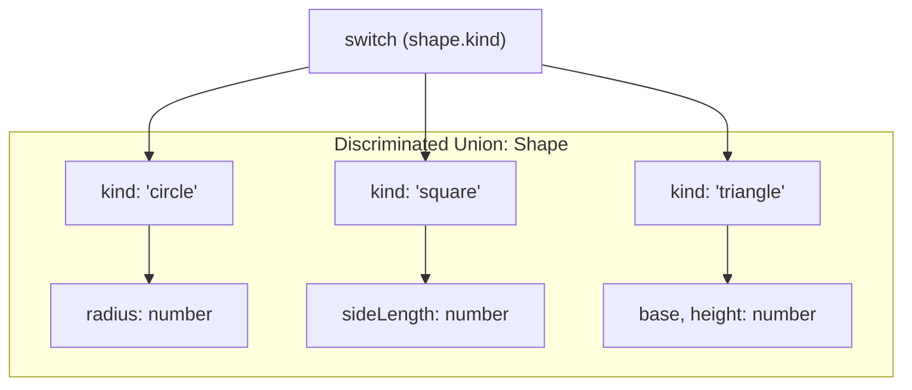
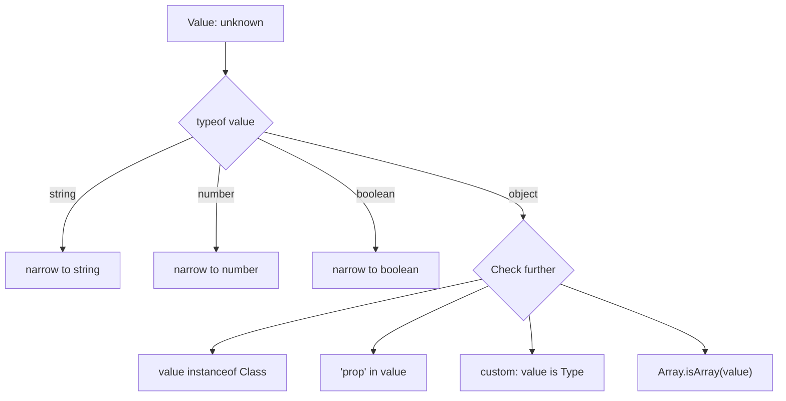

# 09 — Advanced Types

## 1. Intersection Types (`&`)

Combine multiple types into one:

```typescript
interface Named {
  name: string;
}

interface Aged {
  age: number;
}

type Person = Named & Aged;

const alice: Person = {
  name: 'Alice',
  age: 30,
};

// Intersection with overlapping properties
interface A {
  common: string;
  aOnly: number;
}

interface B {
  common: number; // conflict!
  bOnly: boolean;
}

// type C = A & B; // common: never (string & number)
```

## 2. Union Types (`|`)

A value can be one of several types:

```typescript
type ID = string | number;

function printID(id: ID) {
  if (typeof id === 'string') {
    console.log(id.toUpperCase()); // narrowed to string
  } else {
    console.log(id.toFixed(2)); // narrowed to number
  }
}

// Union of literals
type Direction = 'up' | 'down' | 'left' | 'right';
type Status = 'loading' | 'success' | 'error';
type Result<T> = { status: 'success'; data: T } | { status: 'error'; error: string };
```

## 3. Discriminated Unions

A union where a common property (the **discriminant**) is used for type narrowing:

```typescript
// Discriminant: 'kind' or 'type' or 'status'
type Shape =
  | { kind: 'circle'; radius: number }
  | { kind: 'square'; sideLength: number }
  | { kind: 'triangle'; base: number; height: number };

function getArea(shape: Shape): number {
  switch (shape.kind) {
    case 'circle':
      return Math.PI * shape.radius ** 2;   // ✅ shape is Circle
    case 'square':
      return shape.sideLength ** 2;          // ✅ shape is Square
    case 'triangle':
      return (shape.base * shape.height) / 2; // ✅ shape is Triangle
  }
}

// Exhaustiveness checking
function assertNever(x: never): never {
  throw new Error(`Unexpected value: ${x}`);
}

function getAreaSafe(shape: Shape): number {
  switch (shape.kind) {
    case 'circle': return Math.PI * shape.radius ** 2;
    case 'square': return shape.sideLength ** 2;
    case 'triangle': return (shape.base * shape.height) / 2;
    default: return assertNever(shape); // 🔒 ensures all cases handled
  }
}
```



## 4. Type Guards

### `typeof` Guard

```typescript
function padLeft(value: string, padding: string | number): string {
  if (typeof padding === 'number') {
    return ' '.repeat(padding) + value;
  }
  return padding + value;
}
```

### `instanceof` Guard

```typescript
class Dog {
  bark() { console.log('Woof!'); }
}

class Cat {
  meow() { console.log('Meow!'); }
}

function makeSound(animal: Dog | Cat) {
  if (animal instanceof Dog) {
    animal.bark(); // ✅
  } else {
    animal.meow(); // ✅
  }
}
```

### Custom Type Guards (`value is Type`)

```typescript
interface Fish {
  swim: () => void;
}

interface Bird {
  fly: () => void;
}

function isFish(pet: Fish | Bird): pet is Fish {
  return (pet as Fish).swim !== undefined;
}

function move(pet: Fish | Bird) {
  if (isFish(pet)) {
    pet.swim(); // ✅ narrowed to Fish
  } else {
    pet.fly();  // ✅ narrowed to Bird
  }
}
```

### `in` Operator Guard

```typescript
interface Admin {
  role: 'admin';
  privileges: string[];
}

interface User {
  role: 'user';
  email: string;
}

function checkAccess(person: Admin | User) {
  if ('privileges' in person) {
    console.log(person.privileges); // ✅ Admin
  }
}
```

## 5. Assertion Functions (TS 3.7+)

Functions that assert a condition, narrowing types:

```typescript
function assertIsString(value: unknown): asserts value is string {
  if (typeof value !== 'string') {
    throw new Error('Expected string');
  }
}

function processInput(input: unknown) {
  assertIsString(input);
  input.toUpperCase(); // ✅ narrowed to string
}

// Assertion without type predicate
function assert(condition: boolean, message?: string): asserts condition {
  if (!condition) {
    throw new Error(message ?? 'Assertion failed');
  }
}

function multiply(x: number, y: number) {
  assert(x > 0 && y > 0, 'Both numbers must be positive');
  return x * y;
}
```

## 6. `satisfies` Operator (TS 4.9+)

Check that a value matches a type **without** widening the type:

```typescript
// Without satisfies
const palette: Record<string, string> = {
  red: '#ff0000',
  green: '#00ff00',
  blue: '#0000ff',
};
// palette.red is string (widened) — no autocomplete for 'red'

// With satisfies — checks the type, keeps literal values
const palette = {
  red: '#ff0000',
  green: '#00ff00',
  blue: '#0000ff',
} satisfies Record<string, string>;

// palette.red is '#ff0000' (literal)
// palette.green is '#00ff00' (literal)

// Practical: checking union while keeping literals
type Color = 'red' | 'green' | 'blue';
const color = 'red' satisfies Color; // type is 'red', not just Color
```

## 7. Branded Types

Simulate nominal typing with **brands**:

```typescript
// Brand type
type Brand<T, B> = T & { __brand: B };

type UserId = Brand<number, 'UserId'>;
type PostId = Brand<number, 'PostId'>;

function getUser(id: UserId) { /* ... */ }
function getPost(id: PostId) { /* ... */ }

const userId = 1 as UserId;
const postId = 1 as PostId;

getUser(userId); // ✅
// getUser(postId); ❌ Type 'PostId' is not assignable to 'UserId'

// With interfaces
interface UserId2 extends Number {
  __brand: 'UserId';
}

interface PostId2 extends Number {
  __brand: 'PostId';
}

// Factory function
function createUserId(id: number): UserId {
  return id as UserId;
}
```

## Complete Real Example

```typescript
// API state management with discriminated unions
type AsyncState<T> =
  | { status: 'idle' }
  | { status: 'loading' }
  | { status: 'success'; data: T }
  | { status: 'error'; error: string };

// Type guard
function isSuccess<T>(state: AsyncState<T>): state is { status: 'success'; data: T } {
  return state.status === 'success';
}

class AsyncManager<T> {
  private state: AsyncState<T> = { status: 'idle' };

  getState(): Readonly<AsyncState<T>> {
    return this.state;
  }

  setLoading() {
    this.state = { status: 'loading' };
  }

  setSuccess(data: T) {
    this.state = { status: 'success', data };
  }

  setError(error: string) {
    this.state = { status: 'error', error };
  }

  render(callbacks: {
    onIdle?: () => void;
    onLoading?: () => void;
    onSuccess: (data: T) => void;
    onError: (error: string) => void;
  }) {
    const state = this.state;
    switch (state.status) {
      case 'idle': callbacks.onIdle?.(); break;
      case 'loading': callbacks.onLoading?.(); break;
      case 'success': callbacks.onSuccess(state.data); break;
      case 'error': callbacks.onError(state.error); break;
    }
  }
}
```

## Type Guard Decision Tree



**Next:** [10-Type-Inference.md](10-Type-Inference.md) — Type Inference
