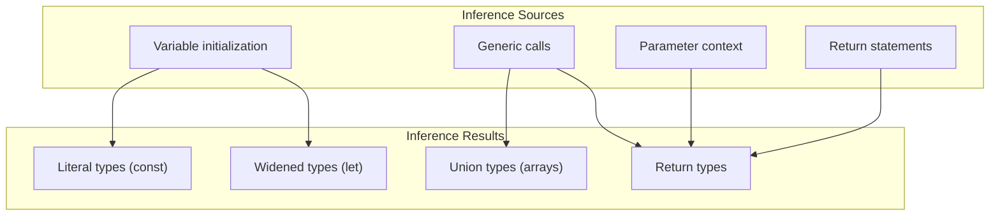

# 10 — Type Inference

## What is Type Inference?

TypeScript can **automatically determine** types without explicit annotations. It's one of the most powerful features — you get safety without verbosity.

```typescript
// ❌ Unnecessary annotations (redundant)
let count: number = 0;
const name: string = 'Alice';
function add(a: number, b: number): number { return a + b; }

// ✅ Let inference work
let count = 0;          // inferred as number
const name = 'Alice';  // inferred as 'Alice' (literal)
function add(a: number, b: number) { return a + b; }
// return type inferred as number
```

## How Inference Works

```mermaid
flowchart LR
    A["Declaration + Initialization"] --> B["Explicit type?"]
    B -->|"Yes" C["Use explicit type"]
    B -->|"No" D["Infer from value"]
    D --> E["Is value const?"]
    E -->|"Yes (primitive)" F["Literal type"]
    E -->|"No (let/var)" G["Widened type"]
    D --> H["Is value function?"]
    H --> I["Infer return from body"]
    H --> J["Infer params from context"]
```

## 1. Basic Variable Inference

```typescript
let x = 3;             // number
let name = 'Alice';    // string
let isDone = false;    // boolean
let items = [];        // any[] (widened)
let items2 = [1, 2, 3]; // number[]

// const — narrower inference
const x = 3;           // 3 (literal type, not number)
const name = 'Alice';  // 'Alice' (literal)
const isDone = true;   // true

// Object inference
const point = { x: 3, y: 4 };
// point: { x: number; y: number }
```

## 2. Function Return Type Inference

```typescript
// Return type inferred from the return statement
function add(a: number, b: number) {
  return a + b;
}
// return type: number

function greet(name: string) {
  return `Hello, ${name}`;
}
// return type: string

function maybe(num: number) {
  if (num > 0) return num;
  return null;
}
// return type: number | null

// Never type
function fail() {
  throw new Error('fail');
}
// return type: never
```

## 3. Contextual Typing

TypeScript infers types from the **context** where a value is used:

```typescript
// Event handler context
window.addEventListener('click', (event) => {
  console.log(event.clientX); // event inferred as MouseEvent
});

// Callback context
[1, 2, 3].forEach((num) => {
  console.log(num.toFixed(2)); // num inferred as number
});

// Array method context
const result = [1, 2, 3].map((x) => x * 2);
// result: number[]

// Object method context
const obj = {
  greet(name: string) {
    return `Hello, ${name}`;
  },
};
obj.greet('Alice'); // return inferred as string
```

## 4. Literal Inference

```typescript
// const → literal type (narrow)
const HTTP_STATUS_OK = 200;     // type: 200
const RED = '#FF0000';          // type: '#FF0000'

// let → widened type
let status = 200;               // type: number
let color = '#FF0000';          // type: string

// as const — force literal inference
const config = {
  server: 'https://api.example.com',
  port: 443,
  retries: 3,
} as const;

// config.server: 'https://api.example.com' (literal)
// config.port: 443 (literal)
// config.retries: 3 (literal)
// Entire object is readonly

// Without as const
const config2 = {
  server: 'https://api.example.com',
  port: 443,
};
// config2.server: string, config2.port: number
```

## 5. Type Widening

When a variable can change, TypeScript **widens** literals to base types:

```typescript
// Literal → widened
const c = 'hello';  // 'hello' (literal)
let l = 'hello';    // string (widened)

// Object properties
const obj = {
  x: 3,   // number, not 3
  y: 4,   // number, not 4
};

// Arrays
const arr = [1, 2, 3];
// arr: number[], not [1, 2, 3]

// Prevent widening with as const
const narrow = [1, 2, 3] as const;
// narrow: readonly [1, 2, 3] (tuple)
```

## 6. Type Narrowing

TypeScript narrows types within control flow:

```typescript
function process(value: string | number | null) {
  // value: string | number | null

  if (value === null) {
    // value: null
    return;
  }

  // value: string | number

  if (typeof value === 'string') {
    // value: string
    console.log(value.toUpperCase());
  } else {
    // value: number
    console.log(value.toFixed(2));
  }
}

// Discriminated union narrowing
type Result = { ok: true; value: number } | { ok: false; error: string };

function handleResult(result: Result) {
  if (result.ok) {
    console.log(result.value); // ✅ narrowed
  } else {
    console.log(result.error); // ✅ narrowed
  }
}

// Truthiness narrowing
function getLength(value: string | null | undefined): number {
  if (value) {
    return value.length; // narrowed to string
  }
  return 0;
}

// Equality narrowing
function example(a: string | number, b: string | boolean) {
  if (a === b) {
    // a and b are both string here
    console.log(a.toUpperCase());
  }
}
```

## 7. Best Common Type

When inferring from arrays, TypeScript computes the **best common type**:

```typescript
// All elements are numbers → number[]
let arr1 = [1, 2, 3];
// arr1: number[]

// Mixed but compatible → union
let arr2 = [1, 'hello', true];
// arr2: (string | number | boolean)[]

// Objects with compatible shapes
let arr3 = [
  { name: 'Alice', age: 30 },
  { name: 'Bob', age: 25 },
];
// arr3: { name: string; age: number }[]

// Incompatible — widened to union
let arr4 = [
  { a: 1 },
  { b: 2 },
];
// arr4: ({ a: number } | { b: number })[]
```

## 8. Complex Inference Scenarios

```typescript
// Generic function inference
function identity<T>(arg: T): T {
  return arg;
}

const a = identity(42);        // T inferred as number
const b = identity('hello');   // T inferred as string
const c = identity({ x: 1 }); // T inferred as { x: number }

// Multiple type params
function pair<T, U>(a: T, b: U): [T, U] {
  return [a, b];
}

const p = pair('hello', 42); // [string, number]

// Type inference with generics and callbacks
function map<T, U>(arr: T[], fn: (item: T) => U): U[] {
  return arr.map(fn);
}

const lengths = map(['hello', 'world'], (s) => s.length);
// T inferred as string, U inferred as number
// Result: number[]

// Nested inference
function createCache<T>() {
  const cache = new Map<string, T>();

  return {
    get(key: string): T | undefined {
      return cache.get(key);
    },
    set(key: string, value: T): void {
      cache.set(key, value);
    },
  };
}

const cache = createCache<User>();
// cache.get and cache.set are fully typed
```

## Inference Flow Diagram



## When to Add Explicit Types

```typescript
// ✅ Good: function signatures (public API)
function getUser(id: number): Promise<User> {
  return fetch(`/users/${id}`).then(r => r.json());
}

// ✅ Good: complex parameters
function processItems(
  items: Array<{ id: number; value: unknown }>,
  filter: (item: { id: number; value: unknown }) => boolean
) {}

// ✅ Good: when inference is ambiguous
let data: string | null = null;

// ✅ Good: empty containers
const items: number[] = [];

// ✅ Good: long function returns (clarity)
function compute(): ComplexResultType {
  // many lines...
  return result;
}

// ❌ Bad: redundant
const x: number = 42; // just use const x = 42
const fn: () => string = () => 'hello'; // just const fn = () => 'hello'
```

**Next:** [11-Declaration-Files.md](11-Declaration-Files.md) — Declaration Files
