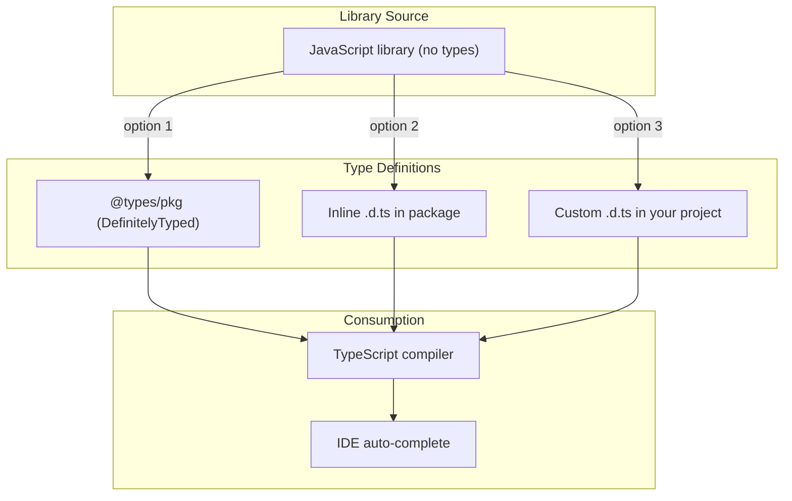

# 11 — Declaration Files (.d.ts)

## What are Declaration Files?

Declaration files (`.d.ts`) describe the **shape** of JavaScript code to TypeScript. They contain **only type information** — no implementation.

```
File                          Purpose
app.ts                        TypeScript source
app.js                        Compiled JavaScript output
app.d.ts                      Type declarations (generated or manual)
```

## The `declare` Keyword

Used to tell TypeScript that something **exists** (without providing implementation):

```typescript
// Declare a variable
declare const API_VERSION: string;

// Declare a function
declare function fetchData(url: string): Promise<unknown>;

// Declare a class
declare class EventEmitter {
  on(event: string, callback: (...args: unknown[]) => void): this;
  emit(event: string, ...args: unknown[]): boolean;
}

// Declare a module
declare module 'some-library' {
  export function doSomething(): void;
}
```

## Ambient Modules

For libraries that don't have types:

```typescript
// globals.d.ts
declare const $: (selector: string) => {
  html: (content?: string) => string;
  css: (prop: string, value?: string) => string;
};

// modules.d.ts
declare module 'old-library' {
  export function init(config: Record<string, unknown>): void;
  export const version: string;
}

// Wildcard module declarations
declare module '*.svg' {
  const content: string;
  export default content;
}

declare module '*.module.css' {
  const classes: Record<string, string>;
  export default classes;
}
```

## Module Augmentation

Adding types to existing modules:

```typescript
// augment express.d.ts
import 'express';

declare module 'express' {
  interface Request {
    user?: {
      id: number;
      name: string;
    };
  }
}

// Now req.user is available and typed
// import { Request } from 'express';
// app.get('/', (req: Request, res) => {
//   console.log(req.user?.name);
// });
```

## Global Augmentation

Adding to global scope:

```typescript
// globals.d.ts
export {}; // makes it a module — prevents ambient declaration

declare global {
  interface Window {
    myApp: {
      version: string;
      config: Record<string, unknown>;
    };
  }

  const __DEV__: boolean;
  const __VERSION__: string;
}

// Now window.myApp is typed
// window.myApp.version // ✅ string
```

## DefinitelyTyped (`@types/`)

The community-maintained repository of type definitions:

```bash
# Install types for popular libraries
npm install --save-dev @types/react
npm install --save-dev @types/node
npm install --save-dev @types/express
npm install --save-dev @types/lodash

# TypeScript automatically finds @types/ packages
```

### Finding Type Definitions

```bash
# Check if a package has built-in types
# Look for "types" or "typings" in package.json

# Search for types
npm info @types/lodash
npx typescript-dts-search lodash

# Quick check
npx ts-node -e "import _ from 'lodash';"
```

## Writing Your Own .d.ts

### For a Simple Module

```typescript
// my-lib.d.ts
export function add(a: number, b: number): number;
export function subtract(a: number, b: number): number;

export interface Config {
  debug: boolean;
  timeout: number;
}

export class MyClass {
  constructor(config: Config);
  run(): void;
}
```

### For a Complex Library

```typescript
// my-lib.d.ts
// Type definitions for my-lib 2.1.0
// Project: https://github.com/example/my-lib
// Definitions by: Akash <https://github.com/akash>

declare namespace MyLib {
  function init(options: Partial<MyLib.Options>): void;

  function on(event: MyLib.Events, callback: (data: unknown) => void): void;

  function off(event: MyLib.Events): void;
}

declare namespace MyLib {
  interface Options {
    apiKey: string;
    endpoint: string;
    retries: number;
  }

  type Events = 'data' | 'error' | 'close';
}

export = MyLib;
export as namespace MyLib;
```

### For UMD Libraries

```typescript
// UMD — works with any module system
export function parse(source: string): ASTNode;
export function stringify(ast: ASTNode): string;

export interface ASTNode {
  type: string;
  value: unknown;
  children?: ASTNode[];
}

// Also available as global
export as namespace MyParser;
```

## Generating .d.ts Automatically

```json
// tsconfig.json
{
  "compilerOptions": {
    "declaration": true,     // generates .d.ts files
    "declarationDir": "./types", // output directory
    "emitDeclarationOnly": true, // only .d.ts, no .js
    "declarationMap": true       // source maps for declarations
  }
}
```

```bash
tsc  # generates both .js and .d.ts
```

## Package.json Types Configuration

```json
{
  "name": "my-library",
  "version": "1.0.0",
  "main": "dist/index.js",
  "types": "dist/index.d.ts",
  "files": ["dist/**/*"]
}
```

## Common Patterns

```typescript
// 1. Extending existing types
import 'express';

declare module 'express-serve-static-core' {
  interface Request {
    timestamp: number;
  }
}

// 2. Override existing declarations
declare module 'some-module' {
  export function parse(input: string): unknown;
  // If the original declaration is wrong:
  // @ts-ignore
  export function parseSafe(input: string): unknown;
}

// 3. Declaration for a global plugin
interface JQuery {
  myPlugin(options: Record<string, unknown>): this;
}

// 4. Augmenting enums
declare enum MyEnum {
  NewValue = 'new',
}
```

## Debugging Type Declarations

```bash
# See the resolved type of a module
tsc --traceResolution

# Show type of a specific expression
# Use: // @ts-expect-error — hover for type

# Generate type info
npx typescript-dts-gen --name my-project --out-dir types
```

## Declaration File Structure



## Error Troubleshooting

| Error | Cause | Fix |
|---|---|---|
| `Cannot find module 'x'` | No types | `npm i --save-dev @types/x` or create `.d.ts` |
| `Property 'x' does not exist on type 'y'` | Missing augmentation | Create module/global augmentation |
| `Module 'x' resolves to a non-module entity` | Bad declaration file | Check the `export` syntax |
| `Duplicate identifier 'x'` | Conflicting declarations | Use `skipLibCheck: true` |

**Next:** [Best-Practices.md](Best-Practices.md) — TypeScript Best Practices
