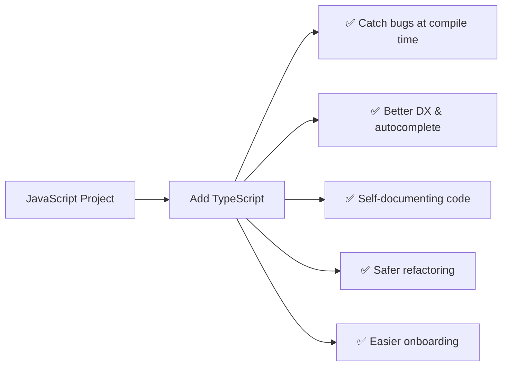

# Projects — Migrating JavaScript to TypeScript

This guide covers how to take existing JavaScript projects and convert them to TypeScript, along with specific project requirements and migration strategies.

## Why Convert to TypeScript?



## Migration Strategy

### Phase 1: Setup

```bash
# Install TypeScript
npm install --save-dev typescript

# Create tsconfig.json
npx tsc --init

# Add build scripts to package.json
```

```json
{
  "scripts": {
    "build": "tsc",
    "dev": "tsc --watch",
    "typecheck": "tsc --noEmit"
  }
}
```

```json
{
  "compilerOptions": {
    "target": "ES2020",
    "module": "ESNext",
    "moduleResolution": "bundler",
    "strict": true,
    "esModuleInterop": true,
    "outDir": "./dist",
    "rootDir": "./src",
    "allowJs": true,
    "checkJs": false
  },
  "include": ["src/**/*"],
  "exclude": ["node_modules", "dist"]
}
```

### Phase 2: Incremental Migration

```mermaid
flowchart TD
    A["Start with .js files + allowJs: true"] --> B["Rename .js → .ts one file at a time"]
    B --> C["Add types to the renamed file"]
    C --> D["Fix type errors (may cascade)"]
    D --> E{"Errors resolved?"}
    E -->|"No" F["Add // @ts-ignore or // @ts-expect-error"]
    E -->|"Yes" G["Move to next file"]
    F --> G
    G --> B
    G --> H["Enable strict: true"]
    H --> I["Remove // @ts-ignore comments"]
    I --> J["✅ Full TypeScript adoption"]
```

### Phase 3: Strict Mode Enablement

```json
{
  "compilerOptions": {
    "strict": true
  }
}
```

Start with `strict: false` during migration, then enable gradually:
1. `strictNullChecks`
2. `noImplicitAny`
3. `strictFunctionTypes`
4. Remaining strict flags

## Project 1: Todo App (Vanilla JS → TS)

### Original JavaScript

```javascript
// todo.js
class TodoList {
  constructor() {
    this.todos = [];
  }

  addTodo(text) {
    this.todos.push({ text, completed: false, id: Date.now() });
  }

  toggleTodo(id) {
    const todo = this.todos.find(t => t.id === id);
    if (todo) {
      todo.completed = !todo.completed;
    }
  }

  getActiveTodos() {
    return this.todos.filter(t => !t.completed);
  }
}
```

### Converted TypeScript

```typescript
// types.ts
export interface Todo {
  id: number;
  text: string;
  completed: boolean;
  createdAt: Date;
}

export type TodoFilter = 'all' | 'active' | 'completed';

export interface TodoStats {
  total: number;
  active: number;
  completed: number;
}

// todo.ts
import { Todo, TodoFilter, TodoStats } from './types';

export class TodoList {
  private todos: Todo[] = [];

  addTodo(text: string): void {
    this.todos.push({
      id: Date.now(),
      text,
      completed: false,
      createdAt: new Date(),
    });
  }

  toggleTodo(id: number): void {
    const todo = this.todos.find(t => t.id === id);
    if (todo) {
      todo.completed = !todo.completed;
    }
  }

  removeTodo(id: number): void {
    this.todos = this.todos.filter(t => t.id !== id);
  }

  getFilteredTodos(filter: TodoFilter): Todo[] {
    switch (filter) {
      case 'active': return this.todos.filter(t => !t.completed);
      case 'completed': return this.todos.filter(t => t.completed);
      default: return [...this.todos];
    }
  }

  getStats(): TodoStats {
    return {
      total: this.todos.length,
      active: this.todos.filter(t => !t.completed).length,
      completed: this.todos.filter(t => t.completed).length,
    };
  }
}
```

### Type Definitions Needed

```typescript
// API response types
interface TodoApiResponse {
  todos: Todo[];
  total: number;
  skip: number;
  limit: number;
}

// Local storage schema
interface LocalStorageSchema {
  todos: Todo[];
  lastUpdated: string;
  version: number;
}
```

## Project 2: Express REST API (JS → TS)

### Required Type Definitions

```typescript
// types/express.d.ts — augment Express types
import 'express';

declare module 'express-serve-static-core' {
  interface Request {
    user?: {
      id: number;
      role: 'admin' | 'user';
    };
    requestId: string;
  }

  interface Response {
    success(data: unknown, message?: string): void;
    error(status: number, message: string): void;
  }
}

// types/models.ts
export interface User {
  id: number;
  name: string;
  email: string;
  passwordHash: string;
  role: 'admin' | 'user';
  createdAt: Date;
}

export interface Product {
  id: number;
  name: string;
  price: number;
  description: string;
  category: string;
  inStock: boolean;
}

// types/api.ts
export interface ApiResponse<T> {
  success: boolean;
  data: T;
  message?: string;
  errors?: string[];
}

export interface PaginatedResponse<T> extends ApiResponse<T[]> {
  pagination: {
    page: number;
    limit: number;
    total: number;
    totalPages: number;
  };
}
```

### Converted Service

```typescript
// services/userService.ts
import { User } from '../types/models';
import { ApiResponse } from '../types/api';

class UserService {
  private users: User[] = [];

  async findById(id: number): Promise<ApiResponse<User | null>> {
    const user = this.users.find(u => u.id === id);
    if (!user) {
      return { success: false, data: null, message: 'User not found' };
    }
    // Don't expose passwordHash
    const { passwordHash, ...safeUser } = user;
    return { success: true, data: safeUser };
  }

  async create(data: Omit<User, 'id' | 'createdAt'>): Promise<ApiResponse<User>> {
    const user: User = {
      ...data,
      id: Date.now(),
      createdAt: new Date(),
    };
    this.users.push(user);
    const { passwordHash, ...safeUser } = user;
    return { success: true, data: safeUser };
  }

  async update(id: number, data: Partial<Omit<User, 'id' | 'createdAt'>>): Promise<ApiResponse<User | null>> {
    const index = this.users.findIndex(u => u.id === id);
    if (index === -1) {
      return { success: false, data: null, message: 'User not found' };
    }
    this.users[index] = { ...this.users[index], ...data };
    const { passwordHash, ...safeUser } = this.users[index];
    return { success: true, data: safeUser };
  }
}
```

### Migration Benefits Observed

| Metric | Before (JS) | After (TS) |
|---|---|---|
| Runtime null errors | ~5/month | 0 after 3 months |
| Time to debug type issues | ~2h/issue | ~15min/issue |
| New dev onboarding | 2 weeks | 3 days |
| Refactoring confidence | Low | High |
| Autocomplete coverage | None | Full |
| Documentation | Outdated comments | Living types |

## Project 3: React Component Library (JSX → TSX)

### Original Component (JavaScript)

```jsx
// Button.jsx
function Button({ variant, size, children, onClick, disabled }) {
  return (
    <button
      className={`btn btn-${variant} btn-${size}`}
      onClick={onClick}
      disabled={disabled}
    >
      {children}
    </button>
  );
}
```

### Converted Component (TypeScript)

```tsx
// types/button.ts
export type ButtonVariant = 'primary' | 'secondary' | 'danger' | 'ghost';
export type ButtonSize = 'sm' | 'md' | 'lg';

export interface ButtonProps {
  variant?: ButtonVariant;
  size?: ButtonSize;
  children: React.ReactNode;
  onClick?: (e: React.MouseEvent<HTMLButtonElement>) => void;
  disabled?: boolean;
  type?: 'button' | 'submit' | 'reset';
  className?: string;
}

// Button.tsx
import React from 'react';
import { ButtonProps, ButtonVariant, ButtonSize } from '../types/button';

const variantClasses: Record<ButtonVariant, string> = {
  primary: 'btn-primary',
  secondary: 'btn-secondary',
  danger: 'btn-danger',
  ghost: 'btn-ghost',
};

const sizeClasses: Record<ButtonSize, string> = {
  sm: 'btn-sm',
  md: 'btn-md',
  lg: 'btn-lg',
};

export const Button: React.FC<ButtonProps> = ({
  variant = 'primary',
  size = 'md',
  children,
  onClick,
  disabled = false,
  type = 'button',
  className = '',
}) => {
  const classes = [
    'btn',
    variantClasses[variant],
    sizeClasses[size],
    className,
  ].filter(Boolean).join(' ');

  return (
    <button
      className={classes}
      onClick={onClick}
      disabled={disabled}
      type={type}
    >
      {children}
    </button>
  );
};
```

### Type Definitions for React

```typescript
// types/common.ts
export type WithChildren<T = {}> = T & { children?: React.ReactNode };
export type WithClassName<T = {}> = T & { className?: string };
export type WithStyle<T = {}> = T & { style?: React.CSSProperties };

export type ComponentProps<T extends keyof JSX.IntrinsicElements> =
  React.ComponentPropsWithoutRef<T>;

export type StrictProps<T, P> = Omit<T, keyof P> & P;

// types/forms.ts
export type FormState<T> = {
  values: T;
  errors: Partial<Record<keyof T, string>>;
  touched: Partial<Record<keyof T, boolean>>;
  isSubmitting: boolean;
};

export type ValidationRule<T> = {
  required?: boolean;
  minLength?: number;
  maxLength?: number;
  pattern?: RegExp;
  validate?: (value: T) => string | undefined;
};
```

## Project 4: Utility Library

```typescript
// Types for utility functions
type Predicate<T> = (item: T) => boolean;
type Transformer<T, U> = (item: T) => U;

// Generic array utilities
export function groupBy<T, K extends string | number>(
  items: T[],
  keyFn: (item: T) => K
): Record<K, T[]> {
  return items.reduce((acc, item) => {
    const key = keyFn(item);
    (acc[key] ??= []).push(item);
    return acc;
  }, {} as Record<K, T[]>);
}

export function partition<T>(
  items: T[],
  predicate: Predicate<T>
): [T[], T[]] {
  return items.reduce(
    ([pass, fail], item) =>
      predicate(item) ? [[...pass, item], fail] : [pass, [...fail, item]],
    [[] as T[], [] as T[]]
  );
}

export function deepClone<T>(obj: T): T {
  return JSON.parse(JSON.stringify(obj));
}

export function debounce<T extends (...args: unknown[]) => unknown>(
  fn: T,
  delay: number
): (...args: Parameters<T>) => void {
  let timeoutId: ReturnType<typeof setTimeout>;
  return (...args: Parameters<T>) => {
    clearTimeout(timeoutId);
    timeoutId = setTimeout(() => fn(...args), delay);
  };
}

// Type tests
type _GroupByTest = ReturnType<typeof groupBy<{ cat: string }, string>>;
// Record<string, { cat: string }[]>
```

## Migration Checklist

```markdown
- [ ] Install TypeScript as dev dependency
- [ ] Create tsconfig.json (start permissive, end strict)
- [ ] Rename .js to .ts (or .jsx to .tsx)
- [ ] Add type annotations to function signatures
- [ ] Create shared type definition files
- [ ] Fix type errors (use // @ts-expect-error temporarily)
- [ ] Enable strict mode gradually
- [ ] Remove temporary // @ts-expect-error comments
- [ ] Add type testing (expect-type, tsd)
- [ ] Update build pipeline
- [ ] Document type patterns for the team
```

## Common Migration Issues

| Issue | Solution |
|---|---|
| `require()` not working | Enable `esModuleInterop: true` |
| `.js` imports in `.ts` files | Use `allowJs: true` or rename all files |
| `this` is `any` | Add `this` parameter type or use arrow functions |
| Third-party library has no types | Install `@types/lib` or create `.d.ts` |
| Gradual migration needed | Allow JS/TS coexistence with `allowJs: true` |
| Circular type dependencies | Extract shared types to a separate file |
| Complex generic types too verbose | Use type inference where possible |

```mermaid
flowchart TD
    A["Start Migration"] --> B["Install TS + Config"]
    B --> C["Pick first file to convert"]
    C --> D["Rename .js → .ts"]
    D --> E["Add basic types"]
    E --> F{"Compiles?"}
    F -->|"No" G["Fix errors or @ts-expect-error"]
    F -->|"Yes" H["Move to next file"]
    G --> H
    H --> I{"All files done?"}
    I -->|"No" C
    I -->|"Yes" J["Enable strict: true"]
    J --> K["Remove temporary suppressions"]
    K --> L["✅ Migration Complete"]
```

## Benefits Observed After Migration

| Benefit | Impact |
|---|---|
| **Fewer production bugs** | ~60% reduction in type-related bugs |
| **Faster development** | Autocomplete reduces lookup time |
| **Better code quality** | Types act as documentation |
| **Confident refactoring** | Compiler catches breakage |
| **Easier code reviews** | Types make intent clear |
| **Team velocity** | Less time debugging incorrect types |
