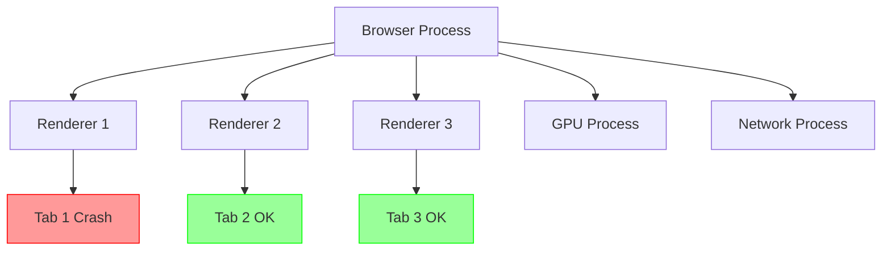
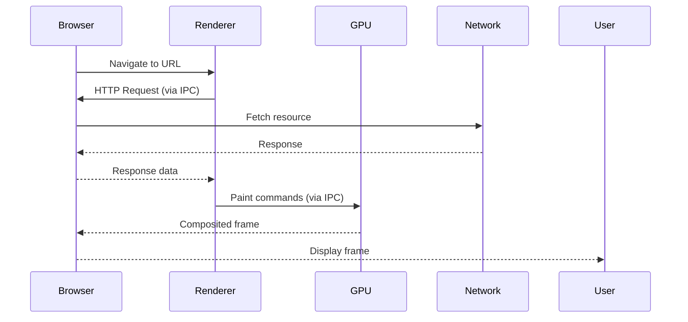

# Browser Architecture

## Overview

A web browser is a complex software system that retrieves, renders, and presents web content. Modern browsers follow a **multi-process architecture** for security, stability, and performance.

## Core Components

| Component | Responsibility |
|---|---|
| **User Interface** | Back/forward buttons, address bar, bookmarks, settings menu |
| **Browser Engine** | Orchestrates actions between UI and rendering engine |
| **Rendering Engine** | Parses HTML/CSS and paints content to screen |
| **Networking** | HTTP/HTTPS requests, caching, DNS resolution |
| **JavaScript Interpreter** | Parses and executes JS (V8, SpiderMonkey, JavaScriptCore) |
| **UI Backend** | Draws basic widgets (buttons, inputs, select dropdowns) using OS native methods |
| **Data Storage** | Cookies, localStorage, IndexedDB, Cache API, WebSQL |

## Single-Process vs Multi-Process Architecture

### Single-Process (Legacy)

```
┌─────────────────────────────────────────────────┐
│                  Browser Process                 │
│  ┌───────┐ ┌──────────┐ ┌─────────┐ ┌──────┐   │
│  │  UI   │ │  Engine   │ │Render   │ │Net   │   │
│  │       │ │          │ │Engine   │ │      │   │
│  └───────┘ └──────────┘ └─────────┘ └──────┘   │
│  ┌────────┐ ┌──────────┐ ┌──────────┐           │
│  │  JS    │ │UI Backend│ │Storage   │           │
│  │Engine  │ │          │ │          │           │
│  └────────┘ └──────────┘ └──────────┘           │
└─────────────────────────────────────────────────┘
```

**Problem**: A single tab crash kills the entire browser. One renderer can access another's data.

### Chrome's Multi-Process Architecture

```
┌────────────────────────────────────────────────────┐
│                  Browser Process                    │
│  ┌─────────┐ ┌──────────┐ ┌──────────┐ ┌───────┐  │
│  │   UI    │ │Network   │ │Storage   │ │GPU    │  │
│  │(Chrome) │ │Service   │ │Service   │ │Process│  │
│  └─────────┘ └──────────┘ └──────────┘ └───────┘  │
├────────────────────────────────────────────────────┤
│              Renderer Process (Tab 1)              │
│  ┌────────┐ ┌──────────┐ ┌─────────────────────┐   │
│  │  HTML  │ │  CSS     │ │     JavaScript       │   │
│  │ Parser │ │  Parser  │ │     Engine (V8)      │   │
│  └────────┘ └──────────┘ └─────────────────────┘   │
│  ┌────────┐ ┌──────────┐                            │
│  │Layout  │ │  Paint   │                            │
│  └────────┘ └──────────┘                            │
├────────────────────────────────────────────────────┤
│              Renderer Process (Tab 2)              │
│  ┌────────┐ ┌──────────┐ ┌─────────────────────┐   │
│  │  HTML  │ │  CSS     │ │     JavaScript       │   │
│  │ Parser │ │  Parser  │ │     Engine (V8)      │   │
│  └────────┘ └──────────┘ └─────────────────────┘   │
│  ┌────────┐ ┌──────────┐                            │
│  │Layout  │ │  Paint   │                            │
│  └────────┘ └──────────┘                            │
├────────────────────────────────────────────────────┤
│           Plugin Process (Flash, PDF)               │
├────────────────────────────────────────────────────┤
│           GPU Process (shared across tabs)          │
└────────────────────────────────────────────────────┘
```

### Chrome's Process Types

| Process | Count | Role |
|---|---|---|
| **Browser** | 1 | UI, network, storage, disk access |
| **Renderer** | 1 per tab | HTML/CSS parsing, JS execution, layout, paint |
| **GPU** | 1 | Compositing, GPU acceleration (shared) |
| **Network** | 1 | Network requests (separated from browser proc) |
| **Plugin** | 1 per plugin | Flash, PDF viewer (sandboxed) |
| **Utility** | varies | Audio, video decoding, data decoding |

## Process Isolation Benefits



**Key benefits:**
- **Isolation**: One tab crash doesn't take down others
- **Security**: Sandboxed renderers can't access system resources
- **Responsiveness**: Heavy JS in one tab doesn't block other tabs
- **GPU process crash**: Doesn't crash the browser, just restarts

## Site Isolation (Chrome 67+)

Each renderer process handles pages from a **single origin**. If `example.com` embeds an `iframe` from `malicious.com`, the iframe gets its own renderer process:

```
┌────────────────────────────────────────────┐
│            Browser Process                  │
├────────────────────────────────────────────┤
│  Renderer: example.com                      │
│  ┌──────────────────────────────────────┐  │
│  │  <html>example.com content...</html> │  │
│  └──────────────────────────────────────┘  │
├────────────────────────────────────────────┤
│  Renderer: malicious.com (iframe)           │
│  ┌──────────────────────────────────────┐  │
│  │  <html>iframe content...</html>      │  │
│  └──────────────────────────────────────┘  │
└────────────────────────────────────────────┘
```

This prevents **Spectre-type attacks** where malicious code in an iframe reads cross-origin memory from the same process.

## Real-World Example: Chrome Task Manager

In Chrome, open `chrome://process-internals` or `Shift+Esc` to see:

```
Task Manager - Google Chrome
┌─────────────────────────────────────────────┐
│ Task                        Memory  CPU    │
├─────────────────────────────────────────────┤
│ Browser                      180 MB   2.1  │
│ GPU Process                   45 MB   0.3  │
│ Network Service               12 MB   0.1  │
│ Tab: Gmail                   210 MB   4.5  │
│ Tab: YouTube                 185 MB   3.2  │
│ Tab: GitHub                   95 MB   1.0  │
│ Subframe: ads.example.com     30 MB   0.5  │
│ Extension: AdBlock            25 MB   0.2  │
└─────────────────────────────────────────────┘
```

## Process Communication (IPC)

Processes communicate via **Inter-Process Communication (IPC)** using Chromium's **Mojo** system:



## Key Takeaways

- **Multi-process architecture** is the industry standard (Chrome, Edge, Firefox)
- **Process isolation** provides crash safety and security boundaries
- **Site Isolation** hardens security against side-channel attacks
- **GPU process** handles compositing for smooth rendering
- **IPC overhead** is the tradeoff — more processes = more memory usage
- **Mobile browsers** often use fewer processes due to memory constraints
