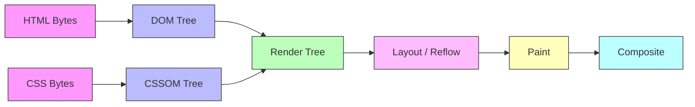
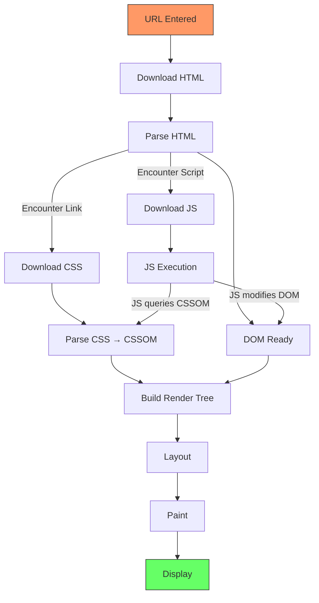

# Rendering Pipeline (Critical Rendering Path)

## Overview

The rendering pipeline is the sequence of steps the browser takes to convert HTML, CSS, and JavaScript into pixels on the screen. Understanding this pipeline is essential for performance optimization.

## Full Pipeline Flow



## Step-by-Step Breakdown

### 1. HTML → DOM (Document Object Model)

```
Bytes:     3C 68 74 6D 6C 3E 3C 62 6F 64 79 3E...
              │
              ▼
Characters: <html><body><h1>Hello</h1><p>World</p>
              │
              ▼
Tokens:     StartTag:html  StartTag:body  StartTag:h1  Text:Hello  EndTag:h1  StartTag:p  Text:World  EndTag:p  EndTag:body  EndTag:html
              │
              ▼
Nodes:      html ── body ── h1 ── "Hello"
                       └── p ── "World"
              │
              ▼
DOM Tree:   Document
             └── html
                  └── body
                       ├── h1
                       │   └── "Hello"
                       └── p
                           └── "World"
```

### 2. CSS → CSSOM (CSS Object Model)

```
Bytes:     b o d y   {   f o n t - s i z e :   1 6 p x ;   }
              │
              ▼
Characters: body { font-size: 16px; }
              │
              ▼
Tokens:     Identifier(body)  OpenBrace  Property(font-size)  Colon  Value(16px)  Semicolon  CloseBrace
              │
              ▼
CSSOM Tree: StyleSheet
             └── Rule: body
                  └── font-size: 16px
```

### 3. Render Tree Construction

Combines DOM + CSSOM, but **excludes**:
- `<head>` and its children
- `display: none` elements
- `<script>` tags (not rendered)

```
DOM Tree:                 CSSOM:                 Render Tree:
Document                  body {font: 16px}      RenderView
  html                    h1 {font: 24px}          RenderBody
    body                  p {font: 16px}             RenderText "Hello"
      h1                  .hidden {display:none}     RenderText "World"
        "Hello"
      p
        "World"
      div.hidden
        "Invisible"
```

### 4. Layout (Reflow)

Calculates geometry for every visible element:
- x, y position
- width, height
- z-index stacking order

```
Before Layout:                    After Layout:
┌─────────────────────┐          ┌─────────────────────┐
│                     │          │  (0,0) h1           │
│                     │          │  ┌───────────────┐  │
│                     │          │  │ "Hello"       │  │
│                     │          │  └───────────────┘  │
│                     │          │  (0,30) p           │
│                     │          │  ┌───────────────┐  │
│                     │          │  │ "World"       │  │
│                     │          │  └───────────────┘  │
└─────────────────────┘          └─────────────────────┘
```

### 5. Paint (Rasterization)

Fills pixels for each layout object:
- Background colors, borders, shadows
- Text rendering
- Image decoding/decompression
- SVG rendering

Paint order (back to front):
1. Background color
2. Background image
3. Border
4. Children (recursive)
5. Outline

### 6. Compositing

Layers are drawn on the GPU and composited together:

```
Layer 1 (Background)  ┐
Layer 2 (Navbar)      ├── GPU Composite ──▶ Display
Layer 3 (Content)     │
Layer 4 (Sticky Ad)   ┘
```

## Critical Rendering Path (CRP)

The CRP is the sequence of steps the browser must complete **before first paint**:



## Blocking Resources

### Render-Blocking Resources

Resources that **block the initial render**:

| Resource | Blocks | Why |
|---|---|---|
| **CSS** (all) | Render Tree | Render Tree needs CSSOM |
| **Sync JS** (`<script>` without defer/async) | DOM + CSSOM | JS can modify DOM/CSSOM |
| **Font files** | Text rendering | Browser holds text until font loads (FOIT) |
| **`<link rel="stylesheet">`** | Subsequent JS execution | Browsers block JS until CSSOM is ready |

### Parser-Blocking Resources

Resources that **block HTML parsing**:

```
<!-- Good: Async/defer scripts don't block parsing -->
<script src="analytics.js" async></script>
<script src="app.js" defer></script>

<!-- Bad: Sync script blocks parsing -->
<script src="large-library.js"></script>

<!-- CSS blocks parsing of subsequent content -->
<link rel="stylesheet" href="styles.css">
<div>I won't render until styles.css loads</div>
```

## Perceived Performance Timeline

```mermaid
gantt
    title Critical Rendering Path Timeline
    dateFormat  X
    axisFormat %s
    
    HTML Download     : 0, 2
    HTML Parse        : 2, 5
    CSS Download      : 2, 6
    CSS Parse         : 6, 8
    JS Download       : 2, 4
    JS Execute        : 4, 7
    Render Tree       : 8, 9
    Layout            : 9, 11
    Paint             : 11, 12
    Composite         : 12, 13
    First Paint       : milestone, 13, 13
```



## Performance Implications

### Optimal CRP (minimal blocking)

```
<html>
<head>
  <!-- Critical CSS inlined -->
  <style>body { font-family: sans-serif; }</style>
  <!-- Non-critical CSS loaded async -->
  <link rel="preload" href="styles.css" as="style" onload="this.rel='stylesheet'">
  <!-- Scripts deferred -->
  <script defer src="app.js"></script>
</head>
<body>
  <h1>Hello World</h1>
</body>
</html>
```

### Suboptimal CRP (full blocking)

```
<html>
<head>
  <link rel="stylesheet" href="styles.css">
  <script src="jquery.js"></script>
  <script src="analytics.js"></script>
</head>
<body>
  <h1>Nothing shows until both CSS and both JS files load</h1>
</body>
</html>
```

## Measuring the CRP

Use the **Performance** panel in DevTools:

1. Open DevTools → Performance
2. Click Record
3. Reload the page
4. Look at the **"Main"** track:

```
DevTools Performance Panel View:
┌─────────────────────────────────────────────────┐
│ Network:  HTML  CSS  JS                         │
│           ────── ──── ───                       │
│ Main:     ParseHTML ParseCSS Layout Paint       │
│           ────────── ──────── ────── ─────      │
│ Frames:   [1] [2] [3]                           │
│           ■   ■   ■                             │
└─────────────────────────────────────────────────┘
```

## Key Takeaways

- **DOM + CSSOM → Render Tree → Layout → Paint → Composite** is the fixed order
- **CSS is always render-blocking** — you need the CSSOM to build the render tree
- **Sync JS blocks parsing** — use `defer` or `async` for non-critical scripts
- **First Paint** happens after the CRP completes
- **Layout and Paint are expensive** — minimizing them improves performance
- **Critical CSS inlining** eliminates the CSS round-trip for above-the-fold content
