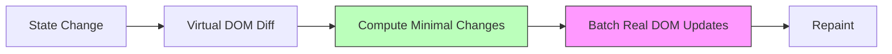

# DOM (Document Object Model)

## Overview

The **Document Object Model (DOM)** is a cross-platform, language-independent interface that treats HTML (and XML) documents as a tree structure of nodes. Each node represents a part of the document (element, text, attribute, comment).

## DOM Tree Structure

```
Document
  └── html
       ├── head
       │    ├── meta (charset="utf-8")
       │    ├── title
       │    │    └── Text: "My Page"
       │    └── link (rel="stylesheet", href="styles.css")
       └── body
            ├── header
            │    └── h1
            │         └── Text: "Welcome"
            └── main
                 ├── p
                 │    ├── Text: "Hello "
                 │    ├── strong
                 │    │    └── Text: "World"
                 │    └── Text: "!"
                 └── img (src="photo.jpg", alt="Photo")
```

## Node Types

| Node Type | Value | Example | Children Allowed |
|---|---|---|---|
| `ELEMENT_NODE` | 1 | `<div>`, `<p>`, `<span>` | Elements, Text, Comments |
| `ATTRIBUTE_NODE` | 2 | `class="foo"` | None (deprecated) |
| `TEXT_NODE` | 3 | `"Hello World"` | None |
| `CDATA_SECTION_NODE` | 4 | `<![CDATA[...]]>` | None |
| `ENTITY_REFERENCE_NODE` | 5 | Legacy | Element, Text |
| `ENTITY_NODE` | 6 | Legacy | None |
| `PROCESSING_INSTRUCTION_NODE` | 7 | `<?xml-stylesheet ...?>` | None |
| `COMMENT_NODE` | 8 | `<!-- comment -->` | None |
| `DOCUMENT_NODE` | 9 | `document` | Element (max 1), Comment |
| `DOCUMENT_TYPE_NODE` | 10 | `<!DOCTYPE html>` | None |
| `DOCUMENT_FRAGMENT_NODE` | 11 | Shadow DOM | Elements, Text |
| `NOTATION_NODE` | 12 | Legacy | None |

## How the DOM Is Built from HTML

### Step 1: Byte Stream → Characters

Raw bytes from the network are decoded into characters based on the charset (usually UTF-8):

```
Network Bytes:   3C 68 74 6D 6C 3E  →  <html>
```

### Step 2: Characters → Tokens

The HTML tokenizer converts characters into tokens. This is done by the **HTML parser** which handles:

- Start tags: `<div>`
- End tags: `</div>`
- Self-closing tags: `<br/>`
- Comments: `<!-- ... -->`
- DOCTYPE: `<!DOCTYPE html>`
- Text content

```
Character stream:  <div class="foo">Hello</div>

Tokens produced:
  1. StartTag: div [attribute: class="foo"]
  2. Text: "Hello"
  3. EndTag: div
```

### Step 3: Tokens → Nodes

The tree construction algorithm builds nodes from tokens:

```
StartTag:html ──▶ html element node
StartTag:head ──▶ head element node  
EndTag:head    ──▶ (closes head)
StartTag:body ──▶ body element node
StartTag:h1   ──▶ h1 element node
Text:"Title"  ──▶ text node ("Title")
EndTag:h1     ──▶ (closes h1)
EndTag:body   ──▶ (closes body)
EndTag:html   ──▶ (closes html)
```

### Step 4: Node Tree Complete

```html
<!DOCTYPE html>
<html>
<head></head>
<body>
  <h1>Title</h1>
</body>
</html>
```

```
Document
  └── DocumentType (html)
  └── html
       └── head
       └── body
            └── h1
                 └── Text: "Title"
```

## Incremental Parsing

The browser does **not** wait for the full HTML to arrive before parsing. It parses **incrementally** as data streams in:

```
Timestamp:  0ms ───────── 100ms ──────── 200ms ──────── 300ms
Network:    [<html><head><] [link rel="sty] [les.css"></he] [ad><body><h1>...]
Parsing:    [Parse <html>]  [Discover CSS]  [Parse </head>] [Parse body content]
Render:     ↓               ↓ parsing halts ↓ CSS downloads ↓ Continue
                            to fetch CSS                   
```

This enables **progressive rendering** — the browser can display content as it arrives.

## DOM APIs

### Node Query Methods

| API | Returns | Performance |
|---|---|---|
| `document.getElementById('id')` | Single Element | O(1) — fastest |
| `document.getElementsByClassName('cls')` | Live HTMLCollection | O(n) — moderate |
| `document.getElementsByTagName('div')` | Live HTMLCollection | O(n) — moderate |
| `document.querySelector('.cls')` | Single Element | O(n) — slower |
| `document.querySelectorAll('.cls')` | Static NodeList | O(n) — slower |

**Live vs Static collections:**
- `getElementsBy*` returns a **live** collection — changes to DOM are reflected immediately
- `querySelectorAll` returns a **static** snapshot

### Node Manipulation

```javascript
// Creating nodes
const div = document.createElement('div');
const text = document.createTextNode('Hello');
const comment = document.createComment('comment');

// Inserting
parent.appendChild(child);
parent.insertBefore(newChild, referenceChild);
parent.prepend(child);   // First child
parent.append(child);     // Last child

// Removing
parent.removeChild(child);
child.remove();

// Replacing
parent.replaceChild(newChild, oldChild);
```

### Traversal Properties

```
node.parentNode              → Node (parent, or null)
node.childNodes              → NodeList (live, all children)
node.firstChild              → Node (or null)
node.lastChild               → Node (or null)
node.nextSibling             → Node (or null)
node.previousSibling         → Node (or null)

node.children                → HTMLCollection (element children only)
node.firstElementChild       → Element (or null)
node.lastElementChild        → Element (or null)
node.nextElementSibling      → Element (or null)
node.previousElementSibling  → Element (or null)
```

### Element Properties

```javascript
el.innerHTML   = '<span>HTML string</span>';  // Parses HTML (XSS risk!)
el.textContent = 'Plain text';                // Safe, faster
el.outerHTML   = '<div>...</div>';            // Replaces element + content

el.className        // String of classes
el.classList        // DOMTokenList: add, remove, toggle, contains
el.dataset          // DOMStringMap: data-* attributes
el.style            // CSSStyleDeclaration: inline styles
el.attributes       // NamedNodeMap: all attributes
```

### Performance Example: innerHTML vs DOM APIs

```html
<!-- Test: Adding 1000 list items -->
<div id="container"></div>
<script>
  const container = document.getElementById('container');
  
  // ❌ SLOW: innerHTML += in loop (re-parses HTML each iteration)
  for (let i = 0; i < 1000; i++) {
    container.innerHTML += '<li>Item ' + i + '</li>';
  }
  
  // ✅ FAST: DocumentFragment batch insert
  const frag = document.createDocumentFragment();
  for (let i = 0; i < 1000; i++) {
    const li = document.createElement('li');
    li.textContent = 'Item ' + i;
    frag.appendChild(li);
  }
  container.appendChild(frag);
</script>
```

## Shadow DOM

Shadow DOM provides **encapsulation** — DOM subtrees that are isolated from the main document:

```
Light DOM:                     Shadow DOM:
┌──────────────────────┐       ┌──────────────────────┐
│ <my-component>       │       │ #shadow-root          │
│   (slot content)     │       │   <style>             │
│   "Hello"            │       │     h1 { color: red } │
│ </my-component>      │       │   </style>            │
└──────────────────────┘       │   <h1>                │
                                │     <slot></slot>    │
                                │   </h1>              │
                                └──────────────────────┘
```

```javascript
const host = document.getElementById('host');
const shadow = host.attachShadow({ mode: 'open' });
shadow.innerHTML = `<style>h1 { color: red }</style><h1><slot></slot></h1>`;
```

## DOM vs Virtual DOM

React and other frameworks use a **Virtual DOM** to minimize real DOM operations:



## Real-World Example: DOM Mutation Observer

```javascript
// Efficiently watch for DOM changes (alternative to polling)
const target = document.getElementById('dynamic-content');

const observer = new MutationObserver((mutations) => {
  for (const mutation of mutations) {
    if (mutation.type === 'childList') {
      console.log(`${mutation.addedNodes.length} nodes added`);
      console.log(`${mutation.removedNodes.length} nodes removed`);
    }
    if (mutation.type === 'attributes') {
      console.log(`Attribute ${mutation.attributeName} changed`);
    }
  }
});

observer.observe(target, {
  childList: true,
  attributes: true,
  subtree: true
});
```

## Key Takeaways

- **DOM is a tree** of nodes representing the document structure
- **12 node types** exist, but `ELEMENT_NODE` (1), `TEXT_NODE` (3), and `DOCUMENT_NODE` (9) are the most common
- **HTML parsing is incremental** — the browser doesn't wait for the full document
- **DOM APIs** vary in performance — `getElementById` is fastest, `querySelectorAll` is flexible
- **Shadow DOM** provides encapsulation for web components
- **Minimize DOM operations** for performance — use DocumentFragment and batched updates
