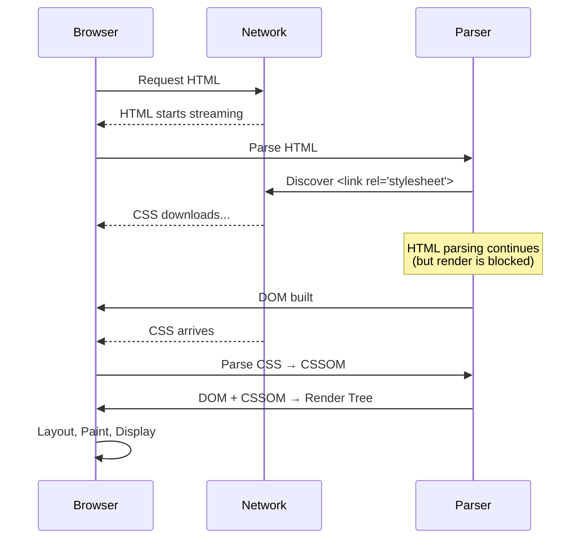

# CSSOM (CSS Object Model)

## Overview

The **CSS Object Model (CSSOM)** is a tree-like representation of CSS rules, similar to how the DOM represents HTML. The browser parses CSS and builds the CSSOM before constructing the render tree.

## CSS Parsing Pipeline

```
Raw CSS Bytes          Characters          Tokens
┌──────────┐          ┌──────────┐        ┌──────────┐
│ 62 6F 64 │ ──────▶  │ body {   │ ─────▶ │ IDENT    │
│ 79 20 7B │  decode  │ font:    │  token │ OPEN CURLY │
│ ...       │          │ 16px; }  │  ize   │ ...      │
└──────────┘          └──────────┘        └──────────┘
                                                 │
                                                 ▼
┌──────────┐          ┌──────────┐        ┌──────────┐
│ CSSOM    │ ◀──────  │ Rules    │ ◀──────│ Nodes    │
│ Tree     │  cascade │          │  build │          │
└──────────┘          └──────────┘        └──────────┘
```

## CSSOM Tree Structure

The CSSOM mirrors the DOM hierarchy but with selector specificity. Each node contains computed styles.

### Example

```html
<html>
  <head>
    <style>
      body { font-size: 16px; color: black; }
      h1 { font-size: 2em; color: blue; }
      .highlight { background: yellow; }
      #main { width: 100%; }
    </style>
  </head>
  <body>
    <h1 class="highlight" id="main">Title</h1>
    <p>Paragraph</p>
  </body>
</html>
```

```
CSSOM Tree (conceptual):
StyleSheet
├── Rule: body
│    ├── font-size: 16px
│    └── color: black
├── Rule: h1
│    ├── font-size: 2em
│    └── color: blue
├── Rule: .highlight
│    └── background: yellow
└── Rule: #main
     └── width: 100%
```

### Computed Styles (after cascade)

```
For <h1 class="highlight" id="main">:
┌──────────────────────────────┐
│ Property         Value       │
├──────────────────────────────┤
│ font-size        32px        │  ← inherited from body (16px × 2em)
│ color            blue        │  ← from h1 rule (overrides body)
│ background       yellow      │  ← from .highlight rule
│ width            100%        │  ← from #main rule
│ display          block       │  ← user-agent default
│ font-weight      bold        │  ← user-agent default for h1
└──────────────────────────────┘
```

## CSS Cascade

The cascade determines which CSS rule applies when multiple rules conflict. The priority order is:

1. **Origin & Importance** (lowest to highest)
2. **Specificity**
3. **Order of appearance** (later wins)

### Origin Hierarchy

```
User Agent (browser defaults)        ← Lowest priority
  └── User (browser settings)          
       └── Author (website CSS)         
            └── !important Author       
                 └── !important User    
                      └── Animations   ← Highest priority
```

## Specificity Calculation

Specificity is calculated as a 4-part value: `(inline, id, class/pseudo-class, element)`.

| Selector | Inline | ID | Class | Element | Specificity |
|---|---|---|---|---|---|
| `*` | 0 | 0 | 0 | 0 | 0,0,0,0 |
| `h1` | 0 | 0 | 0 | 1 | 0,0,0,1 |
| `.class` | 0 | 0 | 1 | 0 | 0,0,1,0 |
| `[attr]` | 0 | 0 | 1 | 0 | 0,0,1,0 |
| `:hover` | 0 | 0 | 1 | 0 | 0,0,1,0 |
| `#id` | 0 | 1 | 0 | 0 | 0,1,0,0 |
| `style=""` | 1 | 0 | 0 | 0 | 1,0,0,0 |
| `div p` | 0 | 0 | 0 | 2 | 0,0,0,2 |
| `.parent .child` | 0 | 0 | 2 | 0 | 0,0,2,0 |
| `div#main.highlight` | 0 | 1 | 1 | 1 | 0,1,1,1 |

### Comparison Algorithm

```javascript
function compareSpecificity(a, b) {
  // Returns 1 if a wins, -1 if b wins, 0 if tie
  const aParts = [a.inline, a.id, a.class, a.element];
  const bParts = [b.inline, b.id, b.class, b.element];
  
  for (let i = 0; i < 4; i++) {
    if (aParts[i] > bParts[i]) return 1;
    if (aParts[i] < bParts[i]) return -1;
  }
  return 0; // Tie — later rule wins
}
```

## CSSOM APIs

The CSSOM is accessible via JavaScript:

```javascript
// Access stylesheets
const sheets = document.styleSheets;
for (const sheet of sheets) {
  const rules = sheet.cssRules;
  for (const rule of rules) {
    if (rule instanceof CSSStyleRule) {
      console.log(rule.selectorText);     // e.g., "body"
      console.log(rule.style.color);      // e.g., "black"
    }
  }
}

// Get computed styles (includes cascade resolution)
const el = document.querySelector('h1');
const computed = getComputedStyle(el);
console.log(computed.fontSize);  // "32px"
console.log(computed.color);     // "rgb(0, 0, 255)"
```

### CSSStyleDeclaration Properties

```javascript
el.style.color = 'red';
el.style.cssText = 'color: red; font-size: 16px;';
el.style.setProperty('--custom-var', 'value');
el.style.getPropertyValue('color');     // "red"
el.style.removeProperty('color');
```

## Blocking Nature of CSS

CSS is **render-blocking** because the render tree requires the CSSOM:



### CSS Blocks JavaScript Execution

Browsers block JS execution until the CSSOM is built because JS can query CSS properties:

```html
<!-- ❌ This script will NOT execute until styles.css loads -->
<link rel="stylesheet" href="styles.css">
<script>
  const width = getComputedStyle(el).width;  // Needs CSSOM!
  console.log(width);
</script>
```

### CSS as Parser-Blocking via Scripts

```html
<!-- CSS blocks parse because JS blocks parse and JS waits for CSS -->
<link rel="stylesheet" href="styles.css">
<script src="app.js"></script>  <!-- Blocks HTML parse until CSS loads -->
```

## Media Query Resolution

CSS is only render-blocking for matching media queries:

```html
<!-- Render-blocking for screen (always matches) -->
<link rel="stylesheet" href="styles.css">

<!-- Only render-blocking when printing -->
<link rel="stylesheet" href="print.css" media="print">

<!-- Never render-blocking on screen (always non-matching) -->
<link rel="stylesheet" href="landscape.css" media="orientation: landscape">

<!-- Best practice: split critical and non-critical -->
<link rel="stylesheet" href="critical.css">                           <!-- Blocks -->
<link rel="stylesheet" href="non-critical.css" media="print" onload="this.media='all'">  <!-- Non-blocking -->
```

## Performance Optimization

### 1. Inline Critical CSS

```html
<head>
  <style>
    /* Critical above-the-fold styles */
    body { font-family: sans-serif; margin: 0; }
    header { height: 60px; background: #333; }
    .hero { font-size: 2rem; text-align: center; }
  </style>
  <link rel="preload" href="full.css" as="style" onload="this.rel='stylesheet'">
</head>
```

### 2. Avoid @import

```css
/* ❌ BAD: @import creates serial download */
@import url('reset.css');
@import url('typography.css');

/* ✅ GOOD: link tags download in parallel */
/* <link rel="stylesheet" href="reset.css"> */
/* <link rel="stylesheet" href="typography.css"> */
```

### 3. Minimize CSS Size

- Remove unused CSS (use Chrome Coverage tab)
- Minify CSS
- Use modern CSS features (Grid, Flexbox) instead of heavy frameworks

## Key Takeaways

- **CSSOM is a tree** of CSS rules, parallel to the DOM but with cascade resolution
- **CSS is always render-blocking** — no render tree without CSSOM
- **CSS blocks JS execution** because JS can query computed styles
- **Specificity** is a 4-part calculation: inline > id > class/pseudo > element
- **Media queries** can make CSS non-blocking for non-matching devices
- **Critical CSS inlining** eliminates the CSS round-trip for immediate rendering
- **`getComputedStyle()`** gives you the final cascaded value for any element
