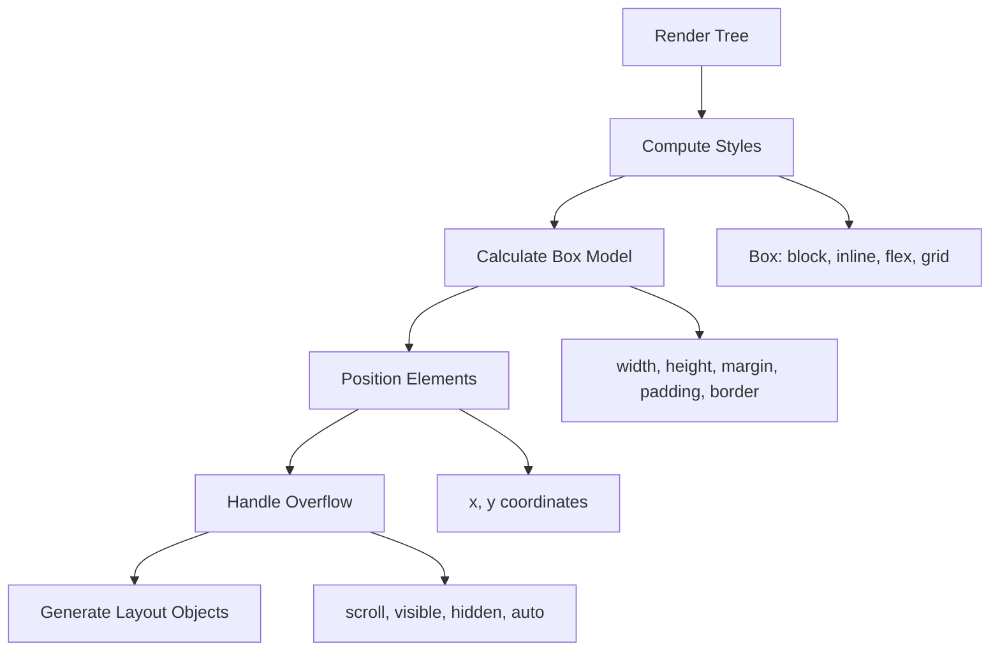
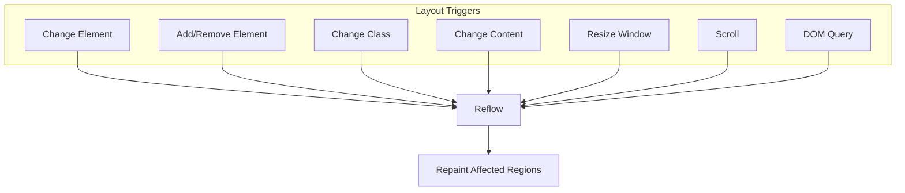

# Layout (Reflow)

## Overview

**Layout** is the phase where the browser calculates the **geometry** (position and size) of every element in the render tree. It's also called **reflow**. This is one of the most expensive operations in the rendering pipeline.

## Layout Pipeline



## Box Model Calculation

Every element is a rectangular box:

```
┌───────────────────────────────────────────────┐
│                  Margin                        │
│  ┌─────────────────────────────────────────┐  │
│  │                Border                    │  │
│  │  ┌───────────────────────────────────┐  │  │
│  │  │              Padding              │  │  │
│  │  │  ┌─────────────────────────────┐  │  │  │
│  │  │  │         Content             │  │  │  │
│  │  │  │                             │  │  │  │
│  │  │  │        width: 200px         │  │  │  │
│  │  │  │        height: 100px        │  │  │  │
│  │  │  └─────────────────────────────┘  │  │  │
│  │  └───────────────────────────────────┘  │  │
│  └─────────────────────────────────────────┘  │
└───────────────────────────────────────────────┘
```

### box-sizing Property

```css
/* content-box (default): width = content width */
/* Total width = width + padding + border */
.box { width: 200px; padding: 20px; border: 2px solid; }
/* Visual width = 200 + 40 + 4 = 244px */

/* border-box: width includes padding + border */
.box { box-sizing: border-box; width: 200px; padding: 20px; border: 2px solid; }
/* Visual width = 200px, content width = 200 - 40 - 4 = 156px */
```

## Layout Algorithms

### Flow Layout (Normal Flow)

The default layout model. Elements flow top-to-bottom (block) and left-to-right (inline).

```
┌─────────────────────────────────────────────┐
│ Block (display: block)                       │
│ ┌─────────────────────────────────────────┐ │
│ │ Block Width = Container Width           │ │
│ │ Block stacks vertically                 │ │
│ └─────────────────────────────────────────┘ │
│ ┌─────────────────────────────────────────┐ │
│ │ Another Block Below                     │ │
│ └─────────────────────────────────────────┘ │
│ Inline elements flow:                      │ │
│ [Inline] [Inline] [Inline] [Inline]        │ │
│ [Inline] [Inline]  ← wraps to next line    │ │
└─────────────────────────────────────────────┘
```

### Positioned Layout

```css
/* Static (default) — normal flow */
position: static;

/* Relative — offset from normal position */
position: relative;
top: 10px; left: 20px;

/* Absolute — positioned relative to nearest positioned ancestor */
position: absolute;
top: 0; right: 0;

/* Fixed — positioned relative to viewport */
position: fixed;
bottom: 0; left: 0;

/* Sticky — normal flow until scroll threshold */
position: sticky;
top: 0;
```

```
Fixed ───────────────────────────────┐
│  Sticky (starts normal, sticks)    │
│  ┌───────────────────────────────┐ │
│  │  Relative                      │ │
│  │  ┌─────────────────────────┐   │ │
│  │  │  Absolute               │   │ │
│  │  │  (inside relative)      │   │ │
│  │  └─────────────────────────┘   │ │
│  └─────────────────────────────────┘ │
└──────────────────────────────────────┘
```

### Flexbox Layout

```
┌───── display: flex; ────────────────────────────┐
│  ┌─────┐  ┌─────┐  ┌─────┐  ┌─────┐  ┌─────┐  │
│  │flex │  │flex │  │flex │  │flex │  │flex │  │
│  │item │  │item │  │item │  │item │  │item │  │
│  │     │  │     │  │     │  │     │  │     │  │
│  └─────┘  └─────┘  └─────┘  └─────┘  └─────┘  │
└─────────────────────────────────────────────────┘
```

Flexbox layout algorithm:

1. **Determine main/cross axis** (`flex-direction`)
2. **Size flex items** based on `flex-grow`, `flex-shrink`, `flex-basis`
3. **Distribute remaining space** along main axis (`justify-content`)
4. **Align items** along cross axis (`align-items`)
5. **Wrap** if needed (`flex-wrap`)

```javascript
// Flexbox calculation example
function calculateFlexItemSize(container, item) {
  const totalFlex = container.children.reduce(
    (sum, child) => sum + child.flexGrow, 0
  );
  const remainingSpace = container.width - 
    container.children.reduce(
      (sum, child) => sum + child.flexBasis, 0
    );
  
  if (remainingSpace > 0 && item.flexGrow > 0) {
    const extra = remainingSpace * (item.flexGrow / totalFlex);
    return item.flexBasis + extra;
  }
  return item.flexBasis;
}
```

### Grid Layout

```
┌───── display: grid; ────────────────────────────┐
│  grid-template-columns: 1fr 1fr 1fr              │
│  grid-template-rows: auto auto                   │
│                                                   │
│  ┌──────────┐  ┌──────────┐  ┌──────────┐      │
│  │  Item 1  │  │  Item 2  │  │  Item 3  │      │
│  │          │  │          │  │          │      │
│  └──────────┘  └──────────┘  └──────────┘      │
│  ┌──────────┐  ┌──────────┐  ┌──────────┐      │
│  │  Item 4  │  │  Item 5  │  │  Item 6  │      │
│  │          │  │          │  │          │      │
│  └──────────┘  └──────────┘  └──────────┘      │
└─────────────────────────────────────────────────┘
```

Grid layout algorithm:

1. **Define tracks** (columns and rows from `grid-template-*`)
2. **Place items** in cells (auto-placement or explicit placement)
3. **Resolve track sizes** (fr units, min-content, max-content, auto)
4. **Align items** within cells (`align-items`, `justify-items`)

## Layout Triggers (What Causes Reflow)

### Property Changes That Trigger Layout

| Property | Triggers |
|---|---|
| `width`, `height` | Reflow of element + descendants + ancestors |
| `margin`, `padding`, `border` | Reflow of element + adjacent elements |
| `display` (to/from `none`) | Full reflow of document |
| `position` | Reflow of element + repositioned elements |
| `font-size` | Reflow of element + all dependent elements |
| `top`, `left`, `right`, `bottom` | Reflow of positioned elements |
| `float`, `clear` | Reflow of following content |
| `text-align`, `vertical-align` | Reflow of inline content |

### Visual Layout Trigger Map



## Layout Thrashing

**Layout thrashing** occurs when you repeatedly force the browser to recalculate layout in a tight loop, typically by alternating read and write DOM operations.

### ❌ Bad: Layout Thrashing

```javascript
// Forces synchronous reflow on every iteration
const boxes = document.querySelectorAll('.box');
for (let i = 0; i < boxes.length; i++) {
  boxes[i].style.width = `${getComputedStyle(boxes[i]).width * 1.1}px`;
  //                                 ^ read           ^ write
  // Each iteration forces a reflow because the style change invalidates layout
}
```

### ✅ Good: Batch Reads and Writes

```javascript
// Batch reads first
const boxes = document.querySelectorAll('.box');
const widths = [];
for (let i = 0; i < boxes.length; i++) {
  widths.push(getComputedStyle(boxes[i]).width);
}

// Then batch writes
for (let i = 0; i < boxes.length; i++) {
  boxes[i].style.width = `${widths[i] * 1.1}px`;
}
```

### Using requestAnimationFrame + FastDOM

```javascript
// Using requestAnimationFrame to batch layout operations
function updateLayout() {
  // Read phase
  const heights = items.map(el => el.offsetHeight);
  const containerWidth = container.offsetWidth;
  
  // Write phase
  items.forEach((el, i) => {
    el.style.height = `${heights[i] * 2}px`;
    el.style.width = `${containerWidth / items.length}px`;
  });
  
  requestAnimationFrame(updateLayout);
}
requestAnimationFrame(updateLayout);
```

## Layout in DevTools

Use the **Performance** panel to identify layout bottlenecks:

1. Open DevTools → Performance
2. Record interaction
3. Look for **Layout** events in the Main thread

```
Performance Panel:
┌────────────────────────────────────────────────────────┐
│ Main ──────────────────────────────────────────────    │
│   Parse HTML    Layout     Paint     Layout    Paint   │
│   ──────────    ──────     ─────     ──────    ─────   │
│   [▄▄▄▄▄▄]     [▄▄▄▄]    [▄▄]     [▄▄▄▄]    [▄▄]    │
│                                                   │
│   Layout thrashing shown as repeated Layout+Paint│
│   without user interaction between them           │
└────────────────────────────────────────────────────────┘
```

**Layout Shifts** (CLS — Cumulative Layout Shift) in the **Performance** panel:

```
Experience → Layout Shifts
┌────────────────────────────────────────────┐
│ Shift 1: 0.045 at 1.2s (image load)       │
│   Node: #hero-image                        │
│   From: (0, 0) To: (0, 300)               │
│                                            │
│ Shift 2: 0.089 at 2.5s (ad insertion)     │
│   Node: #ad-banner                         │
│   From: (0, 600) To: (0, 780)             │
└────────────────────────────────────────────┘
```

## Real-World Example: Content Jump Prevention

```html
<!-- ❌ BAD: No dimensions → layout shift when images load -->


<!-- ✅ GOOD: Explicit dimensions → no layout shift -->


<!-- ✅ BEST: aspect-ratio with responsive width -->

```

## Key Takeaways

- **Layout calculates geometry** — positions and sizes of all elements
- **Different layout modes** (Flow, Positioned, Flexbox, Grid) have different algorithms
- **Layout triggers** include style changes, DOM mutations, window resize, and **DOM queries**
- **Layout thrashing** is the #1 layout performance problem — batch reads and writes
- **`box-sizing: border-box`** makes width calculations more intuitive
- **CSS Grid and Flexbox** move layout logic from JS to the browser
- **Layout is expensive** — it's not just the element, but all descendants and ancestors
